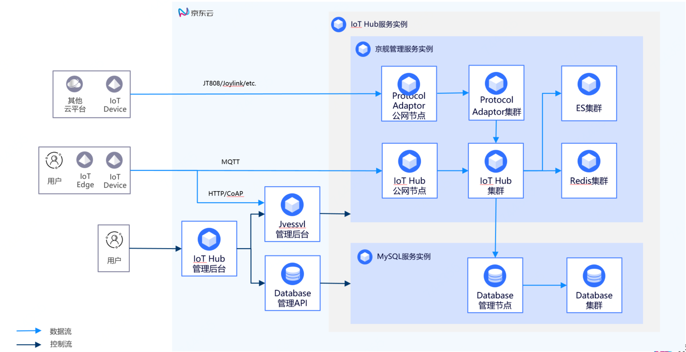

# 基础架构

物联网中心（IoT Hub）包含协议引擎、设备管理、Edge模块管理、数据管理四个主要模块。

## 业务架构
业务架构如下图：

|名称|描述|
| - | - | 
|协议引擎| 支持使用标准协议（MQTT，HTTP或CoAP）设备连接Hub服务。|
|设备管理| 包括设备登记、设备鉴权、设备物模型管理、以及设备孪生管理等功能。|
|Edge模块管理| 包括Edge模块元数据管理以及模块孪生管理等功能。|
|数据管理| 内置规则引擎，用户可以通过规则引擎预处理数据，转发转储到京东云其他云服务中。|

## 相关参考

- [产品优势](../Introduction/Benefits.md)
- [产品功能](../Introduction/Features.md)
- [价格总览](../Pricing/Price-Overview.md)
- [计费规则](../Pricing/Billing-Rules.md)
- [创建实例](../Getting-Started/Create-Instance.md)
