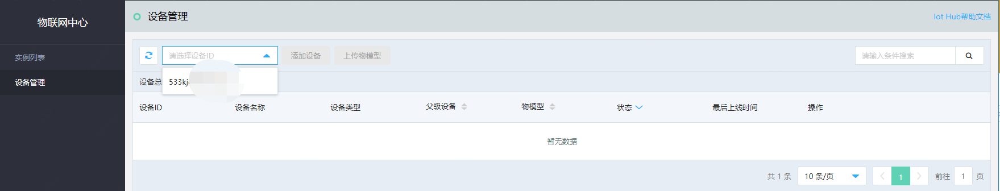

# 添加设备

您可以通过 物联网中心服务 控制台或 API 添加设备。本文介绍通过控制台如何添加设备。

## 前提条件
- 已注册京东云账号，并完成实名认证。如果还没有账号请 [注册](https://accounts.jdcloud.com/p/regPage?source=jdcloud%26ReturnUrl=%2f%2fuc.jdcloud.com%2fpassport%2fcomplete%3freturnUrl%3dhttp%3A%2F%2Fuc.jdcloud.com%2Fredirect%2FloginRouter%3FreturnUrl%3Dhttps%253A%252F%252Fwww.jdcloud.com%252Fhelp%252Fdetail%252F734%252FisCatalog%252F1)，或 [实名认证](https://uc.jdcloud.com/account/certify)。
- 已创建物联网中心服务 实例。

## 操作步骤
1. 登录 [物联网中心服务 控制台](https://iot-console.jdcloud.com/iothub)。
2. 在“设备管理”页面，进行添加设备操作。

	
	
3. 在实例列表的下拉菜单中选择一个 物联网中心服务 实例。

5. 在弹出的添加设备页面里点击“下载物模型模板”。
6. 请在您的本机上编辑物模型模版，生成您需要接入设备的物模型文件。你可以参考附件的温湿度传感器的物模型示例来编辑您自己的物模型文件。[温湿度传感器物模型示例](https://docs-iot-downloads.s3.cn-north-1.jdcloud-oss.com/TempHumiditySensor-OM.json?AWSAccessKeyId=9B860A13DA12A42DCB34BE2ECBE4384D&Expires=1616583586&Signature=xGDR%2FHppBwW7iHtpoOViVXyJhgs%3D)
7. 编辑物模型完成后，点击“上传物模型”按钮，上传您的物模型。
8. 在弹出的添加设备页面里点击“下载设备登记模板”。
9. 请在您的本机上编辑设备登记模板，生成您需要接入的设备登记文件。
10. 编辑设备登记文件完成后，点击“上传设备登记文件”按钮，上传您的设备登记文件。
11. 请在您修改设备的固件，将MQTT客户端的服务端通信地址修改为您创建的物联网中心实例的公网域名，并且设备和物联网服务中心服务建立通信时发送设备ID。（即设备登记文件中的DeviceName字段的值）
    
	

## 相关参考
- [设计物模型](../../Best-Practices/Design-OM.md)
- [实例列表](../../Getting-Started/List-Instance.md)
- [计费规则](../../Pricing/Billing-Rules.md)

