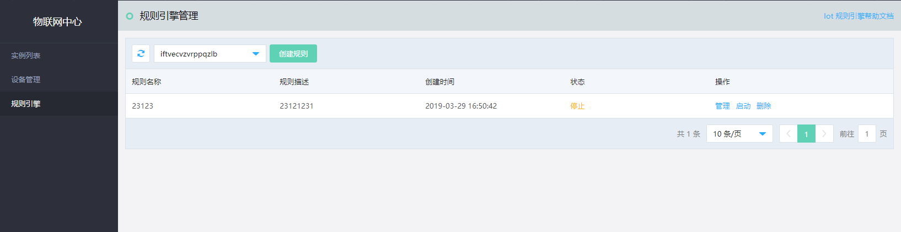

# 创建规则引擎

您可以通过 物联网中心服务 控制台或 API 创建规则。本文介绍通过控制台如何创建规则。

## 前提条件
- 已注册京东云账号，并完成实名认证。如果还没有账号请 [注册](https://accounts.jdcloud.com/p/regPage?source=jdcloud%26ReturnUrl=%2f%2fuc.jdcloud.com%2fpassport%2fcomplete%3freturnUrl%3dhttp%3A%2F%2Fuc.jdcloud.com%2Fredirect%2FloginRouter%3FreturnUrl%3Dhttps%253A%252F%252Fwww.jdcloud.com%252Fhelp%252Fdetail%252F734%252FisCatalog%252F1)，或 [实名认证](https://uc.jdcloud.com/account/certify)。
- 已创建物联网中心服务 实例。

## 操作步骤
1. 登录 [物联网中心服务 控制台](https://iot-console.jdcloud.com/iothub)。
2. 在“规则引擎”页面，进行创建规则操作。

	
	
3. 在实例列表的下拉菜单中选择一个 物联网中心服务 实例。

5. 在"创建规则"页面里输入规则基本信息：规则名称和规则描述。名称不可重复。
6. 在"创建规则"页面里可以编写JS脚本对数据预处理。
7. 在"创建规则"页面里可以设置转发数据动作，将数据转发到京东云JCQ，京东云RDS，京东云ES服务，或者MQTT其他Topic主题，实现M2M通信。
8. 在"创建规则"页面里可以设置转发失败数据动作，在转发服务的目的地服务不可用的情况下，可以将设备数据转发到其他可用的服务。
		*注意
		转发失败动作定义的目的地服务设置和转发数据动作定义的目的地服务设置必须不同。

    
	

## 相关参考
- [设计物模型](../../Best-Practices/Design-OM.md)
- [实例列表](../../Getting-Started/List-Instance.md)
- [计费规则](../../Pricing/Billing-Rules.md)

