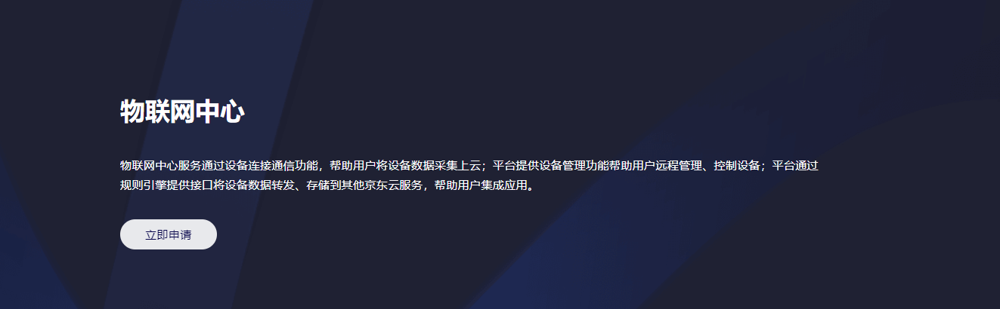

# 购买流程

本文介绍物联网中心服务实例的购买入口。

## 入口：[产品介绍页](https://www.jdcloud.com/products/mongodb)
1. 登录京东云官网[https://www.jdcloud.com/](https://www.jdcloud.com/)。
2. 选择“产品>物联网中心”。

3.弹出物联网中心服务的产品介绍页，点击**立即申请**。

4.在申请页面提交您的申请表单，如果申请通过审核，我们会为您开通控制台访问物联网中心服务的菜单。

5.登录京东云官网[https://www.jdcloud.com/](https://www.jdcloud.com/)。

6.选择“控制台”，具体见下图。

7.登录控制台，具体操作请参考[创建实例](../Getting-Started/Create-Instance.md)。

		请注意：
		* 公测期间购买物联网中心服务需要提交申请。
