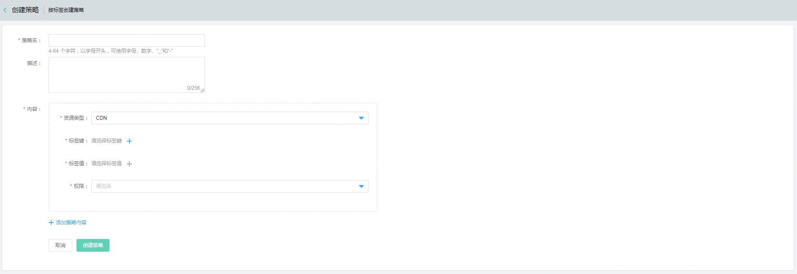

# 什么是策略

授权策略是定义一条或多条权限的 JSON 文档，撰写策略需要遵循 JSON 语法规范。通过给子用户，群组，角色授予策略，来控制子用户，群组和角色对京东云资源的访问权限。其中子用户所拥有的访问权限，是子用户和其所在的群组附加的授权策略的合集。

IAM 支持两种类型的策略：京东云预置的系统策略和用户自行管理的自定义策略。

- 京东云预置的系统策略是产品线接入的时京东云预置好的，不允许用户修改，您可以直接使用并授予子用户，群组和角色。
- 用户自行管理的自定义策略，用户可以通过自定义策略的方式创建对特定资源（resource）的特定操作（action）的策略，您也可以增加限定条件（condition）来限定源IP，特定访问时间和虚拟MFA认证等。用户可自主编辑，删除自定义策略。

## 策略创建

在 授权策略管理 列表页面，点击【创建】按钮，支持三种创建自定义策略的方式。第一种是可视化策略生成器，第二种是 JSON 策略编辑器，第三种是按标签创建策略。

### 可视化策略生成器

可视化策略生成器旨在为用户提供更友好，更便利的策略创建的工具，用户可以可视化的方式依次选择产品线，操作，资源等信息，点击确认后将自动为您生成Json格式的策略。

- 输入策略名称和描述。
- 产品线选择（Service Name），更多内容请参考 [支持IAM的云服务](https://docs.jdcloud.com/cn/iam/support-services)
- 选择操作（Action）
- 选择资源（Resource）
- 完成一组产品线，资源和操作的指定后，您可以通过点击添加按钮，直至您完成整个策略。

**V2版本可视化策略创建页面**

**V3版本可视化策略创建页面**

### 按标签创建策略

按标签创建策略，跟标签服务联合提供的一种可视化策略创建的功能，用户无需逐个地指定操作和资源。

 - 资源的指定可根据指定的标签自动获取标签关联的资源，当主账号需要给子用户授予新创建资源的权限时，无需更改策略，只需对对应的资源打上标签，策略可及时生效。
 - 操作的指定，可根据产品线名称选择对应的权限集合批量指定操作。
 
 
 
### JSON 策略生成器

在 JSON 策略生成器中，输入策略名称和描述后，您可以直接编写 JSON 策略，也可以先选择一个策略模板，再进行 JSON 文档编辑。

