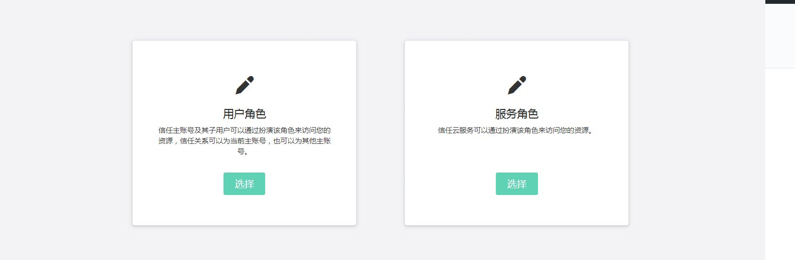
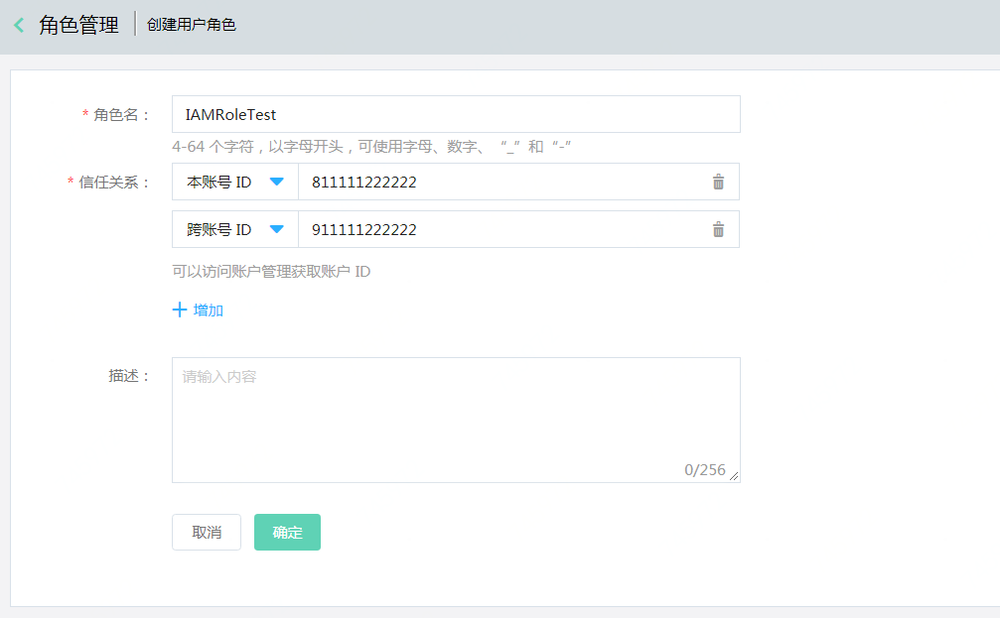
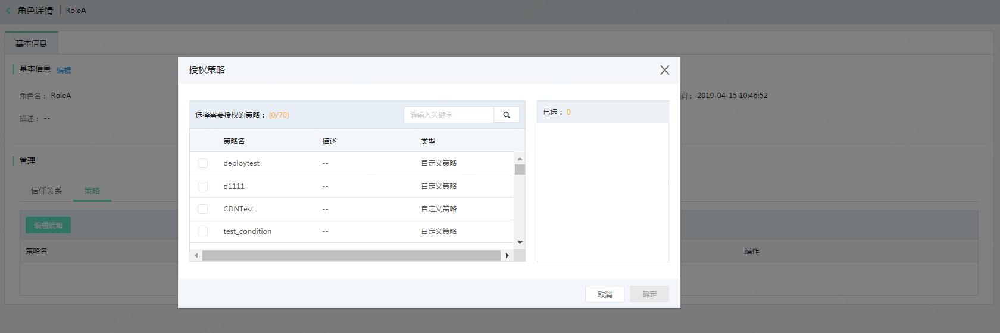
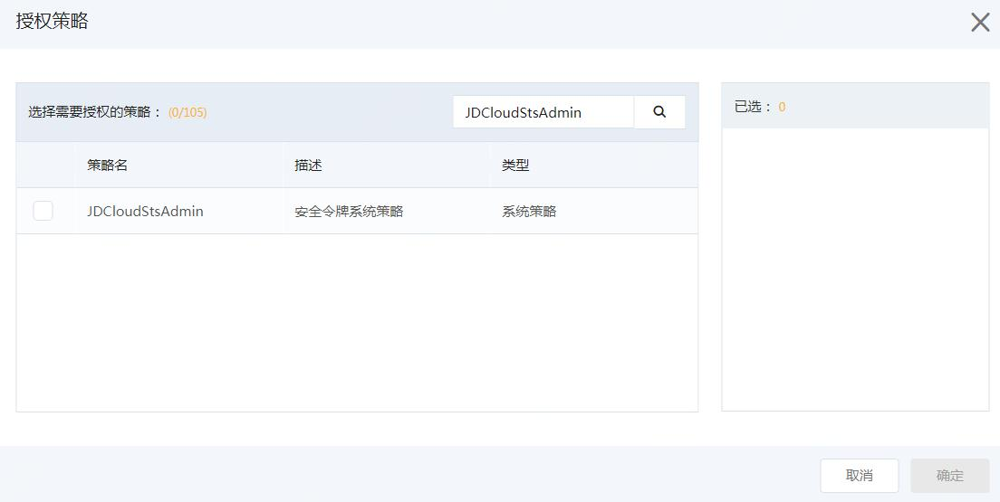
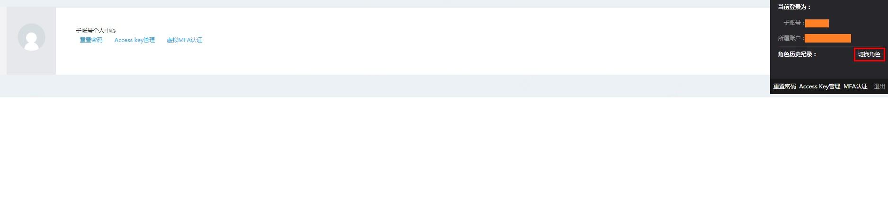
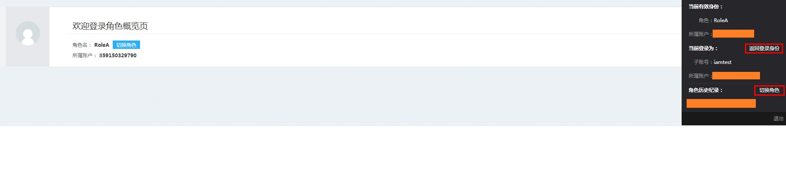

# 什么是角色

角色分为用户角色和服务角色，它是一种虚拟身份类型，没有确定的身份凭证，必须关联到某个实体身份上才能使用。

 - 用户角色必须被当前主账号下的子用户扮演，或者跨账号下的子用户扮演后才能生效，用户角色与子用户的差别主要在使用方法上，角色需要被一个授信的实体用户扮演，扮演成功后实体用户将获得角色的临时安全凭证，使用这个临时安全令牌就能以角色身份访问被授权的资源。
 - 服务角色需要授予某个云服务（如目录服务）来扮演，服务角色将代替用户对您的京东云资源进行管理和操作。

本文主要讲述如何创建一个用户角色并使用角色的身份进行访问。

## 创建用户角色

登录京东云控制台，进入访问控制 > 角色管理，点击【创建】按钮，在创建角色创建窗口填写相关信息：
 
  - 信任关系：指您允许（信任）哪些主账号来扮演该角色，并执行该角色所拥有的权限，例如您是账号A，您创建用户角色RoleA允许账号B来扮演角色访问您的资源。

## 授予用户角色应该拥有的权限

进入角色列表或角色详情页，为用户角色绑定相应的策略以控制切换角色登录后，角色所能拥有的权限，例如给RoleA绑定您想绑定的策略。

## 给子用户授予扮演角色的权限

登录京东云控制台，进入访问控制 > 用户管理，点击【授权】按钮，授予子用户安全令牌系统策略（JDCloudStsAdmin），例如给账号B下的子用户SubUserB绑定JDCloudStsAdmin的权限。
 
  - 在角色信任关系中的主账号里，授予子用户扮演角色的权限。

## 登录子用户控制台，切换角色

登录京东云控制台，在访问控制概览页中获取子用户登录链接，登录子用户，例如进行账号B下的子用户SubUserB的登录。
 
登录后，进入子用户控制台，点击右上角菜单中的 “切换角色”，进行角色身份的登录，例如输入账号A的accountID和RoleA的角色名称，登录后，SubUserB将以RoleA的身份和权限对主账号A的资源进行访问和管理。

