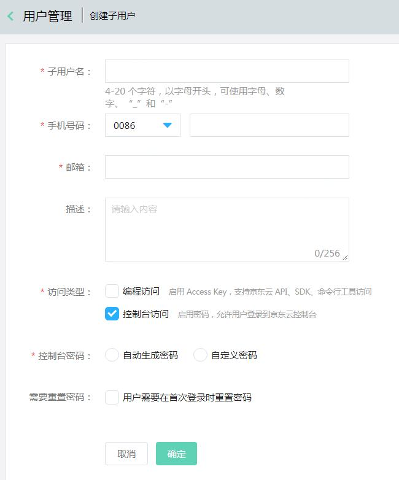
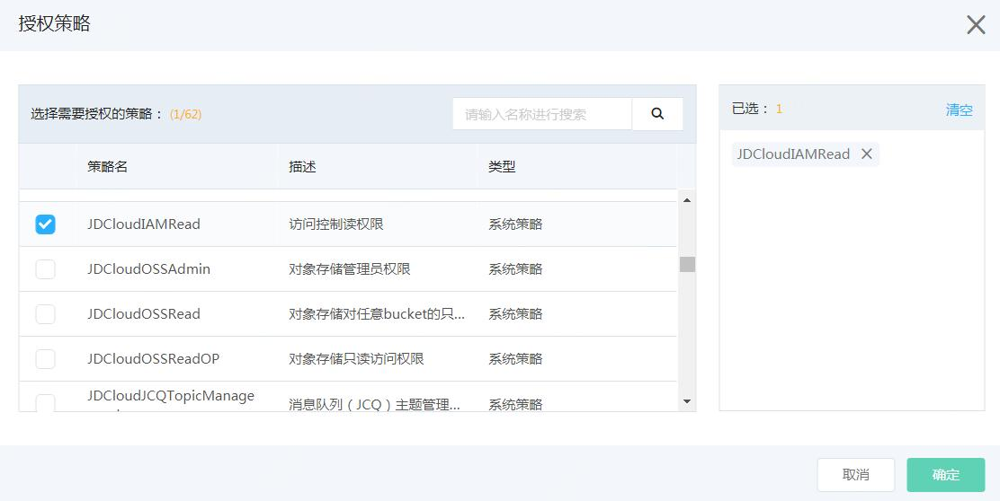
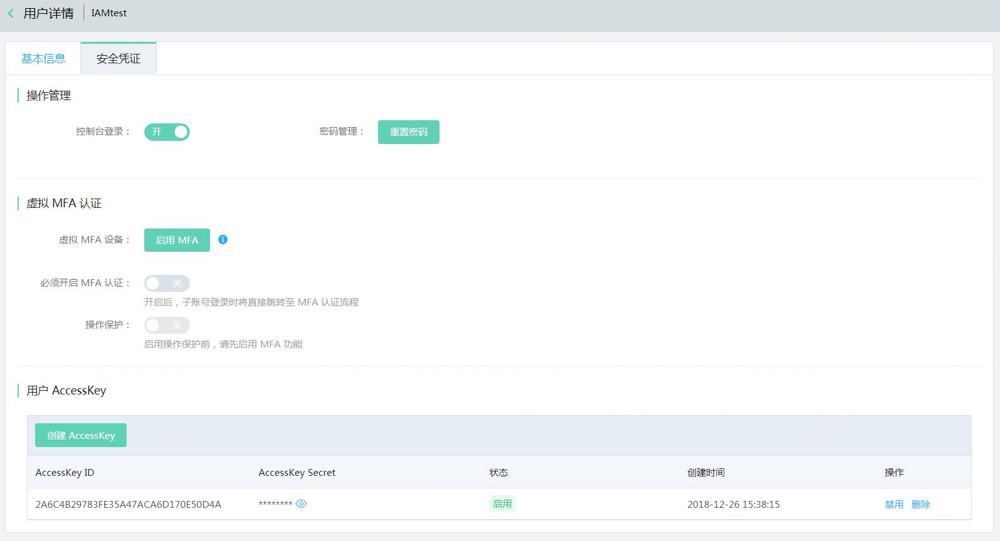
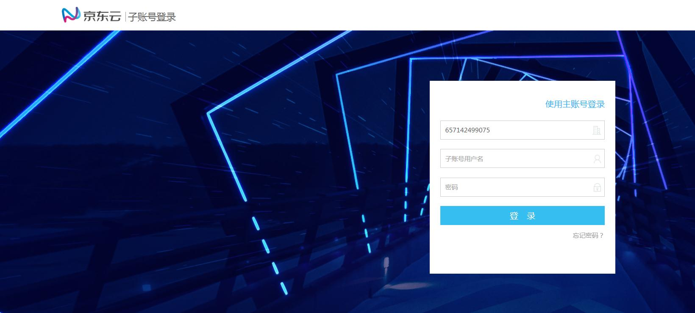

# 什么是子用户

子用户是一种实体身份，有确定的用户名，密码和AK/SK，它通常与某个确定的实体一一对应，如企业的技术人员，运维人员等。

子用户的用户名由主账号创建。子用户不是独立的京东云账号，它归属于主账号，只能在主账号的空间下可见，他只有资源的使用权，没有资源的所有权。没有独立的计量计费，子用户的对资源的使用费用将统一计到主账号的账单中。子用户必须得到主账号的授权，才能登录控制台或使用Open API操作主账号授权的资源。

本文介绍了如何创建、管理子账号，以及子用户如何登录控制台进行操作。

## 创建子用户

登录京东云控制台，进入访问控制 > 用户管理，点击【创建】按钮，在创建子用户窗口填写子用户信息：

子账号创建成功后，您可以选择下载或者邮件的方式下载子用户的密码和访问秘钥信息。

## 给子用户授予策略

访问子用户列表，点击【授权】按钮，可快捷的授予子用户相应的策略。

## 子用户安全凭证设置

- 为子用户重置密码。
- 为子用户开启MFA。
- 要求子用户必须开启MFA，而不是直接帮子用户完成MFA的绑定。子用户将在下次登录时，跳转到MFA的绑定页面，绑定成功后才能进入控制台。
- 为子用户开启操作保护，当子用户的虚拟MFA启用后，主账号可以为子用户开启操作保护。这样子用户在操作主账号授予的敏感操作时将需要进行虚拟MFA验证。
- 为子用户启用访问秘钥。

 

## 子账号登录控制台

每个主账号都有单独的子用户登录链接，请务必提供此登录链接给子用户，确保子用户顺利登录子用户控制台页面。

