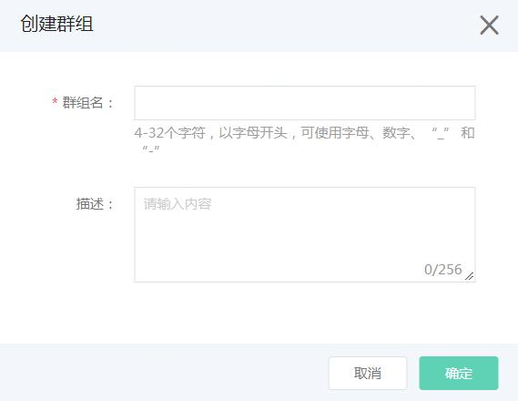
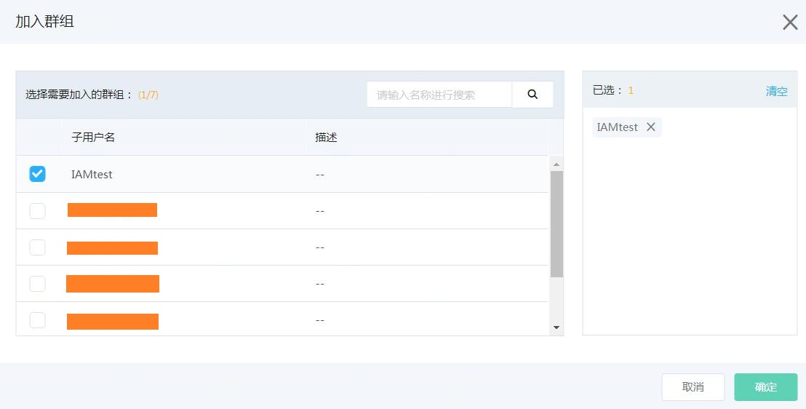
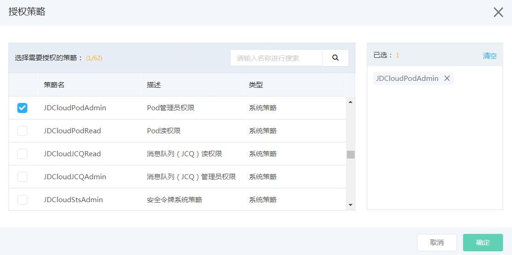

# 什么是群组

群组即子用户组，是一组子用户的集合。利用群组，主账号可以更方便地管理多个权限相同的子用户，也可以通过将子用户加入或移出群组，来变更用户的权限。

本文介绍了如何创建或删除群组、在群组中管理子账号，以及如何管理群组的权限。

## 创建群组

登录京东云控制台，进入访问控制 > 群组管理，点击【创建】按钮，在创建群组窗口填写群组信息：

## 给群组添加子用户

访问群组列表，点击【添加组员】按钮，可快捷的为群组添加相应的子用户

## 给群组授予策略

访问群组列表，点击【授权】按钮，可快捷的授予群组相应的策略。

