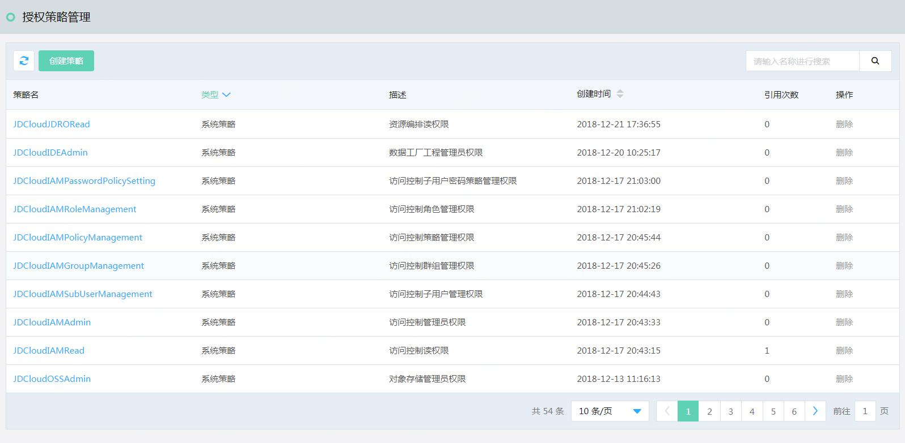
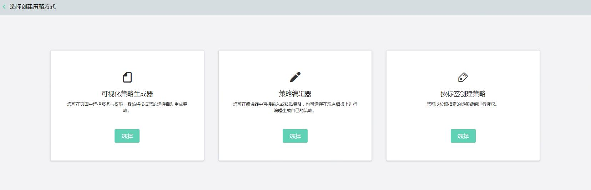
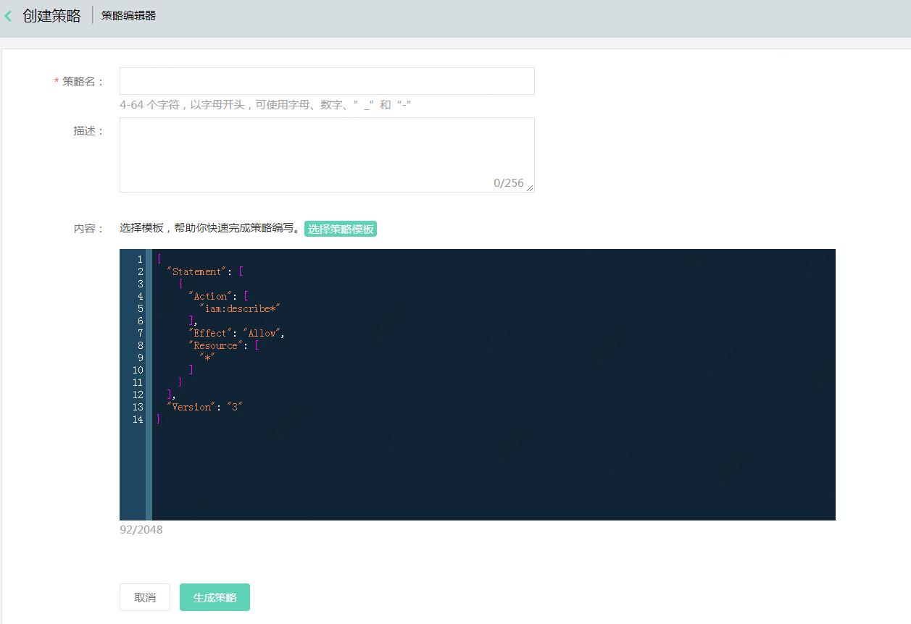
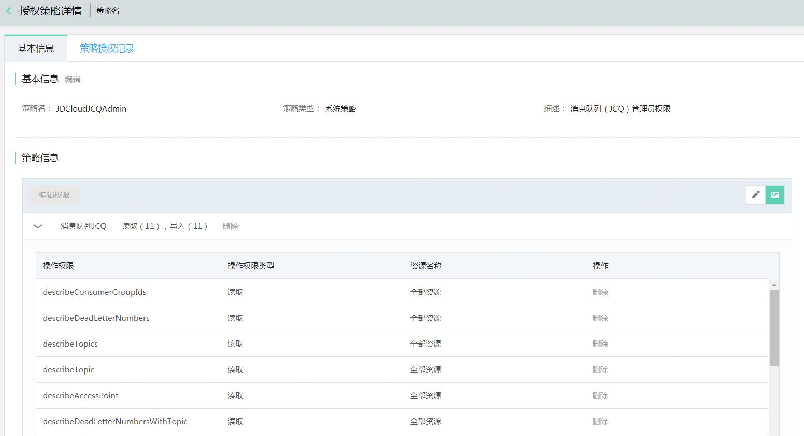
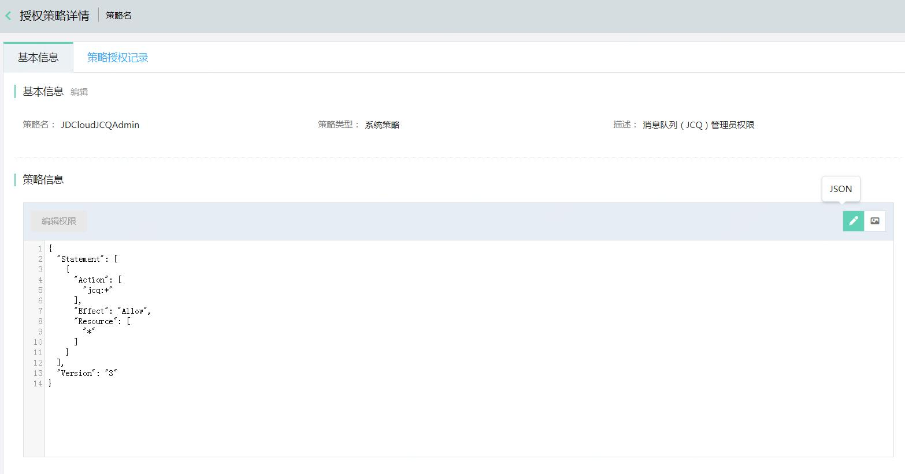
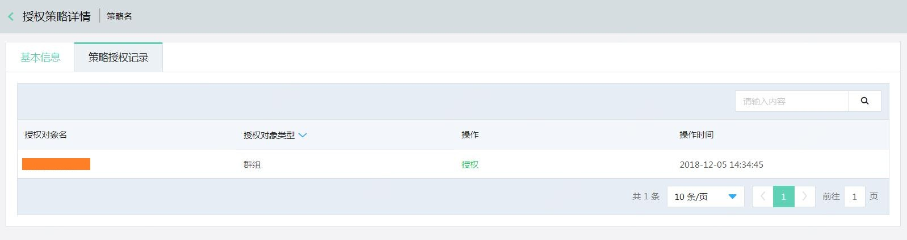

# 什么是策略

授权策略是定义一条或多条权限的 JSON 文档，撰写策略需要遵循 JSON 语法规范。通过给子用户，群组，角色授予策略，来控制子用户，群组和角色对京东云资源的访问权限。其中子用户所拥有的访问权限，是子用户和其所在的群组附加的授权策略的合集。

IAM 支持两种类型的策略：京东云预置的系统策略和用户自行管理的自定义策略。

- 京东云预置的系统策略是产品线接入的时京东云预置好的，不允许用户修改。
- 用户自行管理的自定义策略，用户可以通过自定义策略的方式创建对特定资源（resource）的特定操作（action）的策略，您也可以增加限定条件（condition）来限定源IP，特定访问时间和虚拟MFA认证等。用户可自主编辑，删除自定义策略。

> Condition的功能持续更新中，敬请期待

本文介绍了如何在控制台如何使用策略管理功能。

## 策略列表

登录控制台，进入 访问控制 > 授权策略管理，可以查看所有的系统策略和自定义策略。

> 您也许会发现，策略列表突然新增了一些包含“-v3”的策略名称，这是在产品线接入IAM时，由v2版本切换成v3版本后，策略（Policy）语法发生了变更，为兼容您之前创建策略中所有操作能够生效，系统自动为您创建的策略。例如当您需要给IAM所有用户类型授予京东云管理员权限时，您需要同时授予JDCloudAdmin和JDCloudAdmin-new策略，当您授予京东云只读权限时，您需要同时授予JDCloudRead和JDCloudRead-new两个策略。这部分操作将会持续，直至所有支持v2版本的产品线切换成v3版本。

## 策略创建

在 授权策略管理 列表页面，点击【创建】按钮，支持两种创建自定义策略的方式。第一种是可视化策略生成器，第二种是 JSON 策略编辑器。

### 可视化策略生成器

可视化策略生成器旨在为用户提供更友好，更便利的策略创建的工具，用户可以可视化的方式依次选择产品线，操作，资源等信息，点击确认后将自动为您生成Json格式的策略。

- 输入策略名称和描述。
- 产品线选择（Service Name），更多内容请参考 [支持IAM的云服务](https://docs.jdcloud.com/cn/iam/support-services)
- 选择操作（Action）
- 选择资源（Resource）
- 完成一组产品线，资源和操作的指定后，您可以通过点击添加按钮，直至您完成整个策略。

**V2版本可视化策略创建页面**

**V3版本可视化策略创建页面**

### JSON 策略生成器

在 JSON 策略生成器中，输入策略名称和描述后，您可以直接编写 JSON 策略，也可以先选择一个策略模板，再进行 JSON 文档编辑。

## 策略详情

点击 策略名 或 编辑 按钮，进入策略详情页面。
您可以通过可视化策略和Json策略的方式查看策略的详情，您也可以通过点击编辑策略的方式进行策略内容的变更。

在授权策略记录中，您可以可以看到所有引用该策略的子用户，群组，用户角色和服务角色。

