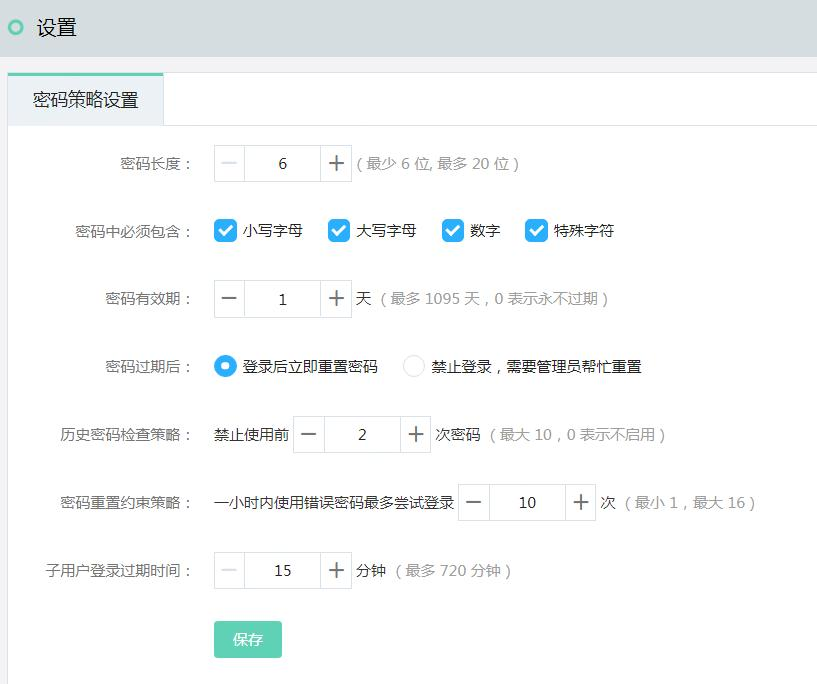

# 设置

## 密码策略设置

密码策略设置旨在为不同的企业提供不同安全等级的子用户管理，您可以根据企业的安全需求为所有子用户设置专属的密码策略。

**密码策略支持设置下述项目：**

- 密码长度：支持6-20位，*默认8位*。
- 密码中必须包含：支持大写字母，小写字母，数字，特殊字符（- & _），*默认大写字母，小写字母和数字*。
- 密码有效期：支持0-1095天，0表示永不过期，*默认90天*。
- 密码过期后：支持“登录后立即重置密码”、“禁止登录，需要管理员帮忙重置” 两个选项，*默认“登录后立即重置密码”*
- 历史密码检查策略：支持设置0-10次，表示不能跟前0-10次设置的密码一致，0表示不启用该项验证，*默认不能跟前3次设置的密码一致*
- 密码重置约束策略：支持一小时内能够尝试输入1到16次密码而不被锁定，*默认一小时内能够尝试输入4次密码*
- 子用户登录过期时间：支持15分钟到720分钟，*默认120分钟*

