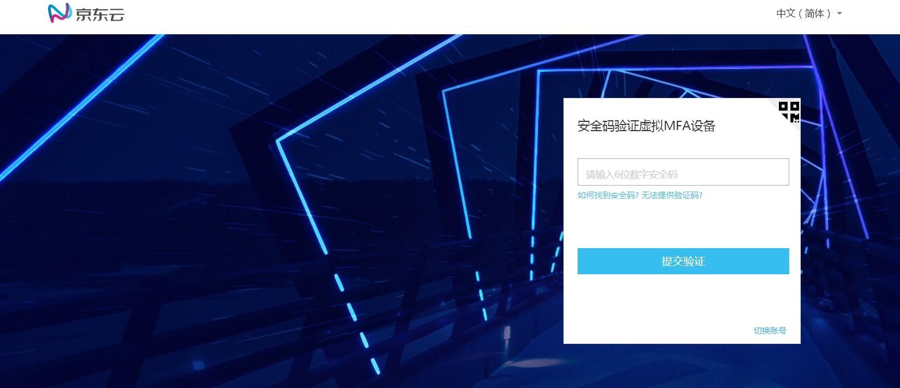
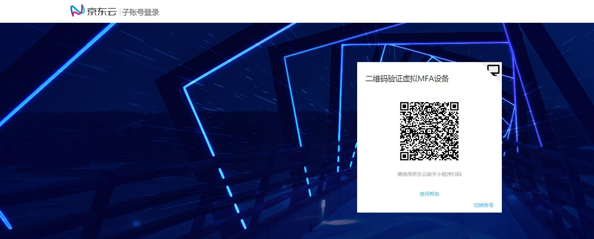
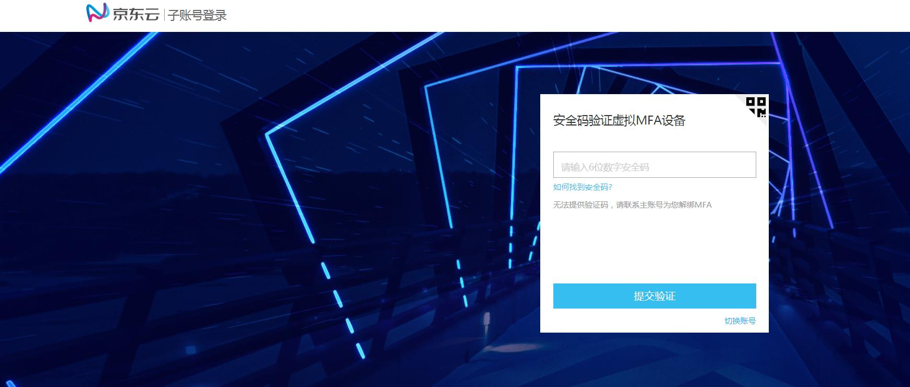

# 登录验证

登录保护是指当您绑定了虚拟MFA设备，在您进行登录操作的时候，除了输入用户名和密码，还需要输入虚拟MFA设备产生的动态验证码进行二次验证。这样即使用户名和密码丢失，他人也无法登录您的账，能够最大限度地保证您的账号安全。

## 主账号登录二次验证

登录问题请查看链接：[MFA登录验证常见问题](https://docs.jdcloud.com/cn/iam/mfa-faqs)

## 子账号登录二次验证

登录问题请查看链接：[MFA登录验证常见问题](https://docs.jdcloud.com/cn/iam/mfa-faqs)

