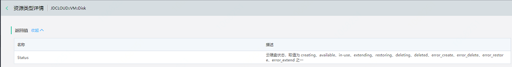
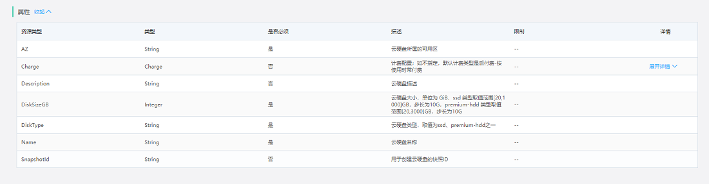

# 资源类型

　　资源类型是京东云资源编排服务可以支持的资源类型的列表，包含云主机、云硬盘、私有网络、负载均衡、云数据库RDS等。 
 
　　打开控制台,选择管理-资源编排-资源类型,在该页面可以查看展示支持编排的资源类型列表。

## 支持的资源类型列表

| 资源类型 | 描述 | 
|:-----|:-----|
| JDCLOUD::VM::Instance | 创建云主机实例 |
| JDCLOUD::VM::Disk | 创建云硬盘 |
| JDCLOUD::VM::AttachDisk | 将已有硬盘挂载到运行中的实例 | 
| JDCLOUD::VPC::VPC | 创建VPC |
| JDCLOUD::VPC::Subnet | 在VPC中创建子网 | 
| JDCLOUD::VPC::SecurityGroup | 安全组 |
| JDCLOUD::VPC::AssociateSecurityGroup | 绑定安全组 | 
| JDCLOUD::VPC::ElasticIp | 弹性公网IP |
| JDCLOUD::VPC::AssociateElasticIp | 将弹性 IP 地址与实例关联|
| JDCLOUD::LoadBalance::LoadBalancer | 创建负载均衡 |
| JDCLOUD::LoadBalance::Listener | 创建监听 |
| JDCLOUD::LoadBalance::TargetGroup | 创建目标组 |
| JDCLOUD::LoadBalance::Backend | 创建后端服务 | 
| JDCLOUD::LoadBalance::RegisterTargets| 实例注册到LB |
| JDCLOUD::RDS::DBInstance | 创建云数据库实例 |

　　表1 资源编排服务支持的资源类型 
## 资源类型详述
### 云主机
#### 云主机Userdata 使用指南

创建云主机过程中，如果需要使用云主机的Userdata功能，同时监控传入的Userdata脚本执行结果，用户可以使用资源编排提供的 JDCLOUD::ResourceOrchestration::WaitConditionHandle 和 JDCLOUD::ResourceOrchestration::WaitCondition。 

##### 资源编排Userdata Linux 脚本示例

```
     "Userdata": {
        "Fn::Base64": {
          "Fn::Join": [
            "",
            [
              "#!/bin/bash \n",
              " Region=",
              {
                "Ref": "JDCLOUD::Region"
              },
              "\n",
              " wget jdro-userdata-${Region}.s3.${Region}.jcloudcs.com/signal.py -O /tmp/signal.py  \n",
              " chmod +x /tmp/signal.py \n",
              " #user code begin \n",


    	  " #add your userdata scripts  here"


              " # user code end \n",
              "/tmp/signal.py --exit-code $? ",
              {
                "Ref": "MyWaitConditionHandle"
              },
              " \n "
            ]
          ]
        }
      }

```

##### 资源编排Userdata Windows 脚本示例

```
     "Userdata": {
        "Fn::Base64": {
          "Fn::Join": [
            "",
            [
               " <powershell> \n",
               " $Region=\"",
               {
                "Ref": "JDCLOUD::Region"
               },
               "\"\n",
               " $client = new-object System.Net.WebClient \n",
               " $OSSAdress = \"http://jdro-userdata-$Region.s3.$Region.jcloudcs.com/signal.exe\" \n",
               " $client.DownloadFile($OSSAdress, 'C:\\WINDOWS\\system32\\signal.exe') \n",

               " $useraction = \"hello world\" \n",
               " $useraction > C:\\jdro.txt \n",

               " jdro-signal  ",
               "       --success ",	" true ",
               {
                   "Ref":"MyWaitConditionHandle"
               },
               "  >> C:\\jdro.log \n ",
               " </powershell> \n"
            ]
          ]
        }
      }

```

   用户可以在Userdata脚本内下载资源编排提供的signal脚本，Linux平台下为python脚本，Windows平台下为signal.exe 。不同地域的脚本是独立部署的，请参考上面的示例。

   建议用户在Userdata末尾执行signal脚本向资源编排服务器端发送脚本执行结果。JDCLOUD::ResourceOrchestration::WaitCondition 资源可以监听到执行结果，如果执行结果成功，该资源会显示创建成功，否则显示创建失败。


##### signal脚本使用说明

   signal脚本参数格式如下：

```
    		Usage: signal.py   \[options\]  \[WaitConditionHandle URL\]

    		Options:
     			-s SUCCESS, --success=SUCCES  

    						[optional] If true, signal success to jdro; if false, signal failure. Default: true 
     			-i ID, --id=ID        [optional]  An unique ID to send with the signal
     			-e EXIT_CODE, --exit-code=EXIT_CODE [optional]  Derive success or failure from specified exit code

```

   WaitConditionHandle URL 由资源 JDCLOUD::ResourceOrchestration::WaitConditionHandle 返回。

```
      	{
                   "Ref": "MyWaitConditionHandle"
        }
```

##### 注意事项  

默认情况下，同一台云主机向资源编排服务端发送多次信号时，只有一次结果会被接收，其余结果会被拒绝。
如果用户通过自定义ID （例如使用随机数），导致多次发送结果使用不同的ID，多次结果都会被接收，从而有可能导致资源创建结果异常。


  
## 查看资源类型详情

您可通过控制台，选择“管理-资源编排-资源类型”，进入资源类型列表页面，选择列表中某一个资源类型，点击操作列的“查看详情”按钮，查看资源类型详情。

- 返回值：指代该资源类型返回的相关信息；展示“名称”和“描述”信息。 

- 属性：指代在模板中定义该资源时，需要指定的属性信息；列表展示“名称”、“类型”、“是否必须”、“描述”和“详情”。

### 返回值

　　资源类型详情页面为用户提供了查询资源类型返回的相关信息。 
  
　　如下图所示，以 JDCLOUD::VM::Disk 为例，它的返回值名称是Status，描述为云硬盘状态，取值为 creating、available、in-use、extending、restoring、deleting、deleted、error_create、error_delete、error_restore、error_extend 之一。
  


### 属性

　　资源类型详情页面为用户提供了在资源编排模板中定义该资源时，需要指定的属性信息。
  
　　如下图所示，以 JDCLOUD::VM::Disk 为例，如AZ、Charge、Description等等。




