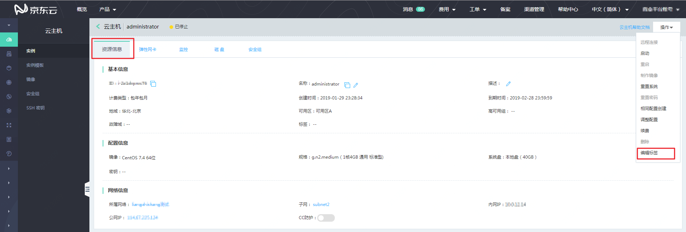
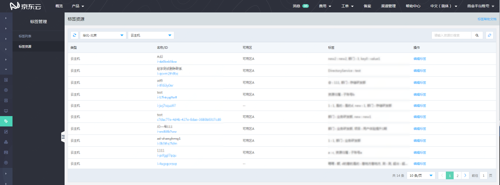
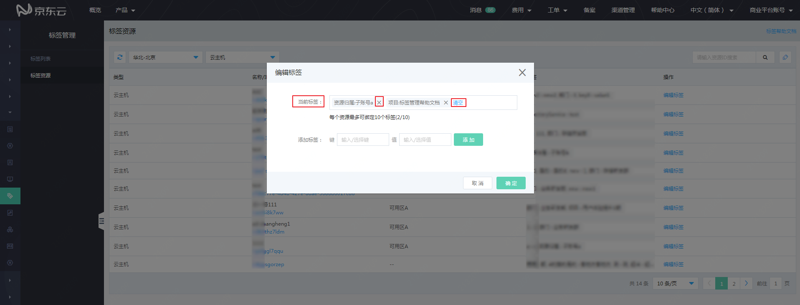
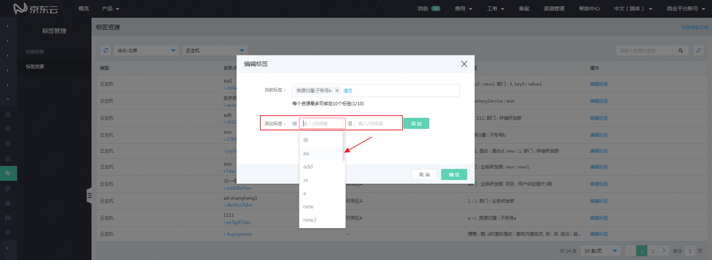
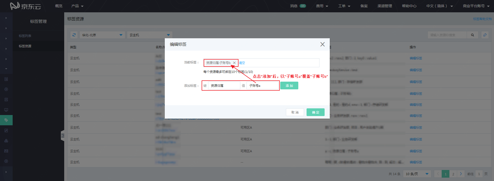

# 标签编辑

1. 在支持标签的产品的列表页，资源详情页或控制台菜单中的“管理”à“标签管理” à“标签资源”页面中，均可以对资源进行标签绑定或解绑操作。

                                                

                                                    

                                                          

2. 点击某一资源右侧的“编辑标签”按钮，可在当前页面打开该资源的标签编辑框。在标签编辑框中的所有操作，仅当点击“确定”按钮后，才会提交生效，否则直接点击编辑框右上角的关闭按钮或右下角的“取消”按钮，均不会使标签编辑操作生效。

1）在标签编辑框中，可以看到该资源当前已绑定的标签。在已绑定的标签右侧点击“X”按钮，可取消该标签与这个资源的绑定关系。点击“清空”按钮，则取消当前所有标签与此资源的绑定关系。

2）在“添加标签”右侧的标签“键”和标签“值”中分别输入需要为当前选中资源绑定的标签“键”和“值”，点击“添加”按钮，该标签即被记入“当前标签”中。当鼠标依次点击标签“键”或标签“值”时，可以看到向下展开的下拉框中有当前用户已绑定资源的所有标签“键”及该标签键对应的所有标签“值”，可以直接点击选择所需的选项。注意下拉框有向下的滚动条，超过7条的内容需要向下滚动寻找。

标签键和值有以下限制：

- 每个标签仅包含一个键，和一个值，键和值均不可为空；

- 键和值首尾的空格将被自动过滤，字符中多个空格将合并为1个空格；

- 标签的键和值区分大小写，大小写不同的标签将被作为不同的标签处理；

- 标签“键”最大所支持127个字符，标签值最大支持255个字符，不建议为键或值命名过长，不利于标签的使用和理解；每个资源最多可绑定10个标签（每个不同键的标签计为一个）。

3）在“添加标签”中输入已有的标签“键”，但标签“值”与当前标签不同，点击“添加”按钮后，相当于覆盖当前标签，绑定新的标签。

