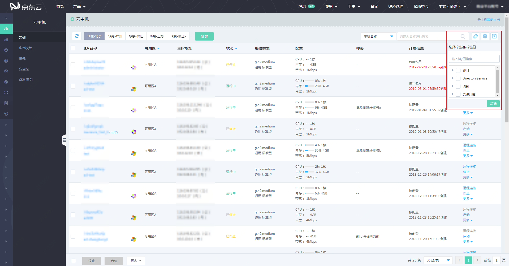
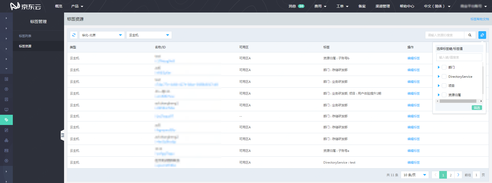
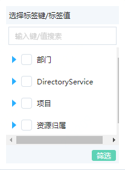
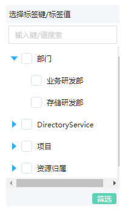
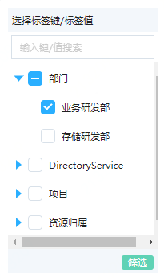
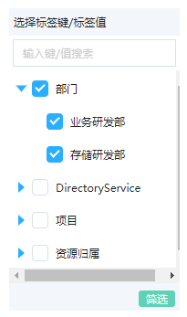
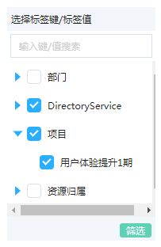
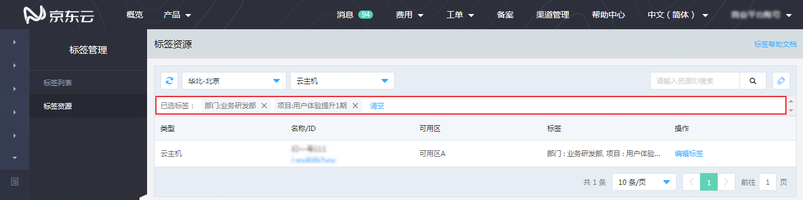

# 标签筛选

在已支持“标签服务”产品的实例列表页面及京东云控制台“标签管理”-“标签资源”页面中，均可以使用标签对资源进行筛选。

 点击列表右上角的标签筛选图标，将展开标签筛选框。

可供筛选的标签以树状形式在筛选框中列出，默认显示标签键，点击标签键前的三角图标，可以展开看到该标签键所对应的标签值。

点击标签值前的多选框，即为选中该标签作为筛选条件；

点击标签键前的多选框，即为选中该标签键下的所有标签作为筛选条件；

 

支持同时选中多个不同标签键的标签。

选择标签后点击“筛选”按钮，即按照所选标签对资源实例进行筛选。筛选结果将出现在列表中。同时，在列表上方会出现包含所选标签筛选条件的提示条。

点击筛选条件标签后的“X”，可以去掉该标签重新对资源实例进行筛选；点击“清空”，将清除所有筛选条件。

同时选择多个标签作为筛选条件时，筛选逻辑如下：

不同标签键的标签在筛选时为“且”的关系，即同时绑定所选中的不同键的标签才符合筛选条件；

相同标签键，不同标签值的标签在筛选时为“或”的关系，即绑定其中任一标签即符合筛选条件。

例如：同时有“部门：业务研发部”、“部门：存储研发部”、“项目：基础平台项目”三个标签被选中，则符合筛选条件的资源应为：

同时绑定“部门：业务研发部”标签和“项目：基础平台项目”标签，或同时绑定“部门：存储研发部”标签和“项目：基础平台项目”标签。
