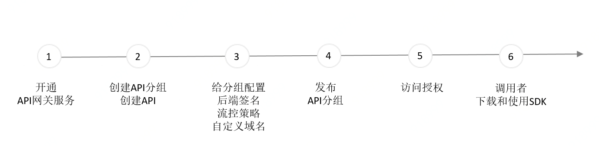

# 入门指南概述

京东云API 网关提供了API的全生命周期管理、流控策略、访问授权、后端签名和API调用情况监控等服务。用户可通过API网关实现自身系统集成和服务聚合，还能便捷安全地开放其业务功能和数据。您可在控制台依次完成以下步骤完成开放API服务：
 

## 前提条件
- 已注册京东云账号，并完成实名认证。如果还没有账号请 [注册](https://accounts.jdcloud.com/p/regPage?source=jdcloud)。

## 操作步骤
###  第1步: 开通API网关服务
目前产品处于公测期间，请公测：在API网关产品页点击申请公测，之后经过运营人员审批加入公测名单，用户会收到已开通的通知（邮件或短信），之后可进入控制台开始使用，服务在菜单互联网中间件下，API网关。

###  第2步: 创建API分组，创建分组下的API
#### 创建API分组

1. 登录 [API网关 控制台](https://apigateway-console.jdcloud.com/apiGroupList)。

2. 在“API分组管理”页面，点击 **新建API分组** ，进入“创建”页面。

3. 填写分组信息后，点击确定，即新建分组。当首次新建时，系统会自动将其保存为版本号为0.0.1的版本。后续可在版本管理中进行多版本维护。

####  创建分组下的API

API 分组创建完成您就可以创建 API 了，创建 API 是定义 API 请求的过程。您需要在创建中依次定义以下内容：

- API 的基本信息：地域、API 名称、子路径、描述等。

- API 请求：查询参数、请求体类型、请求体格式、响应体类型、响应体格式等。

###  第3步:  给分组配置后端签名、流控策略、绑定自定义域名

- 给分组配置后端签名。

- 给分组配置流控策略。

- 给分组绑定自定义域名，该项为可选项。API网关基于 API分组，来绑定域名。API网关通过域名来定位到一个唯一的 API分组，再通过Path+HTTPMethod 确定唯一的 API。

###  第4步: 发布API分组到环境上

在 **API分组管理**页，通过 **发布**操作，将API分组发布到环境。

发布过程中，可选择需要发布的环境（测试、预发、线上），选择要发布的版本，配置后端地址，然后点击发布，即可将分组发布到环境中。

###  第5步: 给API调用者授权访问

- 授权访问

当API提供者通过授权访问方式提供API调用时，API调用者需要先创建一个用于调用API的访问密钥，并将密钥提供给API提供者进行分组的授权绑定。之后API调用者才能使用下载的SDK包。

- 免鉴权访问

当API提供者通过免鉴权方式提供API调用时，API调用者可直接通过下载的SDK进行访问。

###  第6步: API调用者下载和使用SDK包

- 快速上手
	- [快速发布和调用一个API应用](../Getting-Started/example_console.md)

