# 使用签名密钥的方式构建API


## 步骤一: 创建API分组-创建API-发布：

以下过程将指导您完成在API网关控制台中创建API，使用签名密钥的方式授权并进行API调用的过程。


### 1. 登录API网关控制台，打开[API分组管理](https://apigateway-console.jdcloud.com/apiGroupList)。

### 2. 点击“创建分组”按钮。


### 3. 跳转新建API分组页面后，填写API分组信息。


### 4. 点击确定，提示创建成功，在弹出窗口中选择“管理API”，跳转到此分组的API列表界面。


### 5. 您可以通过以下两种方式部署API。

（1）新建API：点击“新建API”按钮，在详情页配置API的“名称”、“子路径”、“查询参数”、“请求体格式”和“正常返回格式”后，点击确定，由此成功新建一个API。如果需要生成SDK，则需要定义请求体格式和正常返回格式。如果不需要SDK，请求体格式和正常返回格式部分留空即可。

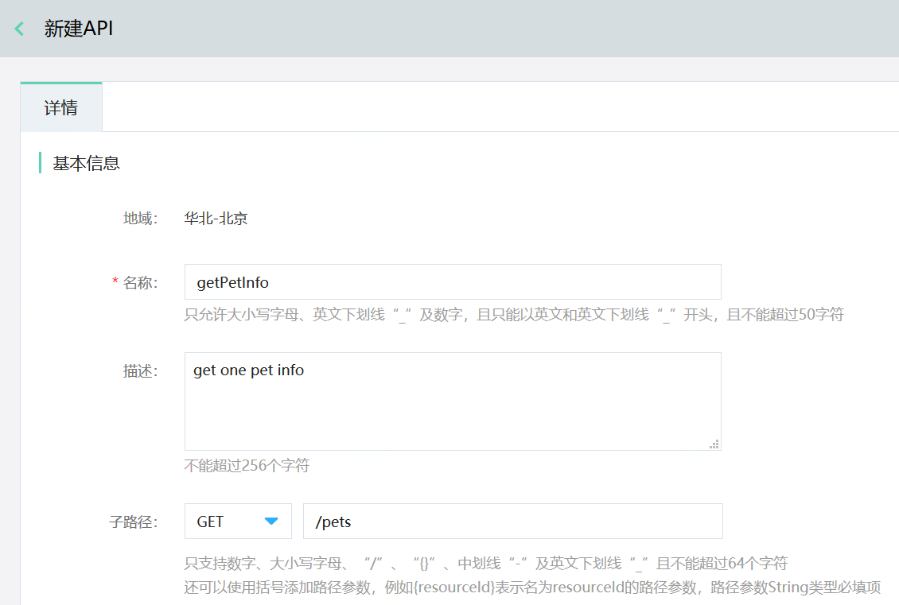

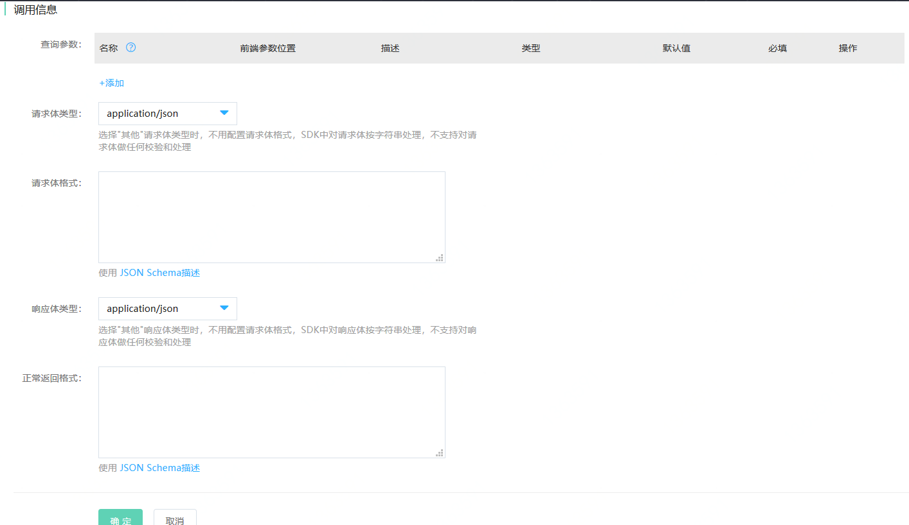

（2）导入API：点击导入API，上传符合swagger2.0规范的yaml文件，点击确定，API列表界面会显示yaml文件中设定的API。([Yaml文件下载地址](https://apigateway.s3.cn-north-1.jdcloud-oss.com/demo/demo_PetStoreTest_Yaml.zip))


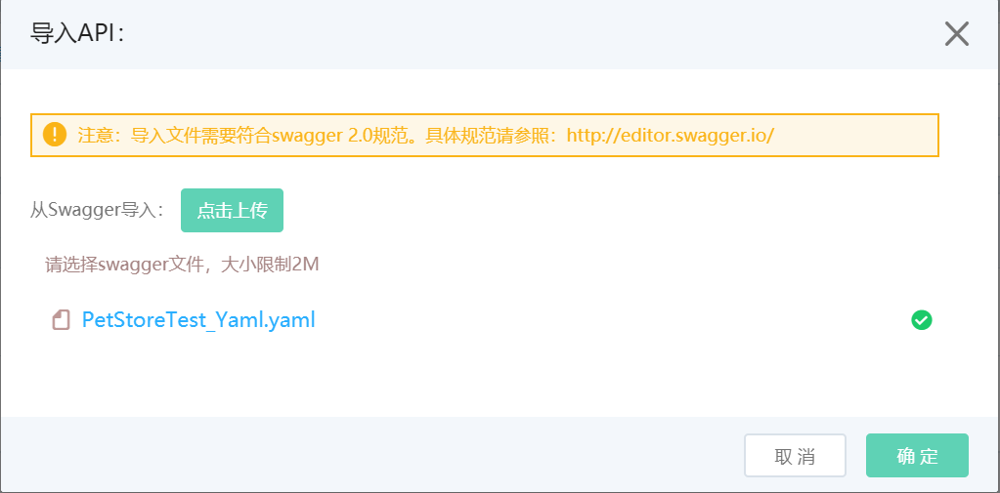

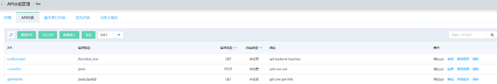


### 6. 点击“版本修订列表”标签页，点击发布，配置好如下几项后，点击确定。

- 发布版本：0.0.1；
- 发布为：线上；
- 后端服务：唯一后端；
- 后端服务地址：http://petstore-demo-endpoint.execute-api.com 。

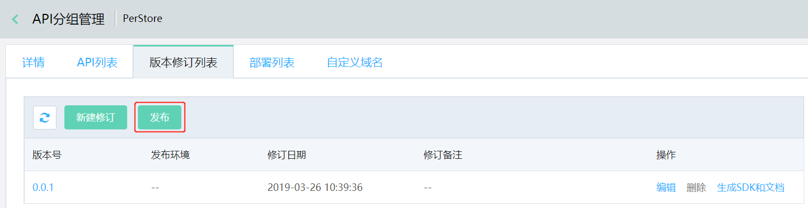

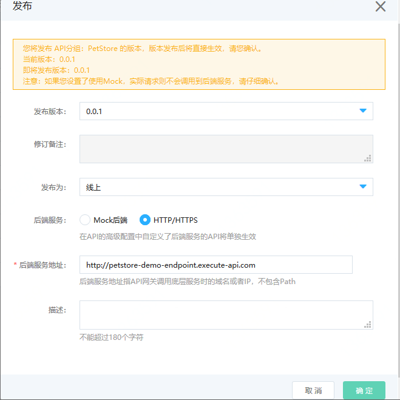

### 7.  发布成功后，点击“生成SDK和文档”，可下载JavaSDK、PythonSDK和API文档。

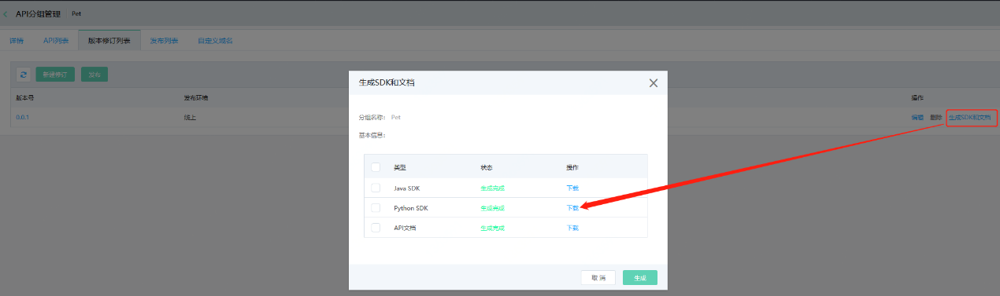


## 步骤二: 获取密钥-创建访问授权-绑定分组：

### 1. 打开[签名密钥](https://apigateway-console.jdcloud.com/accessSecretKey)，点击“创建密钥”按钮。

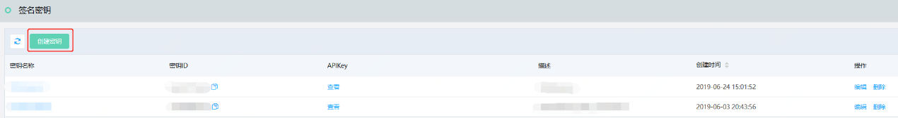

### 2. 填写名称和描述（选填），点击确定。

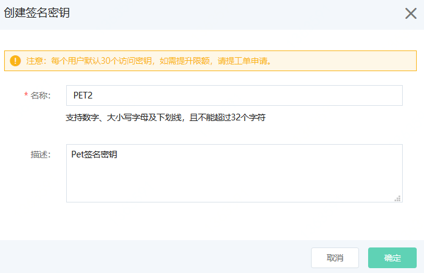

### 3. 打开[访问授权](https://apigateway-console.jdcloud.com/authorizationList)，点击“创建授权”，选择授权类型为“API网关签名密钥”。您可从现有的API网关签名密钥列表中选择目标密钥，并对API分组进行授权。当不同的授权类型访问同一个API分组时，API网关将在API调用过程中优先验证“订阅密钥”类型的授权信息。

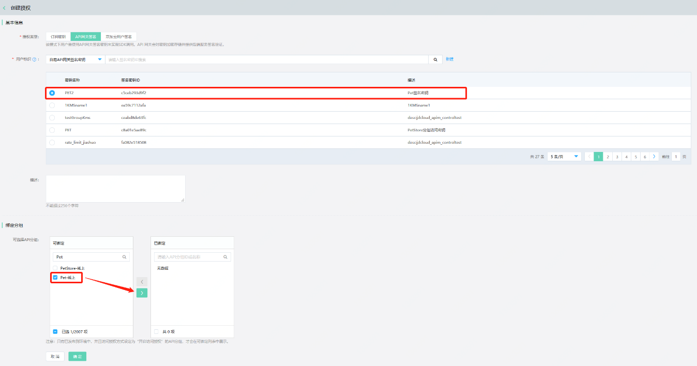
    
    
至此，在API网关控制台的界面操作已经完成，接下来可以对API进行调用。
    
    
## 步骤三:调用API

### （1）通过Java SDK调用

#### 1.	解压下载的Java SDK。

#### 2.	切换到PetStore目录下，编辑Demo.java文件。([项目下载地址](https://apigateway.s3.cn-north-1.jdcloud-oss.com/demo/demo_PetStoreTest_javaSDK_jdcloud.zip))

- accessKeyId为查看密钥详细信息时的APIKey；
- secretAccessKey为查看密钥详细信息时的APISecret；
- 根据发布时选择的环境，选择对应的环境地址；
- 其余为API的调用。
   
 ```Java
package net.jdcloud.PetStore;

import com.jdcloud.sdk.auth.CredentialsProvider;
import com.jdcloud.sdk.auth.StaticCredentialsProvider;
import com.jdcloud.sdk.client.Environment;
import com.jdcloud.sdk.http.HttpRequestConfig;
import com.jdcloud.sdk.http.Protocol;
import net.jdcloud.PetStore.client.PetStoreClient;
import net.jdcloud.PetStore.model.*;

import java.math.BigDecimal;

/**
 * Demo
 */
public class Demo {

    private static String accessKeyId = "";
    private static String secretKey = "";
    private static CredentialsProvider credentialsProvider = new StaticCredentialsProvider(accessKeyId, secretKey);
    private static PetStoreClient client = PetStoreClient.builder()
            .credentialsProvider(credentialsProvider)
            .httpRequestConfig(new HttpRequestConfig.Builder().connectionTimeout(10000).protocol(Protocol.HTTPS).build())
//                .environment(new Environment.Builder().endpoint("xue0ivjzhif3-test.cn-north-1.jdcloud-api.net").build()) // 测试环境地址
//                .environment(new Environment.Builder().endpoint("xue0ivjzhif3-preview.cn-north-1.jdcloud-api.net").build()) // 预发环境地址
            .environment(new Environment.Builder().endpoint("xue0ivjzhif3.cn-north-1.jdcloud-api.net").build()) // 线上环境地址
            .build();

    public static void main (String[] args){

        GetPetInfoRequest getPetInfoRequest = new GetPetInfoRequest();
        getPetInfoRequest.setPetId(1);
        GetPetInfoResponse getPetInfoResponse = client.getPetInfo(getPetInfoRequest);
        System.out.println(getPetInfoResponse.getResult());

        CreatePetRequest createPetRequest = new CreatePetRequest();
        net.jdcloud.PetStore.model.createpet.Body createpetBody = new net.jdcloud.PetStore.model.createpet.Body();
        createpetBody.setId(1);
        createpetBody.setPrice(BigDecimal.valueOf(12.3));
        createpetBody.setType("cat");
        createPetRequest.setBody(createpetBody);
        CreatePetResponse createPetResponse = client.createPet(createPetRequest);
        System.out.println(createPetResponse.getResult());

    }
}
```
#### 3.	运行SDKTest.java，得到返回结果。

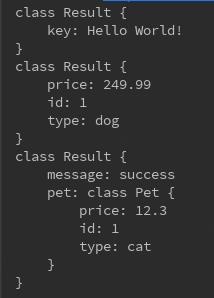


### （2）通过Python SDK调用

#### 1.	解压下载的Python SDK，执行setup.py文件。

#### 2.	切换到PetStore目录下，新建PetStoreTest.py文件。([项目下载地址](https://apigateway.s3.cn-north-1.jdcloud-oss.com/demo/demo_PetStoreTest_pythonSDK_jdcloud.zip))

```Python
# coding=utf-8

from jdcloud_apim_sdk.core.credential import Credential
from jdcloud_apim_sdk.core.config import Config
from jdcloud_apim_sdk.core.const import SCHEME_HTTPS, SCHEME_HTTP
from client.PetStore_client import *
from apis.get_pet_info_request import *
from apis.create_pet_request import *
from apis.test_function_request import *


if __name__ == "__main__":
    access_key = ''
    secret_key = ''
    credential = Credential(access_key, secret_key)
    # config = Config('xueki79b37y4-test.cn-north-1.jdcloud-api.net', scheme=SCHEME_HTTPS) # 测试环境地址
    # config = Config('xueki79b37y4-preview.cn-north-1.jdcloud-api.net', scheme=SCHEME_HTTPS) # 预发环境地址
    config = Config('xueki79b37y4.cn-north-1.jdcloud-api.net', scheme=SCHEME_HTTPS)  # 线上环境地址
    client = PetStoreClient(credential, config)

    parameters = dict()
    body = ''
    header = dict()

    get_pet_info_request = GetPetInfoRequest(parameters= {"petId": 1}, body=body, header=header)
    GetPetInfo_response = client.send(get_pet_info_request)
    print(GetPetInfo_response)

    create_pet_request = CreatePetRequest(parameters=parameters, body={"id":1, "price": 12, "type": "cat"}, header=header)
    CreatePet_response = client.send(create_pet_request)
    print(CreatePet_response)
```

#### 3.	运行PetStoreTest.py，得到返回结果。

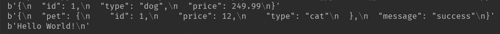


### 您可以通过[API网关监控](http://cms-console-north-2a-backup.jdcloud.com/monitor/apigateway)实时获取您的API调用情况：成功数、流量、响应时间、请求异常等信息以及设置异常情况报警。
