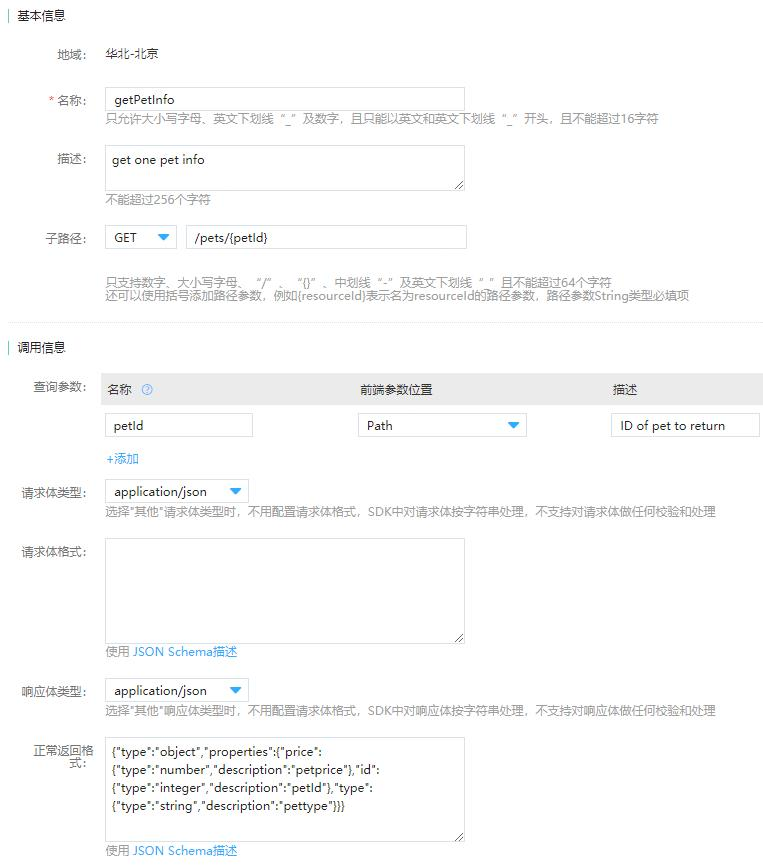
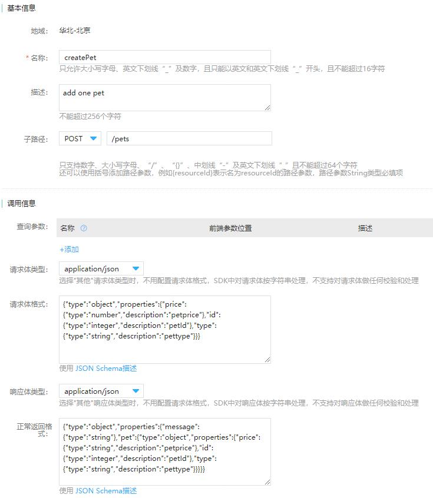
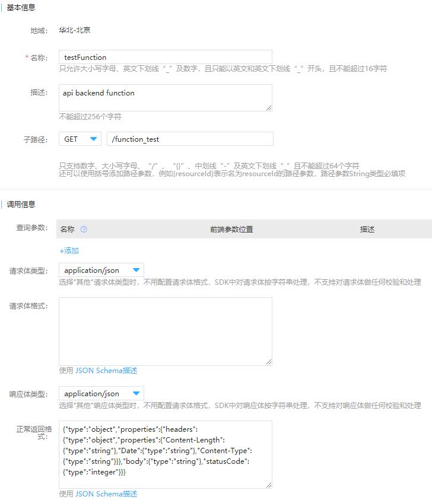
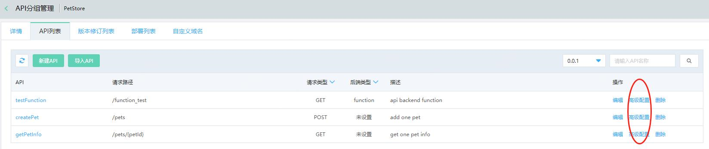
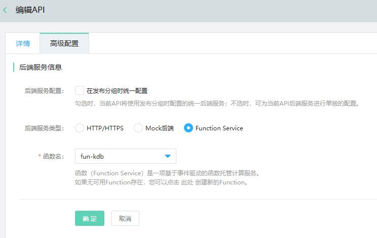
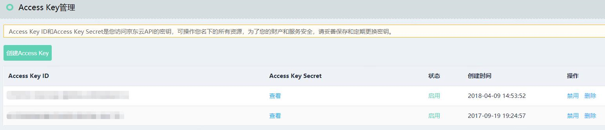
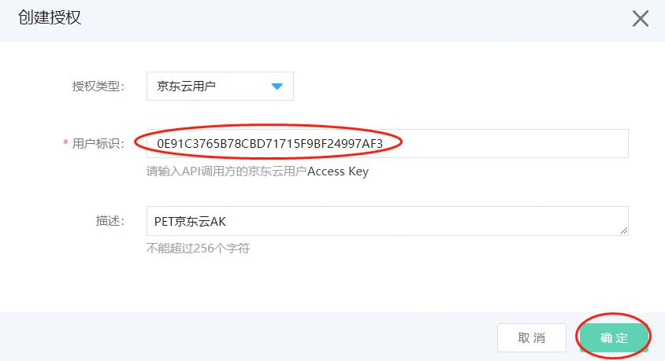

# 在控制台中使用示例构建API

为了帮助您开始使用基本工作流程来构建并测试API网关API，您可以使用京东云控制台API网关来创建并测试与 PetStore 网站进行 HTTP 集成的简单 API。API 定义预配置为Swagger 2.0文件。在将 API 定义加载到API网关中后，您可以使用API网关控制台来检查 API 的基本结构或直接部署并测试API。

示例 API支持使用以下方法来访问 HTTP 后端网站http://petstore-demo-endpoint.execute-api.com/petstore/pets 。

- GET /pets/{petId}：用于对指定为传入请求 URL 的路径变量的 petId 值标识的宠物进行读取访问。后端会返回在 PetStore 中找到的指定宠物。后端服务地址是 http://petstore-demo-endpoint.execute-api.com/petstore/pets/n ，其中n是一个用作所查询宠物的标识符的整数。

- POST /pets：用于对已与后端 /petstore/pets 资源集成的 API /pets 资源进行写入访问。收到正确请求后，后端会将指定的宠物添加到PetStore中并将结果返回给调用方。后端服务地址是 http://petstore-demo-endpoint.execute-api.com 。

## 在 API 网关控制台中根据示例创建一个 API 并进行测试

以下过程将指导您完成在API网关控制台中创建API并通过SDK进行测试。

### 创建API分组-创建API-发布：

#### 1.	登录API网关控制台，打开[API分组管理](https://apigateway-console.jdcloud.com/apiGroupList)。

#### 2.	点击创建分组。


#### 3.	跳转新建API分组页面后，填写API分组信息。


#### 4. 点击确定，提示创建成功，在弹出窗口中选择“管理API”，跳转到此分组的API列表界面。


#### 5.	您可以通过以下两种方式部署API。

- 新建API：点击新建API，配置API的“名称”、“子路径”、“查询参数”、“请求体格式”和“正常返回格式”后，点击确定.







- 导入API：点击导入API，上传符合swagger2.0规范的yaml文件，点击确定，API列表界面会显示yaml文件中设定的API。（[Yaml文件下载地址](https://docs-downloads.oss.cn-north-1.jcloudcs.com/PetStoreTest_Yaml.zip)）


#### 6. 部署完API后，您可以通过API的高级配置为每个API配置独立的后端地址。





- 后端服务配置： 勾选在发布分组时统一配置时，当前API将使用发布分组时配置的统一后端服务。
- 不勾选在发布分组时统一配置时，可为当前API后端服务进行单独的配置，服务类型如下：

    - HTTP/HTTPS：可为此API配置HTTP/HTTPS类型的后端地址；
    - Mock后端：可为此API配置API网关提供的Mock后端；
    - Function Service：函数（Function Service）是一项基于事件驱动的函数托管计算服务。如果无可用Function存在，您可以访问[函数服务](https://function-console.jdcloud.com)创建新的Function。

#### 7.	点击“版本修订列表”标签页，点击发布，配置好如下几项后，点击确定。

- 发布版本：0.0.1；
- 发布为：线上；
- 后端服务：唯一后端；
- 后端服务地址：http://petstore-demo-endpoint.execute-api.com 。


#### 8.	发布成功后，点击“生成SDK和文档”，可下载JavaSDK、PythonSDK和API文档。


### 获取密钥-创建访问授权-绑定分组：

#### 您可以通过两种方式获取密钥：

- 通过API调用者方式创建访问授权

  - 打开[访问密钥](https://apigateway-console.jdcloud.com/accessSecretKey)，点击创建访问密钥。

    

  - 填写名称和描述（选填），点击确定。

    

  - 点击密钥名，查看此访问密钥的详细信息，拷贝访问密钥ID、APIKey和APISecret。

    

  - 打开[访问授权](https://apigateway-console.jdcloud.com/authorizationList)，点击“创建授权”。

    

  - 选择授权类型为API调用者，填写用户标识（访问密钥的访问密钥ID）和描述（选填），点击确定。

    
    
- 通过京东云用户方式创建访问授权

  - 打开[Access Key管理](https://uc.jdcloud.com/account/accesskey)，点击创建Access Key，手机验证通过后可获取Access Key ID和Access Key Secret。


    

  - 打开[访问授权](https://apigateway-console.jdcloud.com/authorizationList)，点击“创建授权”。

    

  - 选择授权类型为京东云用户，填写用户标识（Access Key ID）和描述（选填），点击确定。

    

#### 点击“绑定”，将创建的PetStore分组移动到已绑定。


至此，在API网关控制台的界面操作已经完成，接下来可以通过SDK进行调用。

### 通过Java SDK调用

#### 1.	解压下载的Java SDK。

#### 2.	切换到PetStore目录下，编辑Demo.java文件。（[项目下载地址](https://apigateway.oss.cn-north-1.jcloudcs.com/demo/PetStoreTest_javaSDK_jdcloud.zip)）

- accessKeyId为查看密钥详细信息时的APIKey；
- secretAccessKey为查看密钥详细信息时的APISecret；
- 其余为API的调用。

```Java
package net.jdcloud.PetStore;

import com.jdcloud.sdk.auth.CredentialsProvider;
import com.jdcloud.sdk.auth.StaticCredentialsProvider;
import com.jdcloud.sdk.client.Environment;
import com.jdcloud.sdk.http.HttpRequestConfig;
import com.jdcloud.sdk.http.Protocol;
import net.jdcloud.PetStore.client.PetStoreClient;
import net.jdcloud.PetStore.model.*;

import java.math.BigDecimal;

/**
 * Demo
 */
public class Demo {

    private static String accessKeyId = "0E91C3765B78CBD71715F9BF24997AF3";
    private static String secretKey = "AF7B13C8010F50F03A52C01458714701";
    private static CredentialsProvider credentialsProvider = new StaticCredentialsProvider(accessKeyId, secretKey);
    private static PetStoreClient client = PetStoreClient.builder()
                .credentialsProvider(credentialsProvider)
                .httpRequestConfig(new HttpRequestConfig.Builder().connectionTimeout(10000).protocol(Protocol.HTTPS).build())
//                .environment(new Environment.Builder().endpoint("xv3xbwah945y-test.cn-north-1.jdcloud-api.net").build()) // 测试环境地址
//                .environment(new Environment.Builder().endpoint("xv3xbwah945y-preview.cn-north-1.jdcloud-api.net").build()) // 预发环境地址
                .environment(new Environment.Builder().endpoint("xv3xbwah945y.cn-north-1.jdcloud-api.net").build()) // 线上环境地址
                .build();

    public static void main (String[] args){
//        GetPetInfo
        GetPetInfoRequest getPetInfoRequest = new GetPetInfoRequest();
        getPetInfoRequest.setPetId(1);
        GetPetInfoResponse getPetInfoResponse = client.getPetInfo(getPetInfoRequest);
        System.out.println(getPetInfoResponse.getGetPetInfoResult());

//        CreatePet
        CreatePetRequest createPetRequest = new CreatePetRequest();
        CreatePetBody CreatePetBody = new CreatePetBody();
        CreatePetBody.setId(1);
        CreatePetBody.setPrice(new BigDecimal(3.3));
        CreatePetBody.setType("dog");
        createPetRequest.setBody(CreatePetBody);
        CreatePetResponse createPetResponse = client.createPet(createPetRequest);
        System.out.println(createPetResponse.getCreatePetResult());

//        TestFunction
        TestFunctionRequest testFunctionRequest = new TestFunctionRequest();
        TestFunctionResponse testFunctionResponse = client.testFunction(testFunctionRequest);
        System.out.println(testFunctionResponse.getTestFunctionResult());

    }
}

```

#### 3.	运行SDKTest.java，得到返回结果。


### 通过Python SDK调用

#### 1.	解压下载的Python SDK，执行setup.py文件。

#### 2.	切换到PetStore目录下，新建PetStoreTest.py文件。（[项目下载地址](https://apigateway.oss.cn-north-1.jcloudcs.com/demo/PetStoreTest_pythonSDK_jdcloud.zip)）

```
# coding=utf8

from jdcloud_sdk.core.credential import Credential
from jdcloud_sdk.core.config import Config
from jdcloud_sdk.core.const import SCHEME_HTTPS
from PetStore.apis.create_pet_request import *
from PetStore.apis.get_pet_info_request import *
from PetStore.apis.test_function_request import *
from PetStore.client.PetStore_client import PetStoreClient
from PetStore.models.create_pet_body import *


class PetStoreTest(object)：

    def __init__(self, access_key, secret_key, end_point)：
        self.access_key = access_key
        self.secret_key = secret_key
        self.end_point = end_point
        self.credential = Credential(self.access_key, self.secret_key)
        self.config = Config(self.end_point, scheme=SCHEME_HTTPS)
        self.client = PetStoreClient(self.credential, self.config)

    def create_pet_test(self)：
        req_body = CreatePetBody(id=1, type="dog", price=12).to_dict()
        parameters = CreatePetParameters()
        request = CreatePetRequest(parameters=parameters, bodyParameters=req_body)
        res = self.client.send(request)
        return res

    def get_pet_info_test(self)：
        parameters = GetPetInfoParameters(petId=1)
        request = GetPetInfoRequest(parameters=parameters, bodyParameters=None)
        res = self.client.send(request)
        return res

    def function_test(self)：
        parameters = TestFunctionParameters()
        request = TestFunctionRequest(parameters=parameters, bodyParameters=None)
        res = self.client.send(request)
        return res


if __name__ == "__main__"：
    # 访问密钥详细信息中的APIKey
    APIKey = "0E91C3765B78CBD71715F9BF24997AF3"
    # 访问密钥详细信息中的APISecert
    APISecert = "AF7B13C8010F50F03A52C01458714701"
    # API分组信息中分组路径去掉前缀的部分
    endpoint = "xv3xbwah945y.cn-north-1.jdcloud-api.net"

    pet_store = PetStoreTest(APIKey, APISecert, endpoint)
    print pet_store.create_pet_test().content
    print pet_store.get_pet_info_test().content
    print pet_store.function_test().content

```

#### 3.	运行PetStoreTest.py，得到返回结果。


### 您可以通过[API网关监控](http://cms-console-north-2a-backup.jdcloud.com/monitor/apigateway)实时获取您的API调用情况：成功数、流量、响应时间、请求异常等信息以及设置异常情况报警。


