# 使用订阅密钥的方式构建API

## 步骤一: 创建API分组-创建API-发布：

以下过程将指导您完成在API网关控制台中创建API，使用订阅密钥的方式授权并进行API调用的过程。

### 1. 登录API网关控制台，打开[API分组管理](https://apigateway-console.jdcloud.com/apiGroupList)。

### 2. 点击“创建分组”按钮

### 3. 跳转新建API分组页面后，填写API分组信息。

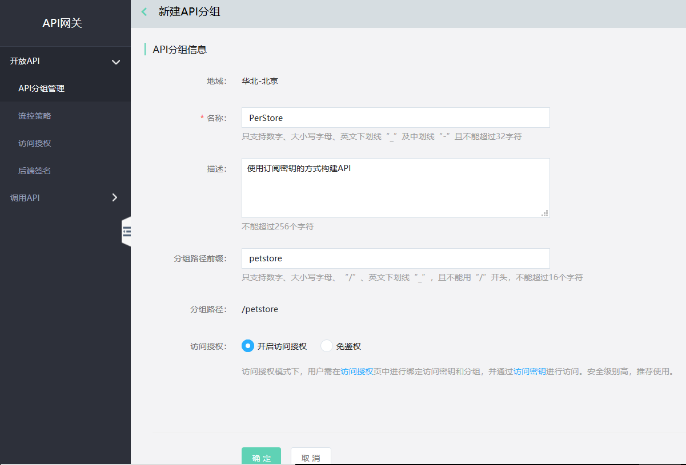

### 4. 点击确定，提示创建成功，在弹出窗口中选择“管理API”，跳转到此分组的API列表界面。

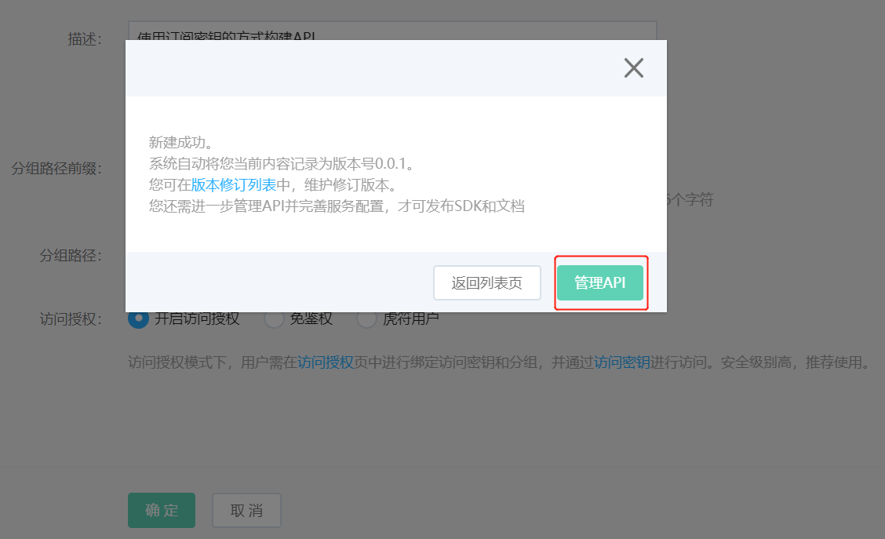

### 5. 您可以通过以下两种方式部署API。

（1）新建API：点击“新建API”按钮，在详情页配置API的“名称”、“子路径”、“查询参数”、“请求体格式”和“正常返回格式”后，点击确定，由此成功新建一个API。如果需要生成SDK，则需要定义请求体格式和正常返回格式。如果不需要SDK，请求体格式和正常返回格式部分留空即可。

（2）导入API：点击导入API，上传符合swagger2.0规范的yaml文件，点击确定，API列表界面会显示yaml文件中设定的API。（[Yaml文件下载地址](https://apigateway.oss.cn-north-1.jcloudcs.com/demo/PetStoreTest_Yaml.zip)）

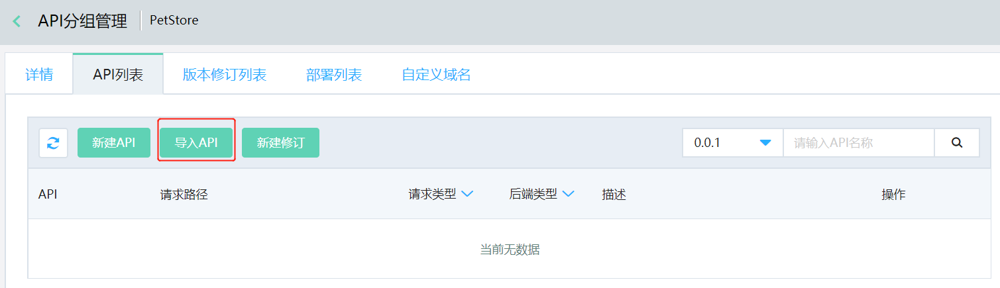

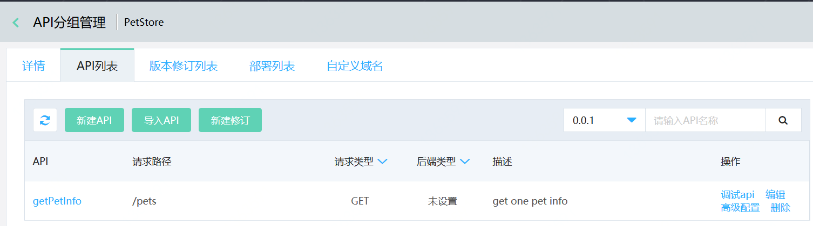

### 6.	点击“版本修订列表”标签页，点击发布，配置好如下几项后，点击确定。

- 发布版本：0.0.1；
- 发布为：线上；
- 后端服务：唯一后端；
- 后端服务地址：http://petstore-demo-endpoint.execute-api.com 。

## 步骤二: 获取密钥-创建访问授权-绑定分组：

1. 打开[订阅密钥](https://apigateway-console.jdcloud.com/subscriptionKey)，点击“创建密钥”按钮。

    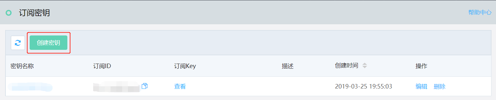

2. 填写名称和描述（选填），点击确定。

    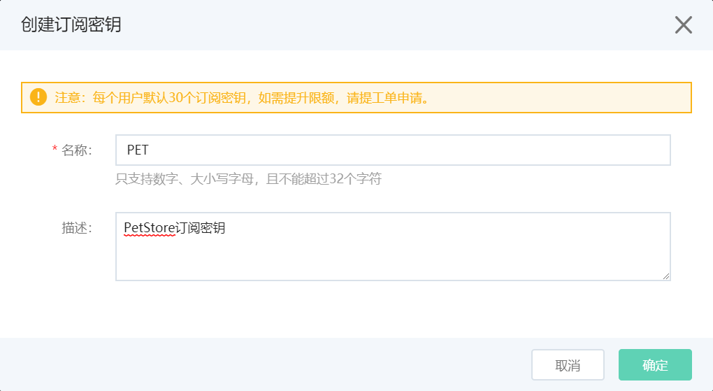

3. 创建成功后，点击密钥名，查看该订阅密钥的详细信息，拷贝订阅密钥ID。

    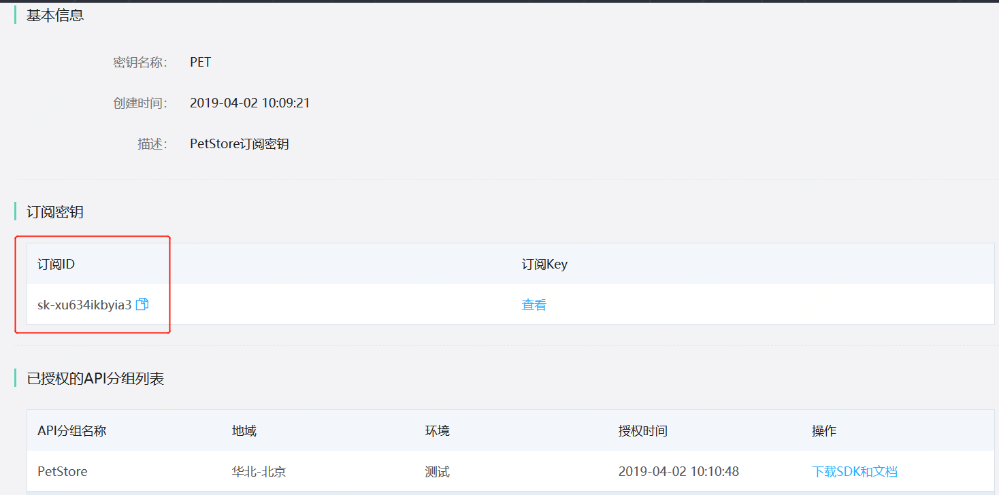

4. 打开[访问授权](https://apigateway-console.jdcloud.com/authorizationList)，点击“创建授权”，选择授权类型为“订阅密钥”。您可从现有的订阅密钥列表中选择目标密钥，并对API分组进行授权。当不同的授权类型访问同一个API分组时，API网关将在API调用过程中优先验证“订阅密钥”类型的授权信息。

    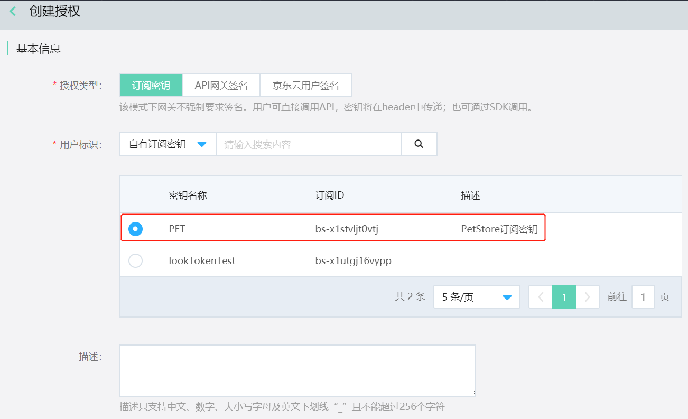

    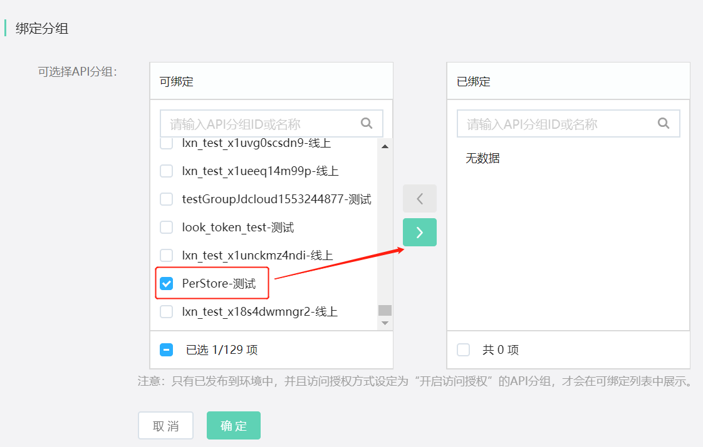
    
至此，在API网关控制台的界面操作已经完成，接下来可以对API进行调用。
    
## 步骤三:调用API
1.	在调用时，请输入使用订阅密钥时必填的header名称：jdcloud-apim-subscription-key
2.	在此，使用postman对API进行调用示例：在postman的Headers部分，在KEY位置输入jdcloud-apim-subscription-key，在VALUE位置输入订阅密钥的Key。
3.	在GET请求部分填写API分组的访问路径与API的请求路径，对API进行调用。

    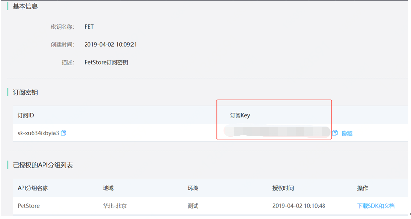

    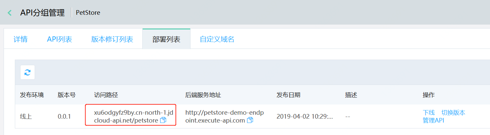
    
    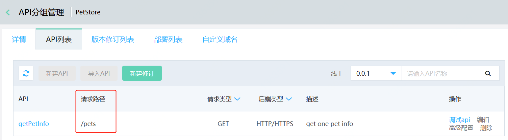
    
    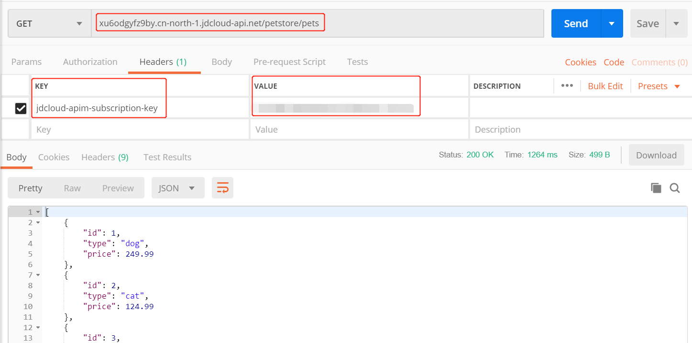

### 您可以通过[API网关监控](http://cms-console-north-2a-backup.jdcloud.com/monitor/apigateway)实时获取您的API调用情况：成功数、流量、响应时间、请求异常等信息以及设置异常情况报警。

