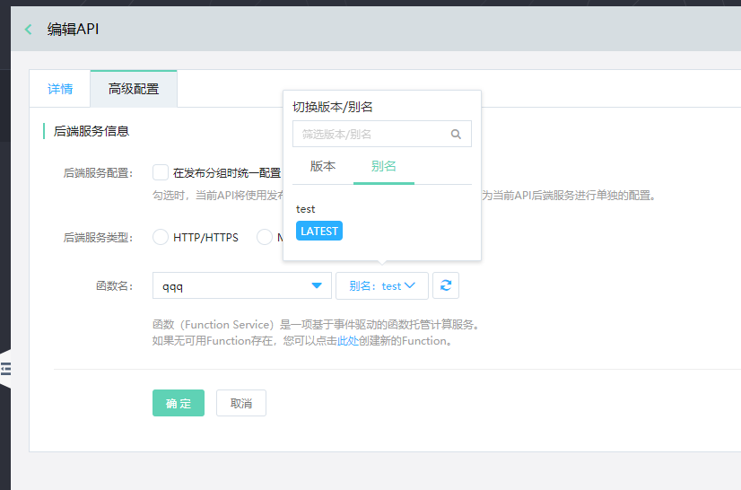
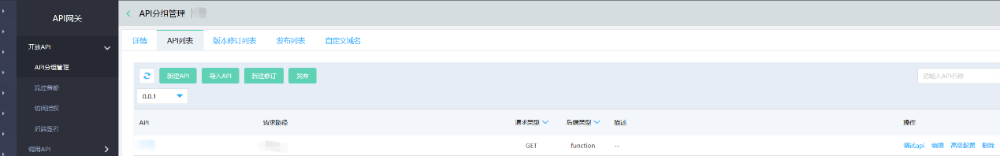

# 函数后端服务

在发布API分组的过程中，高级配置功能为用户提供了给API单独配置函数后端服务的选择。

#### 入口：
互联网中间件>API网关>API分组管理> API列表，选择API并点击操作中的高级配置功能。

##  操作步骤：
在高级配置中，当不勾选“在发布分组时统一配置”时，可选择函数类型的后端服务。使用该类型作为后端时，需先在函数中创建函数，然后在下拉框中找到并选择函数，最后选择此函数对应的版本/别名。当用户不选择版本/别名时，API网关将默认使用LATEST版本。
特殊说明：目前仅支持对单个API配置函数类型后端，不支持对API分组配置函数类型后端。
 
 
 

##  配置规则：
- API分组可以配置的后端服务：HTTP/HTTPS、Mock
- API可以配置的后端服务：HTTP/HTTPS、Mock、函数(Function Service)
- 当某个API分组中所有接口都是同一个后端时，只需给该分组配置后端；当某个API分组中的大部分接口是同一个后端，少数为其他后端时，可以给分组配置数量较多的后端，给其他后端的API单独配置。

