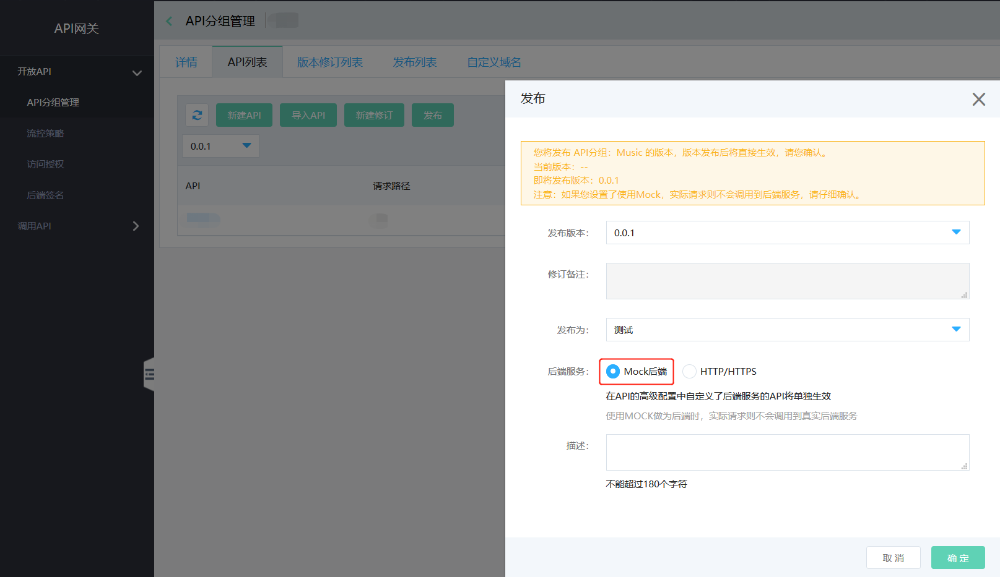
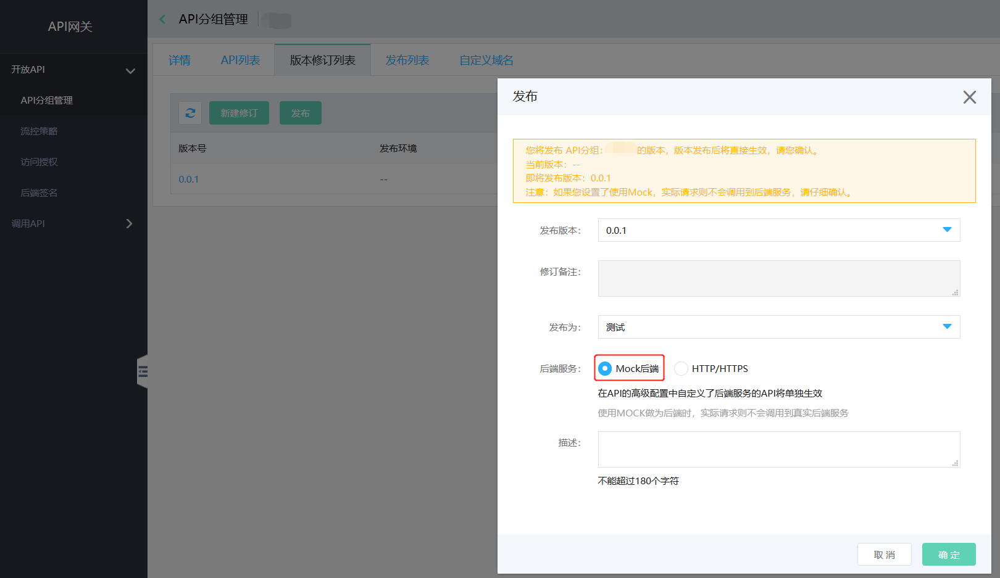
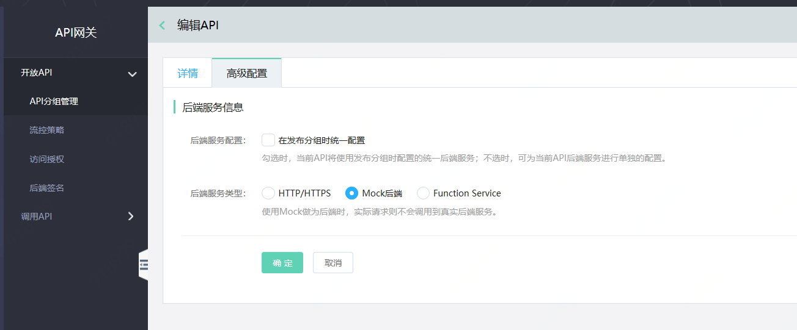

# Mock后端服务

API网关不仅支持在发布API分组的过程中为分组配置统一的后端服务，还在高级配置功能中提供了给API单独配置Mock后端服务的选择。

#### 入口一：
互联网中间件>API网关>API分组管理> API列表>发布

#### 入口二：
互联网中间件>API网关>API分组管理> 版本修订列表>发布

#### 入口三：
互联网中间件>API网关>API分组管理> API列表，选择API并点击操作中的高级配置功能。

##  操作步骤：
- 在API列表页，点击“发布”按钮后，可选择Mock作为后端，实际请求不会调用到真实后端服务。

 
 

- 在版本修订列表页，点击“发布”按钮后，可选择Mock后端服务，实际请求不会调用到真实后端服务。

 
 
 
- 在高级配置中，当不勾选“在发布分组时统一配置”时，可选择Mock后端服务类型，使用Mock作为后端时，实际请求不会调用到真实后端服务。

 

##  配置规则：
- API分组可以配置的后端服务：HTTP/HTTPS、Mock
- API可以配置的后端服务：HTTP/HTTPS、Mock、函数(Function Service)
- 当某个API分组中所有接口都是同一个后端时，只需给该分组配置后端；当某个API分组中的大部分接口是同一个后端，少数为其他后端时，可以给分组配置数量较多的后端，给其他后端的API单独配置。
