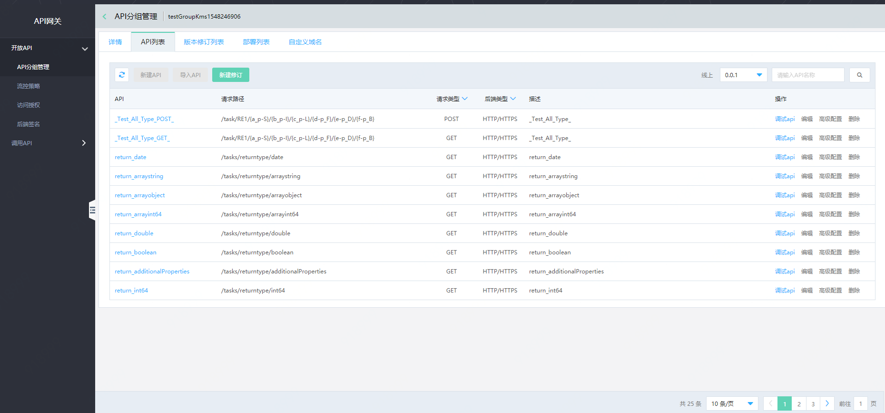
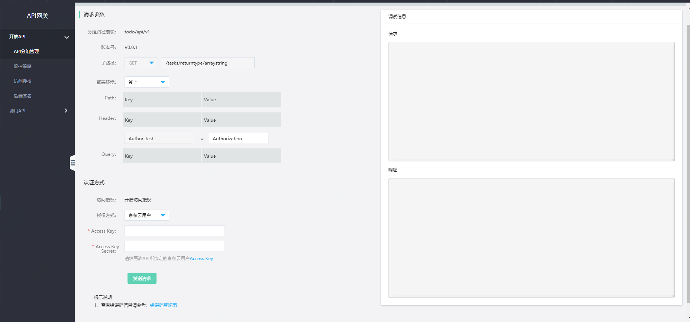

# 调试API

在您在配置完 API 后，可在API调试页中 发起模拟 API 调用，验证API的正确性。

#### 入口

互联网中间件>API网关>API分组管理>管理API，选择API并点击操作中的调试API功能。

####   说明：
目前调试页面可用于调试免鉴权类型API、或已部署的API。

- 如果您的API尚未部署发布，请先进行发布，否则将影响调试结果。

- 如果您的API已部署，若访问授权类型属于免鉴权模式，可直接使用；若属于开启访问授权模式，需先进行授权绑定，才能进行调试。

##  操作步骤：
###  第1步：进入API管理页

首先选择API分组，点击管理API菜单，进入API列表页。然后选择要进行调试的API，并点击操作中的调试API功能。
 

###  第2步：进入API调试页
 

信息项说明：

- 分组路径前缀：为您在定义API分组时，录入的分组路径前缀。

- 版本号：API分组支持多版本操作。同一分组的不同版本，可部署到不同的环境中。此处展示的版本号，为当前调试的API所属的API分组的版本号。

- 子路径：定义API时定义的子路径信息。

- Path参数：定义API时所定义的参数。默认填充默认值；若配置了参数必填，则在测试前会检查必填。

- Header参数：定义API时所定义的参数。默认填充默认值；若配置了参数必填，则在测试前会检查必填。

- Query参数：定义API时所定义的参数。默认填充默认值；若配置了参数必填，则在测试前会检查必填。

- Body 参数：若请求方法定义了POST、PUT、PATCH，则需您自行填写 Body 参数。

- 认证方式为免鉴权：若访问授权类型属于免鉴权模式，可直接调试；

- 认证方式为开启访问授权：您需先对分组进行授权绑定。绑定时若用的API调用者鉴权，则输入APIKey/APISecret；若用的京东云用户鉴权，则输入京东云用户AK/SK。

