# 日志服务

目前您可以在京东云的API分组管理中，实现日志实时采集、日志存储，日志检索，智能分析等功能，并通过日志解决业务运营，业务监控，日志分析等问题。

#### 入口一：

互联网中间件 > API网关 > 开放API > API分组管理 > 日志服务

#### 入口二：

管理 > 日志服务

##  操作步骤：
###  第1步：进入API分组管理页，点击“日志”按钮

 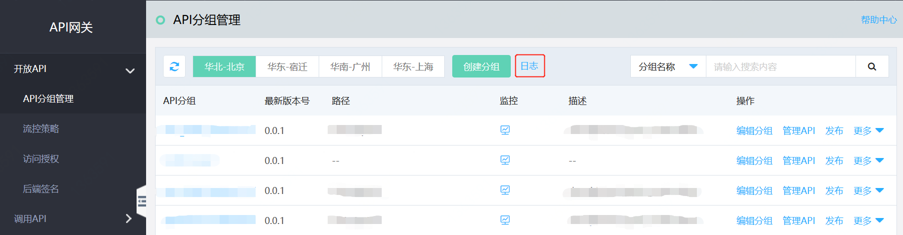

###  第2步：在[日志集管理](https://logs-console.jdcloud.com/logset/list)模块，通过点击“创建日志集”按钮，打开创建日志集页面。

 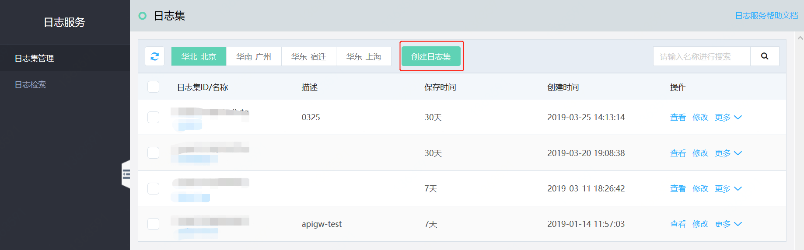
 

###  第3步：设置日志集名称、描述（非必填）及保存时间。点击“确定”按钮后，弹出提示“日志集创建成功，立即去添加日志主题？”

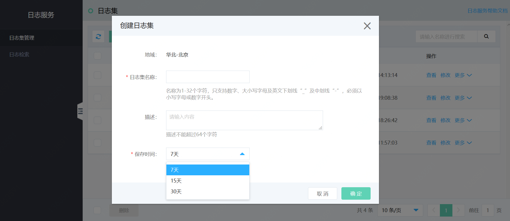

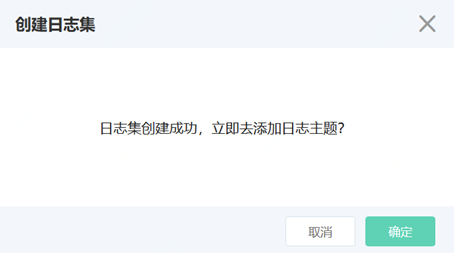

###  第4步：点击“确定”按钮后，跳转至日志集详情，可创建日志主题。

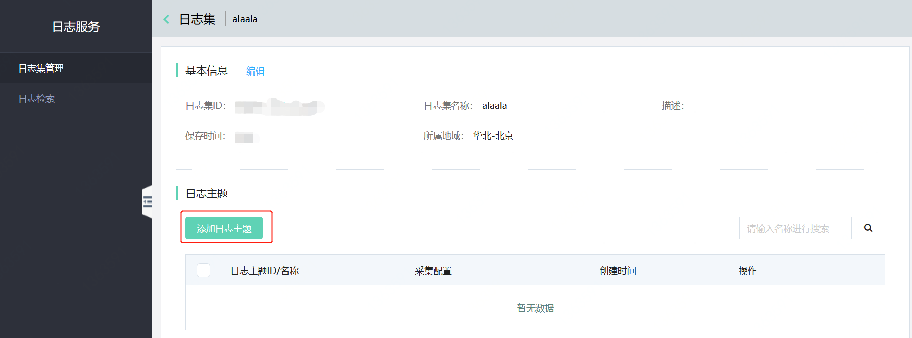
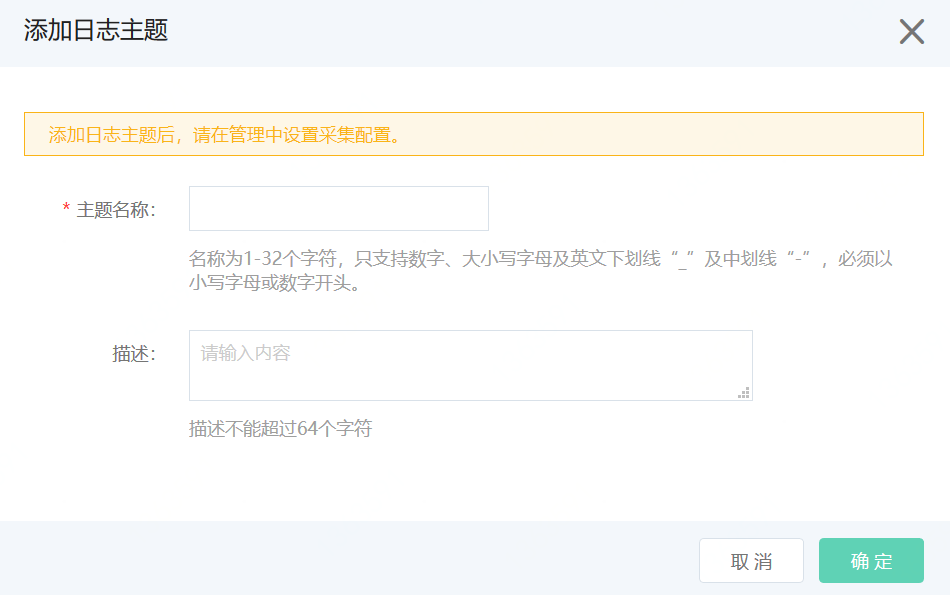

###  第5步：添加日志主题名称后，点击“确定“按钮，弹出提示“日志主题创建成功，立即去添加采集配置？”
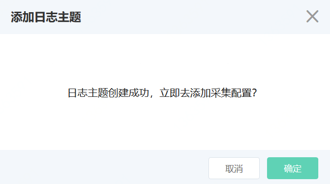

###  第6步：点击“确定”后，进入采集配置页面。点击“添加采集配置”，进入添加采集配置页面，并在“所属产品”对应选项中选择“API网关”，点击“确定”按钮完成配置。
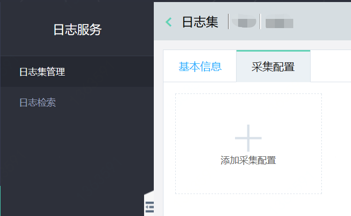
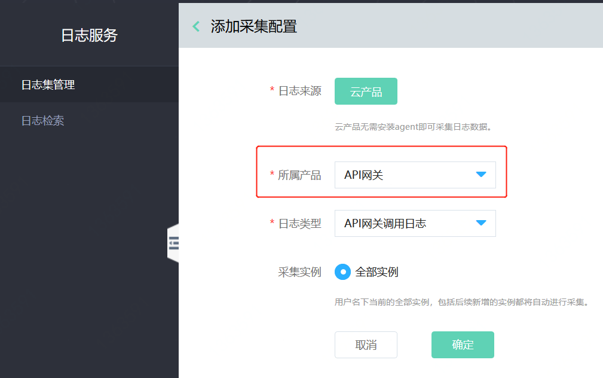
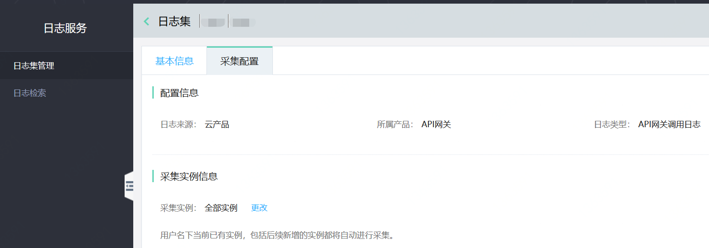

###  第7步：返回至日志集管理中的日志主题列表页面，点击日志集ID/名称，点击“预览”按钮，即可查看到该日志主题之下最新的日志数据。若需要查询日志数据，可到[日志检索](https://logs-console.jdcloud.com/search)查询。
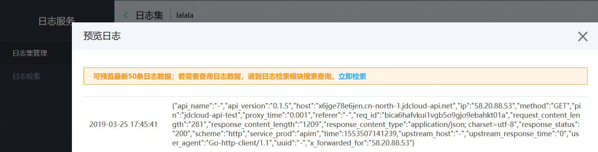

###  第8步：在日志主题列表选中要查看的日志主题，点击“检索”按钮，或者在左侧菜单切换至[日志检索](https://logs-console.jdcloud.com/search)模块，可对日志进行相应的全文检索或键值检索：
1. 全文检索
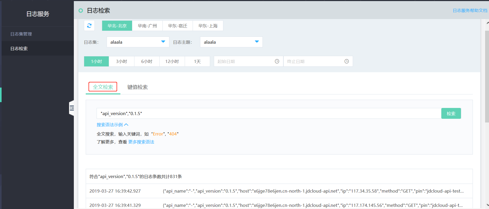

2. 键值检索

（1）快捷检索
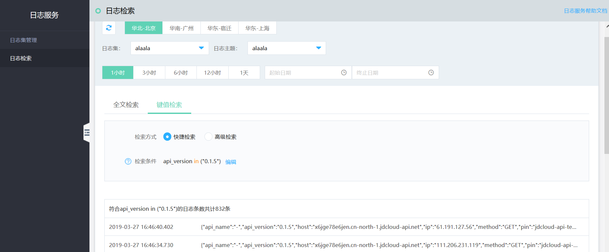

（2）高级检索
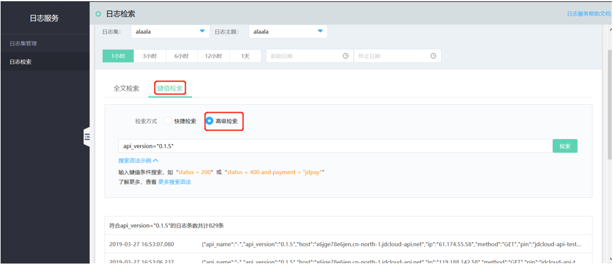

