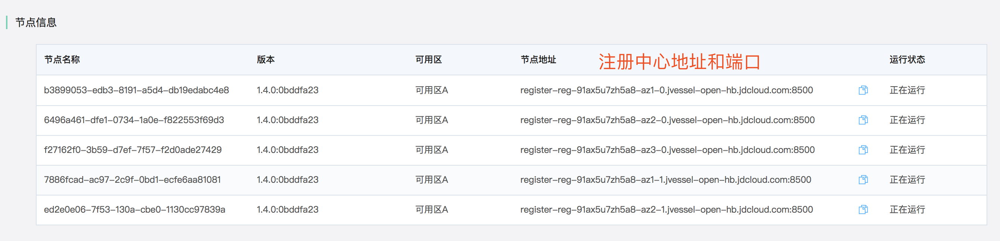
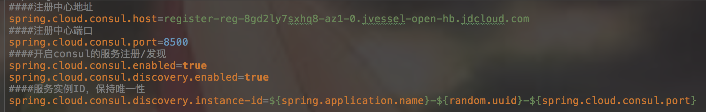
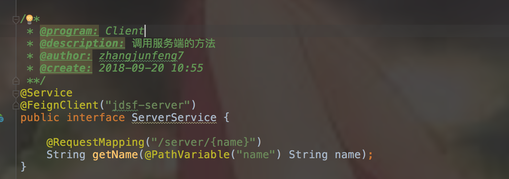
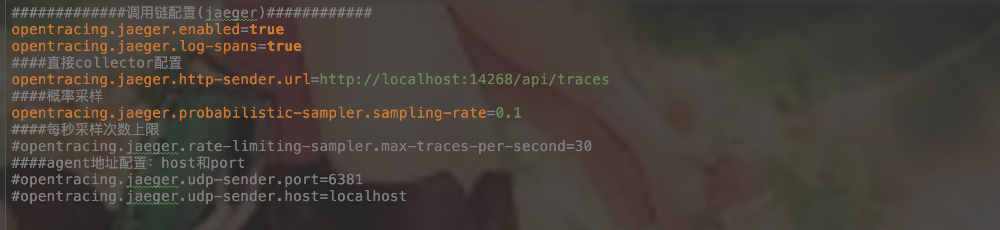
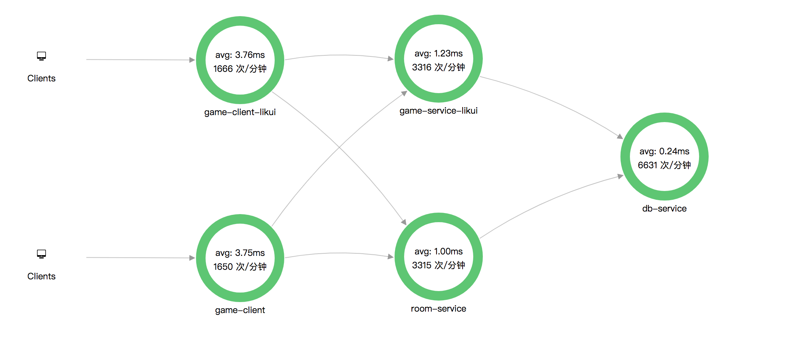
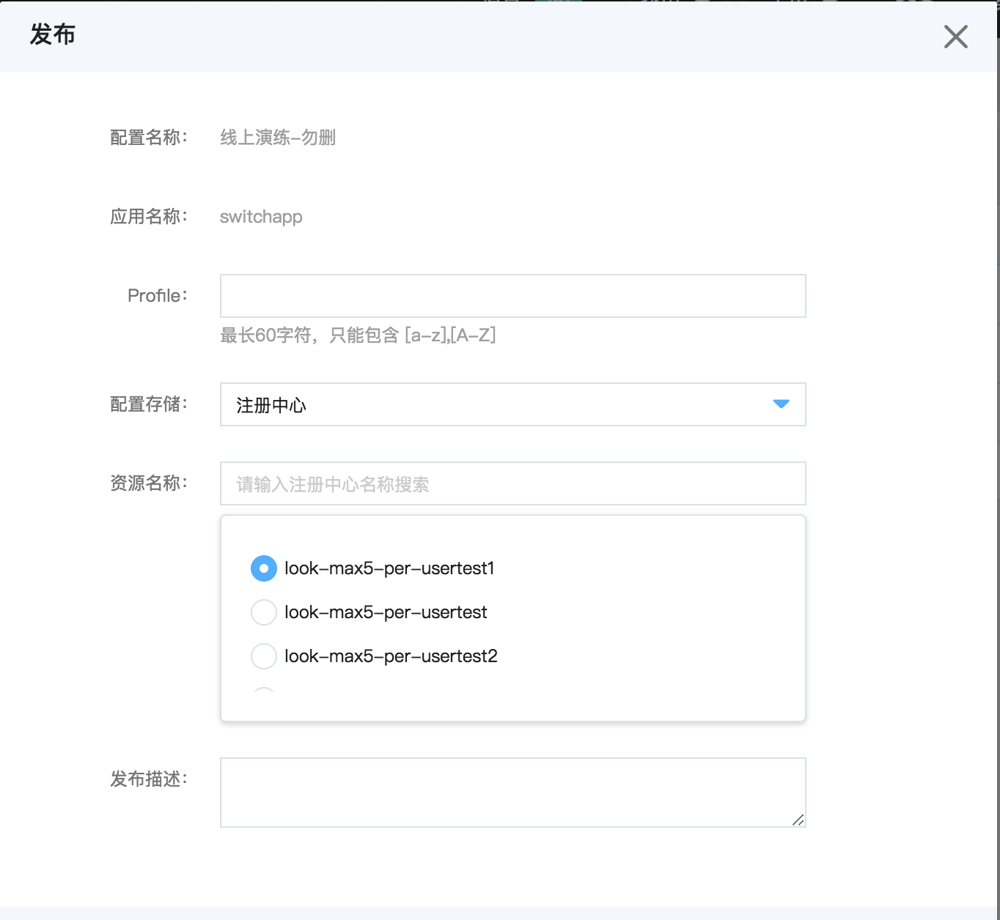
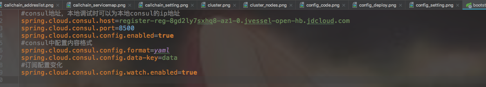
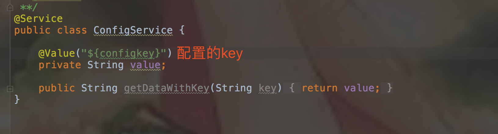

# 入门示例

目前，我们已经提供如下语言的入门示例：

-   Python ：[示例项目下载地址](https://github.com/jdcloud-cmw/jdsf-demo-python)

-   Dotnet：[示例项目下载地址](https://github.com/jdcloud-cmw/jdsf-demo-dotnet)

-   Spring Cloud：[示例项目下载地址](https://github.com/jdcloud-cmw/jdsf-demo-springcloud)

-   Spring Cloud + K8S：[示例项目下载地址](https://github.com/jdcloud-cmw/jdsf-demo-springcloud-kubernetes)

-   Dubbo：[示例项目下载地址](https://github.com/jdcloud-cmw/jdsf-demo-dubbo)

-   Go ：[示例项目下载地址](https://github.com/jdcloud-cmw/jdsf-demo-go)

下面以Spring Cloud应用接入为例说明调用方式。

# 环境准备

1. 要求jdk版本1.8以上； 
2. 下载示例项目：[示例项目下载地址](https://github.com/jdcloud-cmw/jdsf-demo-springcloud) 
3. 本Demo为idea项目，构建工具为maven。如果您的环境也是idea+maven，那么可以直接下载使用。否则请按照自己的工具和环境来创建项目； 

# 项目结构

### 1.工程目录
|- client  
|- server  
|- pom.xml  
其中client表示服务调用者;  
server表示服务提供者； 
pom.xml中定义了项目需要的依赖包 

### 2.依赖定义
pom文件中分不同需求定义了不同的配置项，每个配置项都加上了注释，可以根据自己的需要设置你自己的配置。

# POM说明
### 1.parent项
parent配置表示我们配置哪个项目作为本项目的父项目，配置好之后就能从父项目继承一些配置信息了。 
本项目继承于springcloud2.0，方便基于springcloud2.0的各种扩展管理和开发。
### 2.dependencies项
引入项目开发中需要的具体依赖，根据需要来增加、删除依赖项目。 
本项目中主要引入了服务注册/发现依赖、监控（探活）依赖、服务调用依赖、负载均衡依赖、配置中心依赖、调用链依赖——jaeger和zipkin，用户根据自己项目的需要来修改。
### 3.dependencyManagement项
使用dependencyManagement可以统一管理项目的版本号，确保应用的各个项目的依赖和版本一致，不用每个模块项目都弄一个版本号，不利于管理，当需要变更版本号的时候只需要在父类容器里更新，不需要任何一个子项目的修改；如果某个子项目需要另外一个特殊的版本号时，只需要在自己的模块dependencies中声明一个版本号即可。子类就会使用子类声明的版本号，不继承于父类版本号。

# 配置及使用说明
## 1.注册中心
用户根据自己的服务实例数创建集群后，点击注册中心列表后的【集群信息】，在集群信息页面的"节点信息"部分的"节点地址"就是注册中心地址。如下图： 
 
分别修改示例程序server和client目录下的配置文件(src/main/resources/application.properties)的spring.cloud.consul.host配置和使用方式如下图： 
 
开启服务注册和发现只需要在项目启动类上加上@EnableDiscoveryClient和@EnableFeignClients注解即可。@EnableDiscoveryClient注解是开启服务注册和发现，@EnableFeignClients注解是立即激活FeignClients，利用以下方式进行服务调用： 
 
其中的("jdsf-server")就是要调用的服务端项目名称。

## 2.调用链
用户根据调用链写入TPS数据创建调用链集群，然后点击【集群名称】进入调用链详情页，在集群详情页下方的"调用链地址"就显示了调用链提供的各个协议的地址和端口。如下图： 
 
分别修改示例程序server和client目录下的配置文件(src/main/resources/application.properties)的opentracing.jaeger.http-sender.url配置，注意示例中需要使用HTTP协议的地址。使用方式如下图： 
 
访问用户的服务并成功写入调用数据以后，点击调用链列表后的【依赖图谱】，会分析服务间的调用关系。结果如下图所示： 
 
然后点击具体的服务名称节点，可以进入到每个服务的调用统计页面以及可以查看具体的一条调用信息。

## 3.配置中心
用户根据自己的业务创建需要的配置项和配置内容，然后发布到存储中——目前仅支持存储到注册中心中。如下图： 
 
发布成功以后，分别修改示例程序server和client目录下的配置文件(src/main/resources/bootstrap.properties)的spring.cloud.consul.host等配置中心地址、端口等信息。如下图： 
 
然后用户在代码中以下方式使用——@Value方式： 
 
注：@ConfigurationProperties方式请参照代码CloudConfig类。

# 部署
将名为server和client的两个示例程序部署在注册中心和调用链服务所在VPC和子网，运行后，即可以看到服务注册数据和调用链数据。
