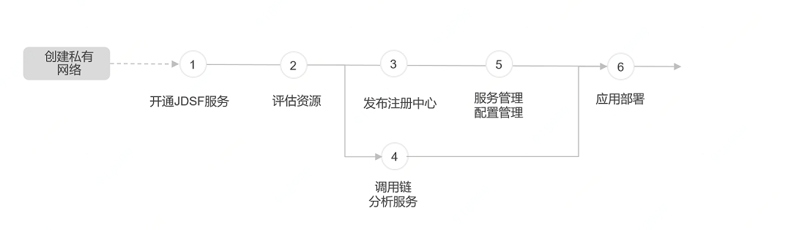

# 服务使用概述

京东云微服务平台已经提供的功能包括以下：注册中心、服务管理、调用链分析服务、配置管理。 控制台使用流程如下：
 

**说明：**

-   创建微服务组件时会占用用户VPC子网中的内网IP资源，请保留足够子网IP资源，建议除云主机外请最少保留15个。

-   在开始使用本产品服务前，请先保证您已在京东云上 创建私有网络。请参考：[创建私有网络](https://docs.jdcloud.com/cn/virtual-private-cloud/vpc-configuration)

-   注册中心与调用链分析服务相互独立，您可以按需购买您需要的功能。

###  第1步：开通服务
#### 注册账号
注册京东云账户 若您已有京东云账号，可跳过本步骤进行后续设置。 若您还未注册京东云账号，可在京东云官网进行注册，请参考 [注册](https://accounts.jdcloud.com/p/regPage?source=jdcloud&ReturnUrl=https%3a%2f%2fuc.jdcloud.com%2fpassport%2fcomplete%3freturnUrl%3dhttps%3a%2f%2fwww.jdcloud.com)。

#### 认证账号
为了正常使用本服务，您还需要对您的账号进行认证。
进入实名认证页面，可选择认证类型为个人或企业。请参考[实名认证](https://uc.jdcloud.com/account/certify)。

#### 开通服务
公测期间，在产品页点击申请公测开通服务。详情请参考[购买流程](../Pricing/Purchase-Process.md)。

### 第2步：评估资源
评估您的服务所需要使用的实例资源情况。 要使用注册中心，您需要估计连接此注册中心的服务实例个数；要使用调用链分析服务，您需要估计调用链日志并发写入数量TPS，即整个业务集群总TPS乘以采样率。

###  第3步：创建注册中心
注册中心的管理是微服务治理的核心内容。进入 注册中心管理创建注册中心管理。服务中心创建成功后，可进行扩缩容、服务鉴权配置、查看集群信息、删除等操作。详情请参考[创建注册中心集群](../Operation-Guide/Cluster/Create-Cluster.md)。

### 第4步：创建调用链分析服务
进入调用链分析服务，点击新建分析服务，可创建调用链跟踪。调用链能够跟踪分布式服务每一次请求的调用路径，帮助用户了解、分析请求处理各个阶段的耗时情况和状态，从而全面掌握服务调用关系、精准发现系统的瓶颈和隐患的服务。详情请参考[创建调用链分析服务](../Operation-Guide/Analysis-Service/Create-Analysis-Service.md)。

**说明：第4步和第3步，并无强制先后关系。您可直接使用调用链分析服务。**

### 第5步：服务管理和配置管理
进入服务管理，可查看对写入到注册中心的服务实例数据。目前提供的用户功能包含进行服务鉴权配置、查看服务中的实例详情、查看数据监控等。详情请参考[服务列表](../Operation-Guide/Service-List/Service-List.md)。

进入配置管理，新建配置，可对注册中心信息进行配置。配置管理，提供了将分布式系统的配置信息在云控制台上进行集中管理的服务，用户可以实时的增、删、改配置，并提供配置信息的更新机制。详情请参考[配置列表](../Operation-Guide/Config-List/Config-List.md)。

###  第6步：应用部署
开发标准应用，按照创建的注册中心地址和调用链服务地址，设定应用相关参数，部署并运行。
在应用中使用服务地址示例请参考[入门示例](../Getting-Started/Basic-Example.md)。

