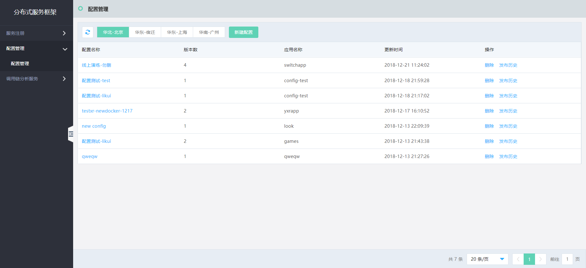
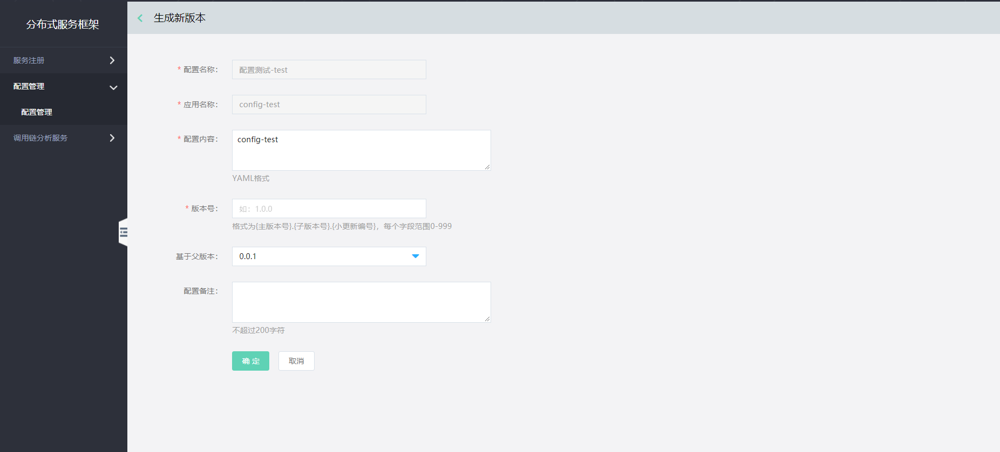
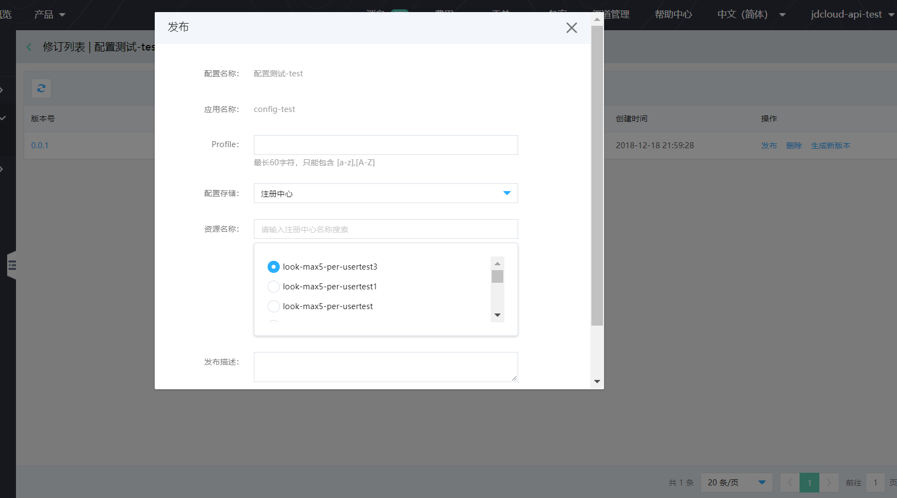

# 生成新版本

## 操作步骤：

### 第1步： 进入配置管理列表。
点击配置项的名称，如图中“配置测试-test”，进入该配置的版本列表页。
 
 
 
### 第2步：选择当前版本作为父版本，进入配置详情，然后点击操作中的生成新版本，进入版本编辑页。保存后生成新版本。
 

  
  
#### 说明：
- 这里默认的父版本号为您上一步中选择的版本的版本号。
- 默认展示父版本内容。
- 新版本号需要大于所有老版本号。
- 	当切换父版本时，“配置内容”里的信息会自动更换成为父版本内容，用户可自行修改编辑。

### 第3步： 发布新版本。
- 如果需要发布新版本，直接选择要发布的版本，点击发布按钮。
- 然后填写发布信息，进行配置发布。
  
  
  
  
#### 说明：
- 发布后，新版本会替代原有版本作为线上版本。
- 在版本修订列表中，需至少保留1条版本记录。如您需要删除所有记录，请在上一级“配置管理”中删除整条配置记录。

