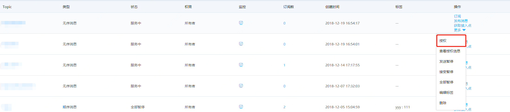
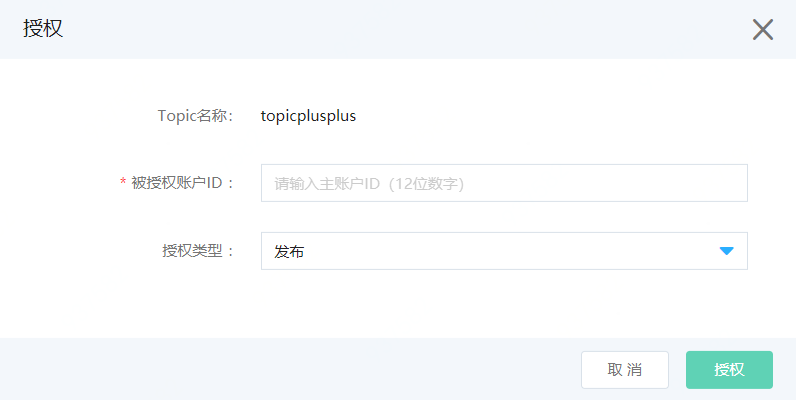
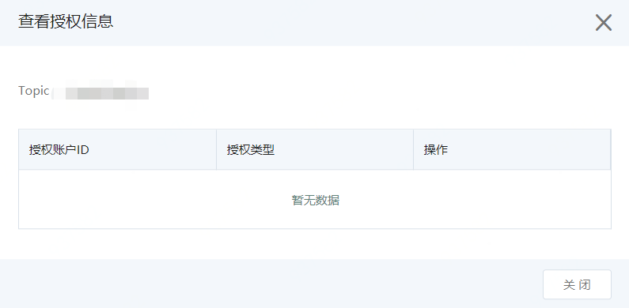

# 主主账号授权

消息队列 JCQ主主账号授权的功能通过消息队列 JCQ控制台实现。

1.进入消息队列 JCQ控制台，找到需要授权的Topic，点击操作“更多”下的“授权”。

   
   
2.弹出授权页面，需要输入被授权主账户的账户ID（用户可以从账户管理中的基本信息里查询到，为12位的一组数字）和授权类型进行授权。

   
   
主主授权的授权类型如下: 

| 授权类型 | 资源范围         | 备注                                                         |
| -------- | ---------------- | ------------------------------------------------------------ |
| 发布     | 所选择的单一资源 | 被授权者可以向Topic发布消息                                  |
| 订阅     | 所选择的单一资源 | 被授权者可以向Topic创建、删除及管理订阅并且消费消息          |
| 发布订阅 | 所选择的单一资源 | 被授权者可以向Topic发布消息和创建、删除及管理订阅并且消费消息 |

3.点击操作“更多”下的“查看授权信息”，查看某个资源Topic授权情况，并且可以删除授权。

 
