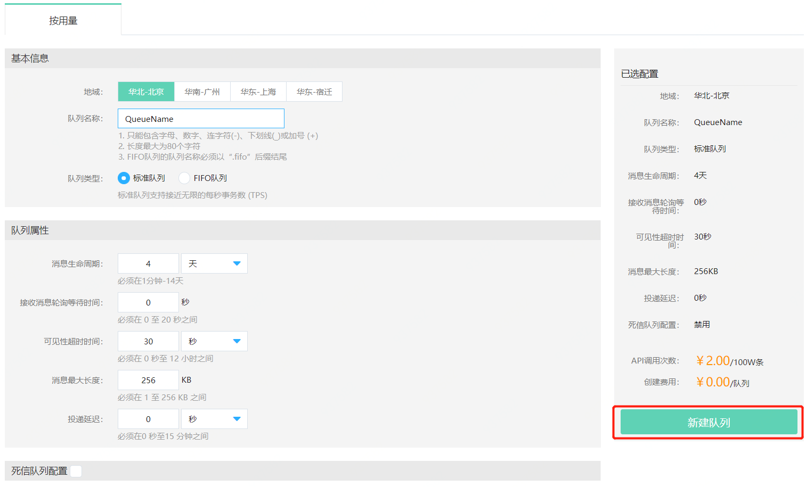

# 创建队列

在队列服务中，消息的发送和接收需要通过点对点Queue的形式，故用户首先要创建队列服务中的队列（Queue），然后发送消息到某个指定的队列，而消费者可以通过拉取（Pull）的模式对队列中的消息进行消费。

## 前提条件

- 已注册京东云账号，并完成实名认证，且保证账户处于正常状态，没有在黑名单中。如果还没有账号请 [注册](https://accounts.jdcloud.com/p/regPage?source=jdcloud%26ReturnUrl=%2f%2fuc.jdcloud.com%2fpassport%2fcomplete%3freturnUrl%3dhttp%3A%2F%2Fuc.jdcloud.com%2Fredirect%2FloginRouter%3FreturnUrl%3Dhttps%253A%252F%252Fwww.jdcloud.com%252Fhelp%252Fdetail%252F734%252FisCatalog%252F1)，并 [实名认证](https://uc.jdcloud.com/account/certify)。
- 因为产品的计费类型为按用量计费，请确认您的账户不能处于欠费状态。

## 注意事项

- 您开始使用京东云提供的队列服务，即代表您同意服务的[等级协议](<https://docs.jdcloud.com/cn/product-service-agreement/queue-service-terms-of-service>)及[计费标准](../Pricing/Price-Overview.md)。
- 对于用户创建的队列数量服务没有限制，请根据您的业务需要创建。

## 步骤一：创建队列

1. 进入京东云控制台，菜单互联网中间件-队列服务。

2. 首先选择想要创建资源的区域（比如华北-北京），然后点击“新建”按钮，新建队列。

   

3. 新建队列中需要填写“队列名称”、选择队列类型，根据自身需要填写队列属性和死信队列配置，然后点击新建队列完成创建。

   

   ### 说明：

   1. FIFO队列名称的命名需要以“.fifo”后缀结尾。
   2. 死信队列为消息接收失败后的隔离队列，即源队列中的消息在超过设置最大接收次数后会将发送到死信队列，可以在死信队列中隔离这些消息以确定其处理失败的原因，并且不影响源队列正常的消费。标准队列的死信队列必须为标准队列，FIFO队列的死信队列必须为FIFO队列。

## 步骤二：创建 AccessKey和 SecretKey

在调用队列服务的SDK进行消息的发送和接收或者管理操作时候，还需要验证用户的身份信息，即需要在控制台创建AccessKey和 SecretKey。

### 创建方法：

在京东云用户中心账户管理下的[AccessKey管理页面](https://uc.jdcloud.com/account/accesskey)申请AccessKey和SecretKey密钥对（简称AK/SK）。
AK/SK信息请妥善保管，如果遗失可能会造成非法用户使用此信息操作您在云上的资源，给你造成数据和财产损失。AK/SK密钥对允许启用、禁用，启用后可用其调用OpenAPI，禁用后不能用其调用OpenAPI。
