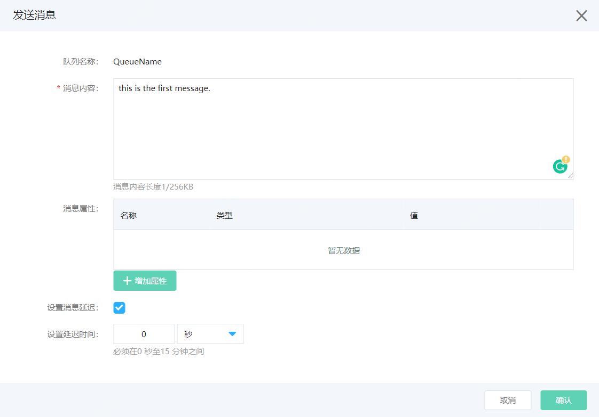
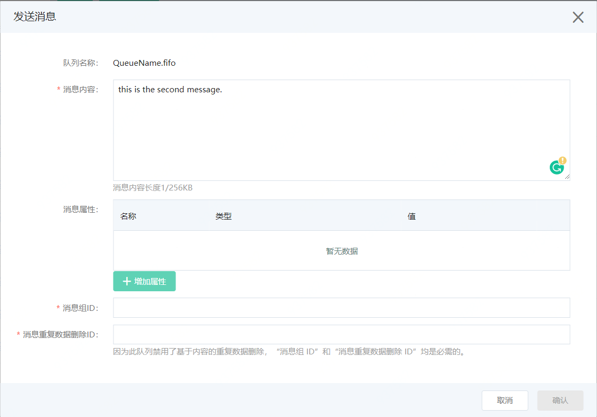
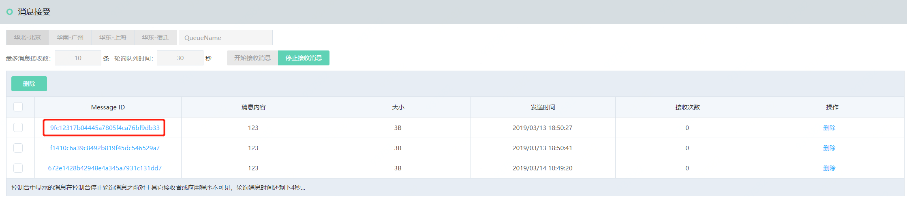
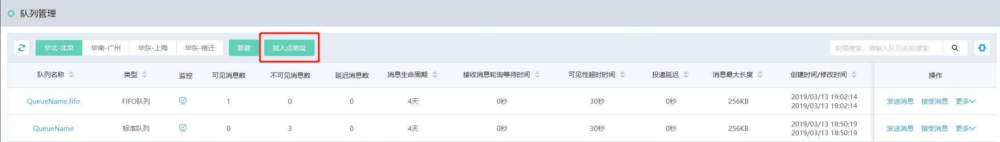
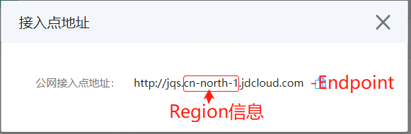

# 发送和接收消息

在控制台创建消息队列（Queue）后，用户可以通过控制台或者调用SDK来发送或者接收消息。
控制台不支持批量发送，主要用于调试和检验资源的可用性，生产环节建议使用SDK来进行消息的发送。


## 前提条件

- 已经创建队列，并且状态处于服务中。

- 已经创建了用户的AK和SK。

  

## 方式一：通过控制台发送和接收消息

1. 在队列管理页面中，找到想要发送消息的队列，在操作中选择”发送消息“。

2. 输入消息内容，并且如果需要为消息增加消息属性可以添加，对于标准队列可以为消息设置发送延时消息延迟时间，对于FIFO队列需要为消息设置消息组ID和消息重复数据删除ID。

   标准队列-发送消息：

   

   FIFO队列-发送消息：

   

   ### 说明：

   1. 消息延迟时间的设置将覆盖延迟队列上的延迟投递的值。

   2. 消息组ID是标记消息属于某个消息组的标识, 队列服务会以FIFO方式处理同一消息组中的消息（但是不同消息组中的消息可能无序)。    消息重复数据删除ID是用于删除重复已发送消息的令牌，用于避免消息的重复接受做到精确的一次性接收。

      

3. 消息发送成功，会返回消息发送成功通知和消息的Message ID及相关属性。

4. 找到刚才发送消息的队列，在操作中选择”接收消息“，进入到消息接收界面。

5. 选择想要接收的消息条数以及打算轮询队列的等待时间，点击开始“接收消息”。

   设置接收参数：

   

   接收消息结果：

   

   ### 说明：

   1. 最多接收消息数为此次轮询队列想要接收最大的消息数，到达此消息数将停止对队列进行轮询。
   2. 轮询队列时间为此次轮询队列的最长时间，到达此时间无论是否达到设置的接受消息条数都将停止轮询队列。
   3. 在轮询队列的过程中随时点击停止接收消息，即可停止对队列的轮询。
   4. 对于显示的消息可以从控制界面选择删除，前提是消息没有超过[可见性超时时间](../Introduction/Core-Concepts.md)（即您对此消息还保有操作权），点击消息ID可以查看消息详情。

   


## 方式二：通过SDK发送和接收消息

SDK推荐您使用AWS SQS SDK, 京东云队列服务支持了SQS SDK的接口。在使用SDK的时候，您需要配置4个参数：Accesskey、Secretkey、Endpoint和Region。其中AK&SK您在之前[AccessKey管理页面](https://uc.jdcloud.com/account/accesskey)已经创建，Endpoint和Region您可以点击控制台“接入点地址”获取, Endopint为一个HTTP/S的地址，Region为所选地域的英文代号，如下图所示。






以Java SDK为例进行说明，其他方式及开发语言请参考其他章节。

1.以Maven方式引入依赖

```
<dependency>  
    <groupId>com.amazonaws</groupId>  
    <artifactId>aws-java-sdk</artifactId>  
    <version>x.x.x</version>      
     //设置为 Java SDK 的最新版本号 
</dependency>
```

关于 Java SDK 的最新版本号，请[查看](https://mvnrepository.com/artifact/com.amazonaws/aws-java-sdk)。

或者下载[AWS SDK](https://aws.amazon.com/cn/sdk-for-java/)自行添加。

2.初始化，将AK&SK、接入点地址和Region信息填入。

   ```Java
   
  final String accessKey = "your accesskey";
  final String secretKey = "your secretkey";
  final String endpoint = "your region endpoint";
  final String region = "your region";
   
  AmazonSQS sqs = AmazonSQSClientBuilder.standard()
                  .withCredentials(new AWSStaticCredentialsProvider(new BasicAWSCredentials(accessKey,secretKey)))
                  .withEndpointConfiguration(new AwsClientBuilder.EndpointConfiguration(endpoint,region))
                  .build();
                  
   ```

3.SDK的demo可以参考：[队列服务 Demo Code](https://github.com/awsdocs/aws-doc-sdk-examples/tree/master/java/example_code/sqs)。
