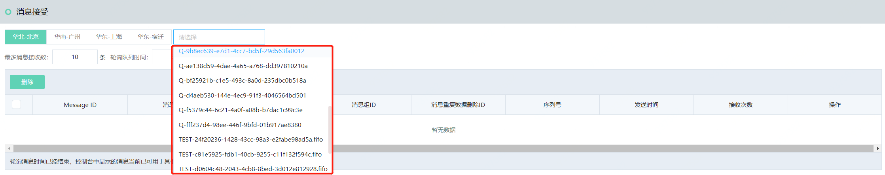

# 接收消息

1. 在队列管理页面中，找到想要接收消息的队列，在操作中选择”接收消息“，进入到消息接收界面。

2. 选择想要接收的消息条数以及打算轮询队列的等待时间，点击开始“接收消息”。

   设置接收参数：

   

   - 最多消息接收数：此次轮询队列想要接收最多的消息数，到达此消息数将停止对队列进行轮询
   - 轮询队列时间：此次轮询队列的最长时间，到达此时间无论是否达到设置的接受消息条数都将停止轮询队列

3. 轮询队列的过程中随时点击停止接收消息，即可停止对队列的轮询。

4. 选择其他队列接收消息，从下拉列表中选择队列，可以接收其他队列的消息。

   

5. 删除消息：勾选消息前的复选框，可以选择单条或者批量删除消息，前提是消息没有超过[可见性超时时间](../../Introduction/Core-Concepts.md)（即您对此消息还保有操作权），点击消息ID可以查看消息详情。
