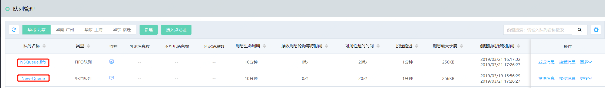
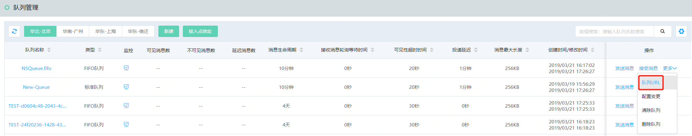
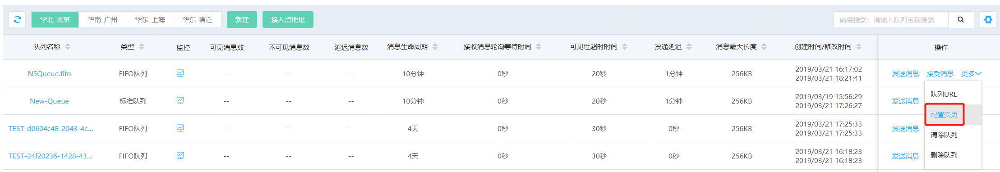
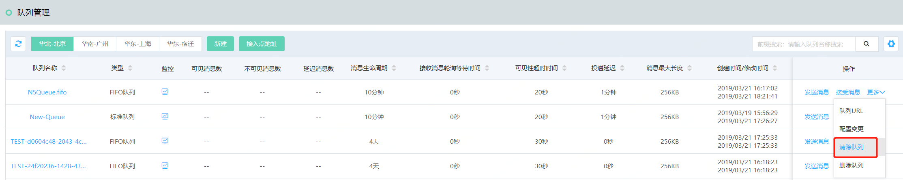
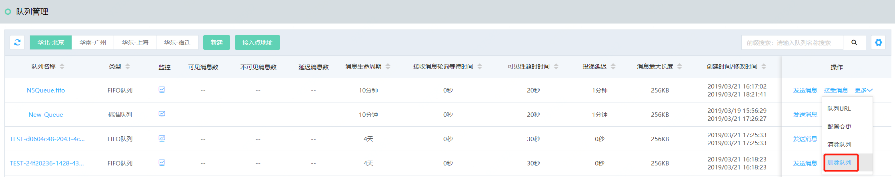

# 管理队列

1. 队列详情

   列表中，点击队列名称，可以查看队列的详情，包括基本信息，队列属性及死信队列配置。

   

2. 获取队列URL

   列表中操作列，点击更多中的队列URL，可以获取队列的URL。

   

3. 队列配置变更

   列表中操作列，点击更多中的配置变更，可以对队列的配置进行修改。

   

4. 队列中消息清除

   列表中操作列，点击更多中的清除队列，进行队列中所有消息，包括可见消息，不可见消息，延迟消息。

   

5. 删除队列

   列表中操作列，点击更多中的删除队列，将队列删除，无法恢复。

   
