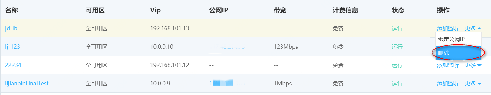

# 删除公网负载均衡实例

当您不再需要使用公网分布式网络负载均衡实例提供服务时，可以选择将其删除。公网和私网类型的分布式网络负载均衡实例删除步骤相同。

## 注意事项

开启删除保护功能后，分布式网络负载均衡不允许被删除，该功能用于预防分布式网络负载均衡被误删除。

## 操作步骤

 1. 在京东云控制台左侧导航栏选择 **网络**>> **负载均衡**，进入应用负载均衡列表页。

 2. 选择 **分布式网络型** 页签，进入分布式网络负载均衡列表页。

 3. 鼠标悬停到 **操作** 栏下的 **更多**，选择 **删除** 可删除指定分布式网络负载均衡。

 

