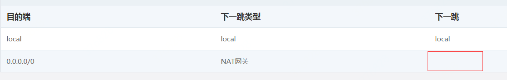

# 删除NAT网关
1. 打开私有网络控制台 https://cns-console.jdcloud.com/host/vpc/list

2. 在左侧导航栏，点击**NAT 网关**

3. 在NAT网关页面勾选要删除的NAT网关，如果状态为运行中，在操作列点击**停止**

4. 刷新页面，确认要删除NAT网关状态变更为停止，在操作列点击**删除**，在弹出窗口后，点击**确定**

注：NAT网关删除后，和网关绑定的公网IP会一起被删除。

路由表中指向被删除NAT网关的路由表项的下一跳会变为空，此路由表项失效，如下图所示。

