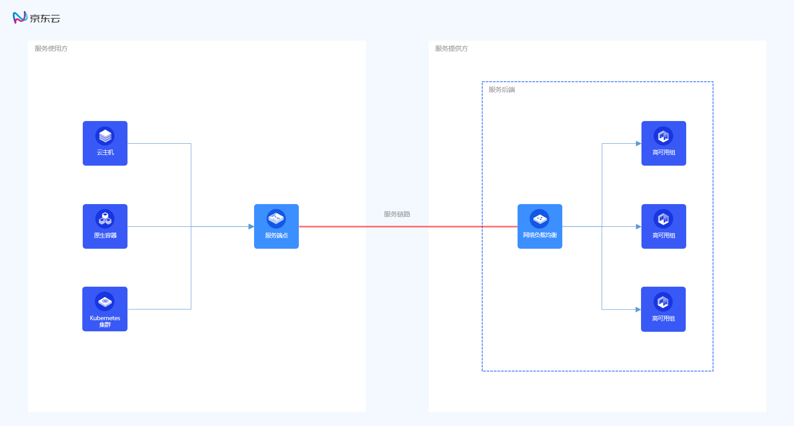

# 产品概述

## 服务链路简介

**服务链路 ServiceLink** 采用备高可用性与高扩展性的虚拟网络技术，主要用于实现私有网络内部业务对于公共服务的内部通道访问，从而降低通过公网访问公共服务带来的安全风险。服务链路产品由服务后端（Service Backend）与服务端点（Service Endpoint）两个模块组成，服务后端为服务提供商提供了灵活与弹性的业务部署框架，服务端点为服务使用方提供了安全与可扩展的业务访问入口。服务链路产品主要服务于SaaS服务提供商与服务使用方，着力于构建SaaS服务生态的多样性，为用户提供便捷化工具实现业务敏捷部署与安全访问。

## 服务链路架构

服务链路产品由服务后端与服务端点两个模块组成。每个服务后端可以关联一个网络负载均衡，网络负载均衡的监听端口即为该服务后端提供公共服务的端口。服务使用方在其私有网络内选择服务后端并建立连接至该服务后端的服务端点，通过访问服务端点IP地址以及该服务后端的服务端口即可实现对于该公共服务的内部通道访问。服务链路架构请参考下图。

## 服务链路特性

服务链路产品由服务后端与服务端点两个模块组成，服务后端为服务提供商提供了灵活与弹性的业务部署框架，服务端点为服务使用方提供了安全与可扩展的业务访问入口。服务链路产品特性如下：

### 服务后端

* **弹性框架**：服务后端是一种弹性业务部署框架，每个服务后端可以关联一个网络负载均衡。网络负载均衡具有高性能、高可用、水平扩展的特点，并支持挂载高可用组。服务后端采用网络负载均衡与高可用组的部署架构，保障服务的可靠性。

* **安全控制**：服务后端支持用户白名单与服务端点连接控制两种安全保障方式。服务后端白名单提供了第一重安全防护机制，非白名单用户不可发现对应服务后端；服务端点连接控制提供了第二重安全防护机制，服务提供商可选择接受或拒绝服务端点连接以实现安全控制。

* **业务复用**：服务后端关联网络负载均衡时，不影响网络负载均衡当前已对外提供业务的流量，即同一网络负载均衡可同时面向公网、面向私有网络内部以及通过服务后端面向服务使用方提供服务，该特性复用了网络负载均衡已有业务，降低了用户业务部署成本。

### 服务端点

* **本地访问**：服务端点是用户私有网络内访问服务后端的连接入口。服务端点占用服务使用方私有网络内一个IP地址，服务使用方业务流量经该IP地址通过服务链路进入服务提供商的服务后端，从而实现业务流量的内部通道访问，规避了公网访问风险。

* **安全控制**：服务端点支持挂载多个安全组，每个安全组可以设置多条安全组规则。服务端点位于服务使用方一侧，因此服务使用方通过为服务端点关联安全组以及设置安全组规则，可以实现对业务访问服务后端的安全控制。

* **地域可用**：服务端点为地域级跨可用区服务。京东云为用户提供跨可用区子网服务，基于该项技术，京东云服务端点可实现跨可用区提供访问入口。用户仅需创建一个服务端点，则该私有网络内不同可用区业务流量均可通过该服务端点转发至服务后端。

## 服务链路操作

### 服务后端

- [创建服务后端](../Operation-Guide/Service-Backend/Create-Service-Backend.md)
- [删除服务后端](../Operation-Guide/Service-Backend/Delete-Service-Backend.md)
- [接受连接](../Operation-Guide/Service-Backend/Accept-Service-Endpoint-Connection.md)
- [拒绝连接](../Operation-Guide/Service-Backend/Reject-Service-Endpoint-Connection.md)
- [批量接受连接](../Operation-Guide/Service-Backend/Batch-Accept-Service-Endpoint-Connection.md)
- [批量拒绝连接](../Operation-Guide/Service-Backend/Batch-Reject-Service-Endpoint-Connection.md)
- [启用自动接受连接](../Operation-Guide/Service-Backend/Enable-Service-Backend-Auto-Accept.md)
- [停用自动接受连接](../Operation-Guide/Service-Backend/Disable-Service-Backend-Auto-Accept.md)
- [添加白名单用户](../Operation-Guide/Service-Backend/Add-White-List-User.md)
- [移除白名单用户](../Operation-Guide/Service-Backend/Remove-White-List-User.md)
- [批量添加白名单用户](../Operation-Guide/Service-Backend/Batch-Add-White-List-User.md)
- [批量移除白名单用户](../Operation-Guide/Service-Backend/Batch-Remove-White-List-User.md)

### 服务端点

- [创建服务端点](../Operation-Guide/Service-Endpoint/Create-Service-Endpoint.md)
- [删除服务端点](../Operation-Guide/Service-Endpoint/Delete-Service-Endpoint.md)
- [添加安全组](../Operation-Guide/Service-Endpoint/Add-Security-Group.md)
- [移除安全组](../Operation-Guide/Service-Endpoint/Remove-Security-Group.md)
- [查看监控数据](../Operation-Guide/Service-Endpoint/View-Monitoring-Data.md)

## 服务链路计费

* 服务后端产品免费，服务后端关联的负载均衡以及负载均衡关联的计算资源独立计费。
* 服务端点产品收取资源占用费以及流量使用费，详细计费规则请查看[计费说明](../Pricing/Billing-Overview.md)。
