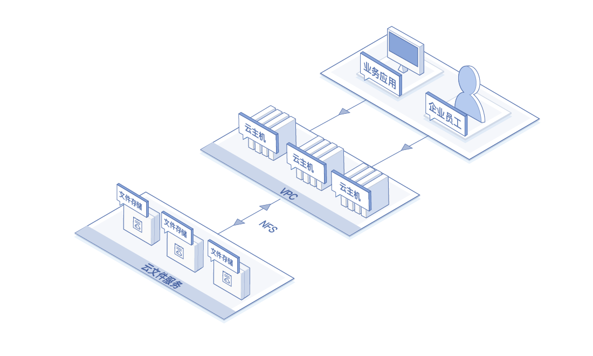
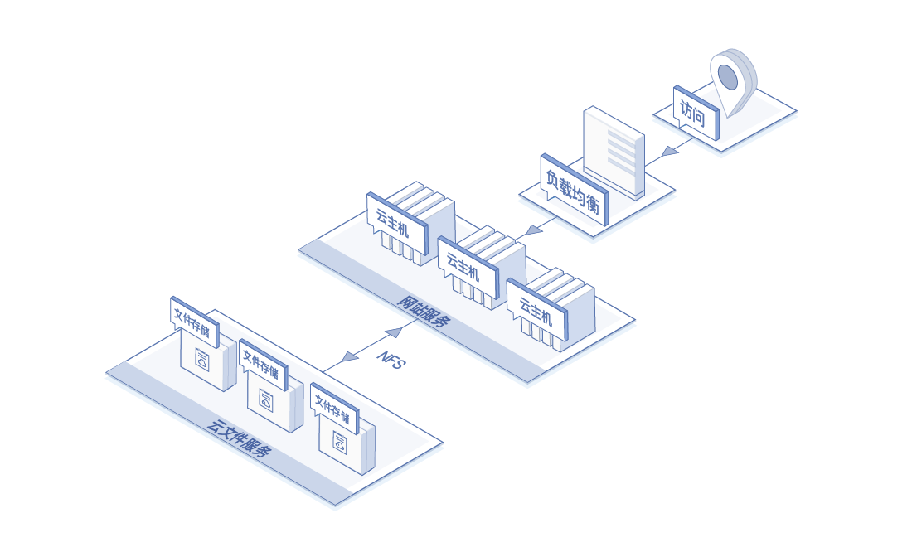
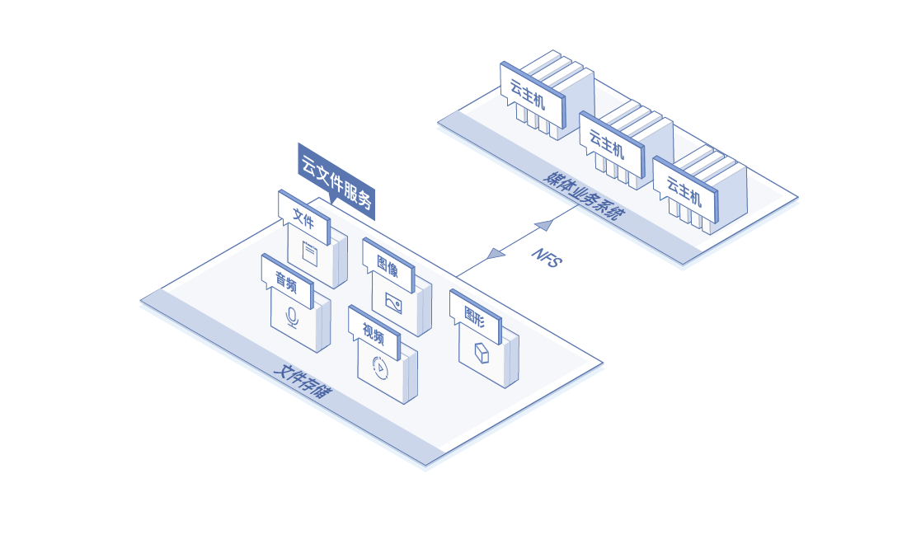

# 应用场景

## 组织内文件共享

在企业协同办公场景中，业务应用、员工需要访问或共享相同的数据。通过在云文件服务中创建文件系统，可以满足上述需求。同时还可以通过对文件和目录级别的权限设置，对向文件系统的访问进行控制。

## Web应用、服务

在内容管理系统和Web应用、服务的场景中，云文件服务可以充分发挥其持久性强、吞吐量高的特点，提供数据存储、读取、共享的服务。

## 媒体业务

在媒体业务中需要对文件、图像、图形、音频、视频等进行共享存储和编辑处理。云文件服务的高吞吐量和共享文件访问功能可以为媒体业务提供统一的存储空间，供所有用户使用，提升媒体业务处理效率。

