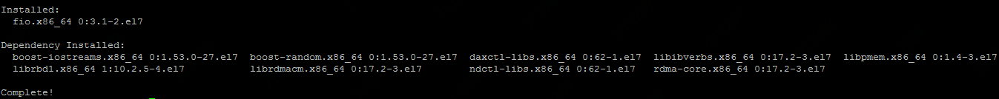
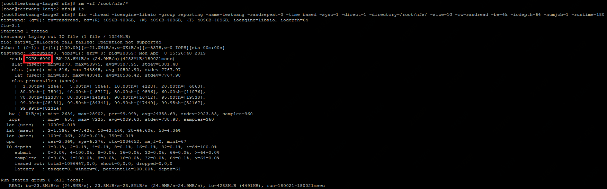
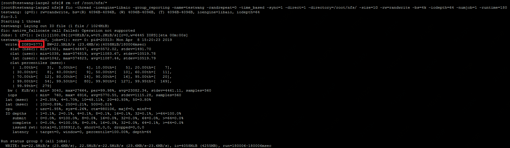
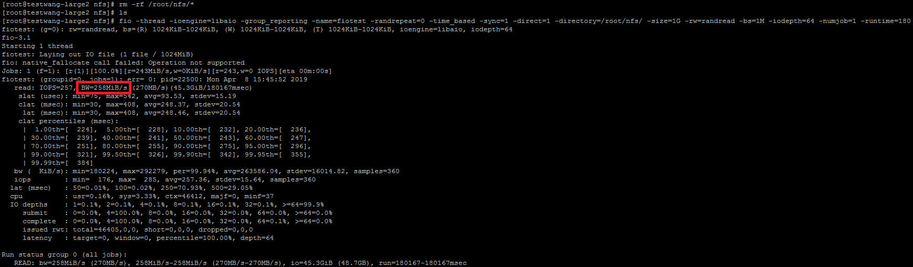
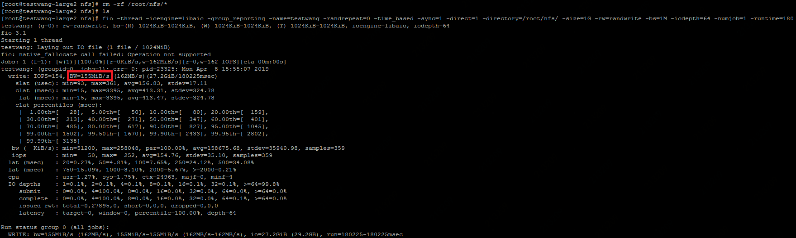

# 云文件服务性能测试

## 1.测试工具

您可以使用FIO或IOZone等测试工具对文件服务进行测试。本文档以FIO为测试工具进行介绍。

 

## 2.测试环境搭建及测试工具的安装

1)创建运行性能测试工具的云主机实例，并登录该云主机实例。注意：

- 因目前云文件服务仅支持NFS 4.0和NFS 4.1协议，所以请创建Linux实例。
- 为避免云主机实例本身的性能和带宽对云文件服务性能测试结果造成影响，请创建为8核32GB及以上规格的云主机实例。

登录云主机实例操作可参考["登录云主机"](https://docs.jdcloud.com/cn/virtual-machines/connect-to-linux-instance)。

2)通过yum源安装fio工具，也可选择从fio官网下载安装：

`yum install fio`

在提示下载安装包大小时选择“y”，完成下载和安装。

安装完成后，请输入：

`fio -v`

验证fio版本。请确认安装v3.1及以上版本的fio进行测试，以取得更准确的测试结果。

3)安装libaio引擎：

`yum install libaio-devel`

安装完成后即完成了测试工具的安装工作。

4)创建云文件服务并挂载到该云主机实例，可参考[“创建文件存储”](https://docs.jdcloud.com/cn/cloud-file-service/creating-file-system)和[“挂载文件存储”](https://docs.jdcloud.com/cn/cloud-file-service/mount-file-system)

 

## 3.测试前的注意事项

1)Linux：因目前云文件服务仅支持NFS 4.0和NFS 4.1协议，因此，请在Linux环境中进行性能测试。本文档的操作系统测试环境为：CentOS 7.4

2)Sunrpc_slot设置：因Linux nfs客户端对同时发起的NFS请求数量进行了限制，在成功挂载云文件系统后运行以下命令：

`cat /proc/sys/sunrpc/tcp_slot_table_entries`

可以看到，该参数的默认配置为2。

为避免该参数配置过小导致IO性能较差，需要适当提高该参数的值避免该配置影响测试结果，请以root身份运行以下命令：

`echo "options sunrpc tcp_slot_table_entries=64" >> /etc/modprobe.d/sunrpc.conf`

`echo "options sunrpc tcp_max_slot_table_entries=64" >>  /etc/modprobe.d/sunrpc.conf`

`sysctl -w sunrpc.tcp_slot_table_entries=64`

3)云主机实例带宽：不同规格的云主机实例带宽上限不同，为避免云主机实例本身的性能和带宽对云文件服务性能测试结果造成影响，请创建为8核32GB及以上规格的云主机实例。

4)测试参数：以下参数会影响性能测试结果或者影响您做性能测试时所产生的费用，请在测试前了解这些参数的配置和使用，也可以使用后文的测试示例直接进行测试。

**Io Type（参数：-rw）：** 不同的IO类型对性能测试结果存在影响。常见的IO类型包括：write（顺序写）、read（顺序读）、randwrite（随机写）、randread（随机读）、readwrite（顺序混合读写）、randrw（随机混合读写）；

**Block Size（参数：-bs）：** 使用块的大小，影响IOPS和带宽性能；

**Io Size（参数：-size）：** 此次测试需要操作多少数据，在保证数据量足够测试使用的情况下，对性能测试结果没有直接影响，但请注意：因为测试工具会实际创建此参数设置大小的文件，会占用您的文件系统存储空间，因此会产生存储费用。请酌情设置此参数；

**Io Depth（参数： -iodepth）：** 队列深度；

**Num of Jobs（参数： -numjobs）：** 线程数，测试单文件读写时配置为1；

 

## 4.典型测试场景

**测试环境：**

- **云主机实例规格：** 地域：华南-广州；规格类型：g.n2.2xlarge
- **操作系统：** CentOS 7.4 64位

- **文件系统：** 地域：华南-广州

- **时间：** 2019-04-08

- **测试工具：** Fio-3.1

**随机读IOPS**

  **测试语句：**

`fio -thread -ioengine=libaio -group_reporting -name=fiotest -randrepeat=0 -time_based -sync=1 -direct=1 -directory=/root/nfs/ -size=1G -rw=randread -bs=4k -iodepth=64 -numjob=1 -runtime=180`

  **预期IOPS：** 5000

**随机写IOPS**

  **测试语句：**

`fio -thread -ioengine=libaio -group_reporting -name=fiotest -randrepeat=0 -time_based -sync=1 -direct=1 -directory=/root/nfs/ -size=1G -rw=randwrite -bs=4k -iodepth=64 -numjob=1 -runtime=180`

 **预期IOPS：** 5000

**随机读带宽**

  **测试语句：**

`fio -thread -ioengine=libaio -group_reporting -name=testwang -randrepeat=0 -time_based -sync=1 -direct=1 -directory=/root/nfs/ -size=1G -rw=randread -bs=1M -iodepth=64 -numjob=1 -runtime=180`

  **预期带宽：** 50MiB/s

**随机写带宽**

  **测试语句：**

`fio -thread -ioengine=libaio -group_reporting -name=testwang -randrepeat=0 -time_based -sync=1 -direct=1 -directory=/root/nfs/ -size=1G -rw=randwrite -bs=1M -iodepth=64 -numjob=1 -runtime=180`

  **预期带宽：** 50MiB/s

