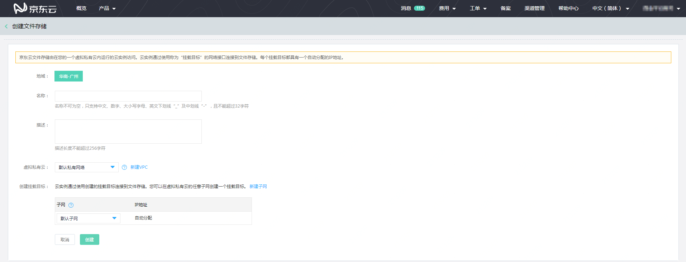
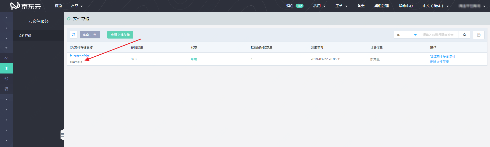

# 创建文件存储

1.在“文件存储”列表页，点击列表上方的“创建文件存储”按钮，进入“文件存储”的创建页面。

2.选择“地域”，公测期间仅支持“华南-广州”和“华北-北京”地域；按照输入要求填写文件存储的“名称”及“描述”。分别在“虚拟私有云”和“创建挂在目标”栏的下拉菜单中为该文件存储的挂载目标选择所在“虚拟私有云”（VPC）及“子网”。

由于“虚拟私有云”（VPC）之间的网络隔离策略，仅位于当前所选择“虚拟私有云”及“子网”内的云主机实例可以挂载该文件存储。所以，请根据您需要挂载文件存储的云主机所在网络选择文件存储的“虚拟私有云”（VPC）及“子网”。

如果不存在已有的“虚拟私有云”及“子网”，可以依次通过页面上的“新建VPC”和“新建子网”按钮，创建VPC和子网。

3.完成文件存储各属性的填写后，点击“创建”，即可完成创建操作。“文件存储”创建成功后会自动跳转回“文件存储”列表页。

