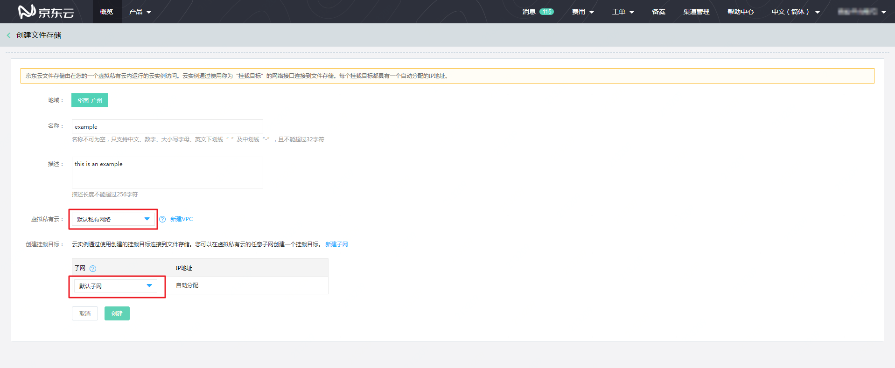
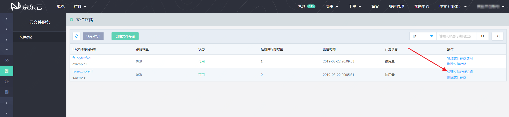
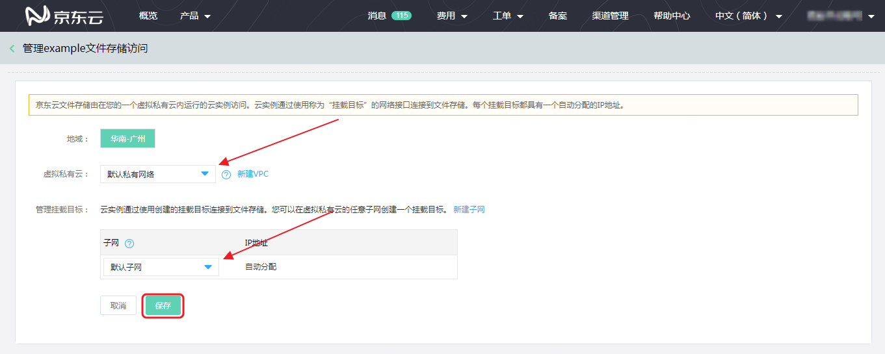

# 创建挂载目标

您的云实例使用文件存储时，均需要通过称为“挂载目标”的网络接口连接到文件存储。每个挂载目标都具有一个自动分配的IP地址。

创建挂载目标的方式有两种：

1. 创建文件存储时创建；
2. 通过“管理文件存储访问”创建。

**创建文件存储时创建：**

在“创建文件存储”时，需要您选择“虚拟私有云”和“创建挂载目标”中的“子网”，完成这两项内容的选择后，即为该文件存储在创建文件存储的同时创建了一个在所选“虚拟私有云”和“子网”内的挂载目标。

管理文件存储访问中创建：

在文件存储列表页或文件存储信息页面点击“管理文件存储访问”按钮，均可进入该文件存储的挂载目标管理页面。页面中已默认选择了一个现有的“虚拟私有云”和“子网”，请根据您需要使用文件存储的云实例所在的虚拟私有云和子网，选择与之一致的虚拟私有云和子网。选择完成后，点击“保存”，即为该文件存储创建了挂载目标。

