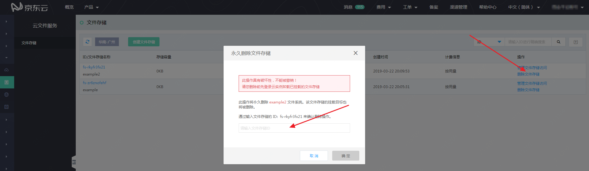

# 删除文件存储

在“文件存储”列表页面，可以通过点击“删除文件存储”按钮永久删除一个文件存储。

**请注意：删除操作不能被撤销，删除后文件存储中的任何数据将会丢失且无法还原**。因此，请谨慎进行“删除文件存储”的操作。

点击“删除文件存储”后，会弹窗提示需要确认删除操作。在输入框中输入该文件存储的ID进行确认后，点击“确定”即可删除该文件存储。输入时区分大小写，文件存储ID的所有字符均为小写。

如果文件存储有当前可用的“挂载目标”，则不能删除文件存储，并提示“不能删除在用状态的文件存储”。需要在“管理文件存储访问”中，删除该文件存储的挂载目标后，才可删除该文件存储。

 
