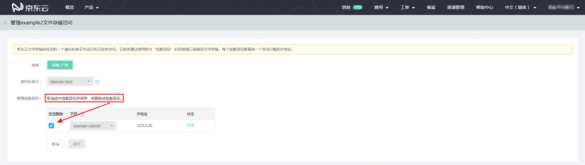

# 删除挂载目标

通过“管理文件存储访问”可以删除选定文件存储的“挂载目标”。在文件存储列表页或文件存储信息页面点击“管理文件存储访问”按钮，如果当前文件存储有可用挂载目标，将可看到在“管理挂载目标”中有选中状态的挂载目标。此时该挂载目标的状态“可用”，且“子网”不可修改。

点击该挂载目标前的选择框，取消选中，即弹出“删除挂载目标”提示框，提示您“请您在删除挂载目标前先从所有云实例卸载该文件系统”。点击“确定”，再点击“保存”按钮，即删除了此挂载目标。**已删除的挂载不可恢复**，请在删除挂载目标前，**务必确认已从云实例中卸载了该文件存储**，否则会因无法访问到该文件存储，引起云实例对文件存储的读写错误。

在已点击确认删除挂载目标提示框的“确定”但未点击“管理文件存储访问”页面的“保存”按钮前，重新勾选挂载目标前的选择框相当于取消之前的删除操作。

 
