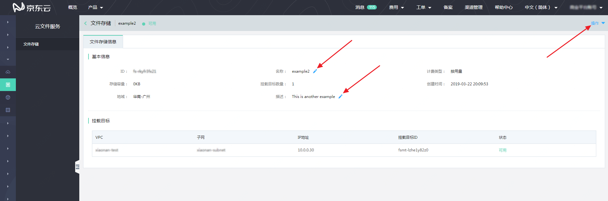

# 文件存储信息

在文件存储列表内，点击任意文件存储的“ID”即可进入该文件存储的信息页面。文件存储信息页面主要向用户提供查看该文件存储详细信息的功能。

在该页面中，可以查看此文件存储的“ID”、“名称”、“计费类型”、“存储容量”、“挂载目标数量”、“创建时间”、“地域”、“描述”、“DNS名称”和“挂载目标”信息。

其中，可以通过点击“名称”和“描述”右侧的编辑按钮，对该文件存储的名称或描述进行编辑，编辑完成后点击弹出框的“确定”按钮即可保存。

在文件存储信息页面的右上角，有“操作”按钮，可以通过点击“管理文件存储访问”或“删除文件存储”使用相应功能。

  

