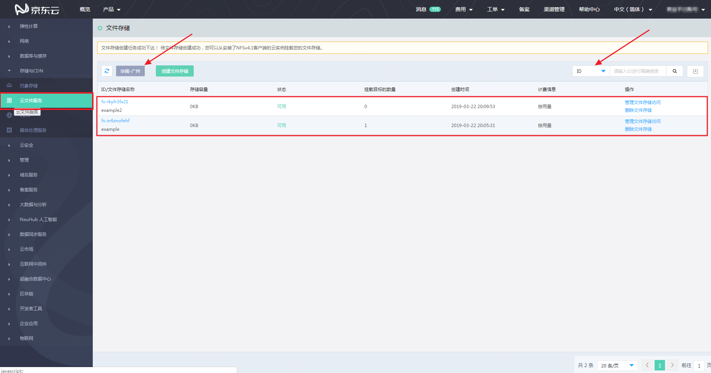

# 文件存储列表

登录京东云控制台，点击控制台左侧菜单的“存储与CDN”-“云文件服务”，进入“文件存储”列表页面。 

在文件存储列表页，可以看到当前登录账号下所有已创建的文件存储。文件存储区分“区域”（region），因此，您可以通过点击列表页上方的“区域”按钮，切换不同区域，查看该区域下创建的文件存储。公测期间，仅开放“华南-广州（cn-south-1）”区域。

 

在文件存储列表的右上方，可以通过文件存储的ID或名称对文件存储进行搜索。其中，使用“ID”搜索时为“精确”搜索，关键字必须和文件存储的ID完全匹配；使用“名称”搜索时为“模糊”搜索，只要文件存储名称中包含关键字即符合搜索条件。

 

文件存储列表中的内容按照“创建时间”倒序排列，可以通过点击文件存储的“ID”，查看该文件存储的“详情信息”；也可以点击每个文件存储右侧的“管理文件存储访问”以管理该文件存储的挂载目标，或点击“删除文件存储”删除该文件存储。
