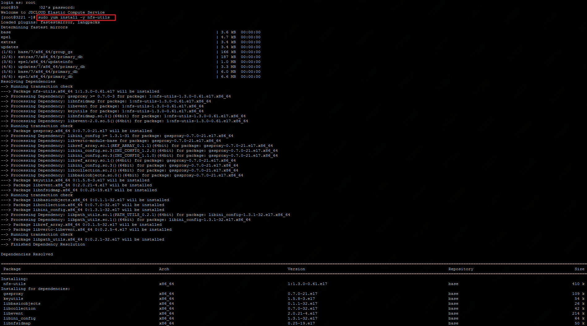
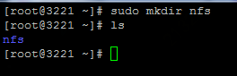
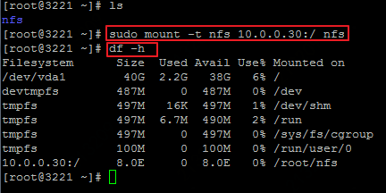

# 挂载文件存储

1.在京东云主机实例中挂载文件存储，首先需要登录到您的云主机实例终端，可参阅：[登录linux实例](https://docs.jdcloud.com/cn/virtual-machines/connect-to-linux-instance)

2.安装utils客户端：

在CentOS 的终端下，运行如下命令:

`sudo yum install –y nfs-utils`

在Ubuntu系统的终端下，运行如下命令：

`sudo apt-get install nfs-common`

3.创建目录，如创建名为nfs的目录：

`sudo mkdir nfs`
Ubuntu系统运行如下命令：
`mkdir nfs`

4.通过挂载目标的IP地址挂载文件存储，挂载目标的IP地址可在“控制台-存储与CDN-云文件服务-文件存储”页面，点击该文件存储的ID后查看。

如，挂载目标的IP为10.0.0.30，挂载到上一步创建的nfs目录。**注意，因挂载工具默认NFS协议为4.1版本，所以CentOS 7.2及以下版本的挂载命令略有不同：**

**CentOS 6.9至CentOS 7.2版本运行以下命令：**

`sudo mount -t nfs,nfsvers=4.0 10.0.0.30:/ nfs`

CentOS 7.3及以上版本运行以下命令：

`sudo mount -t nfs 10.0.0.30:/ nfs`

在Ubuntu系统的终端下，运行如下命令：

`mount -t nfs 10.0.0.30:/ nfs`

5.通过运行以下命令，验证是否挂载成功：

`df -h`

挂载成功后会出现“Filesystem”为挂载目标IP，“Mounted on”为上一步指定目录的记录。

**注意**

1. 云文件服务暂不支持使用传输中的数据加密，即不支持使用以下命令挂载文件系统。

sudo mount -t nfs -o tls 10.0.0.30:/ nfs

2. 挂载文件存储时，挂载选项的默认值如下，大多数情况下，请避免修改默认的参数值，以免对性能或稳定性造成影响：

- rw：以可读写模式加载
- relatime：访问文件时，仅在 atime 早于文件的更改时间时对 atime 进行更新。
- vers=4.1：NFS协议版本为4.1
- rsize=1048576 ：设置 NFS 客户端对每个网络 READ 请求可以接收的数据最大字节数。在从文件存储上的文件读取数据时应用此值。默认设为最大值：1048576。
- wsize=1048576：设置 NFS 客户端对每个网络 WRITE 请求可以发送的数据最大字节数。在从文件存储上的文件读取数据时应用此值。默认设为最大值：1048576。
- namlen=255：设定远程服务器所允许的最长文件名为255字节。
- hard：设置 NFS 客户端在 NFS 请求超时之后的恢复行为，设置为hard时，NFS 请求在服务器回复之前会持续重试。为确保数据完整性，建议使用硬挂载选项(hard)。
- proto=tcp：使用TCP协议挂载。
- timeo=600：NFS请求重试的等待响应时间，此处默认设为600分秒（60秒）。过小的timeo参数值可能引起性能下降。
- retrans=2：NFS客户端重试请求次数，此处默认设为2次。
- noresvport：NFS 客户端在每次重新建立网络连接时，使用新的传输控制协议 (TCP) 源端口。有助于确保 EFS 文件系统在网络恢复事件后具有不间断的可用性。

