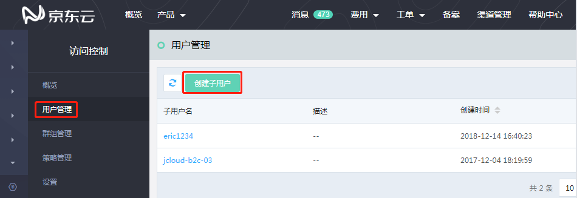
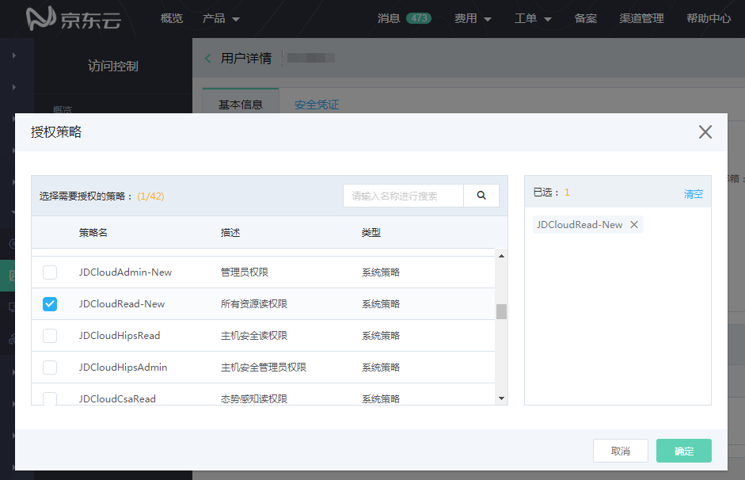
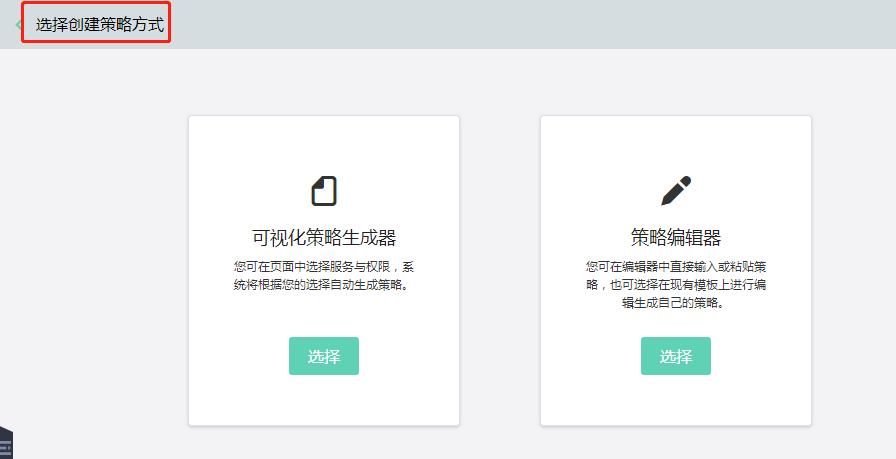
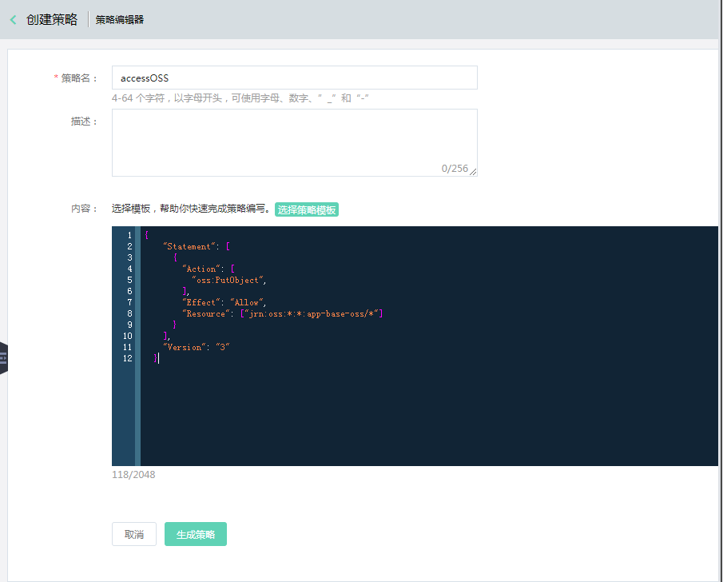
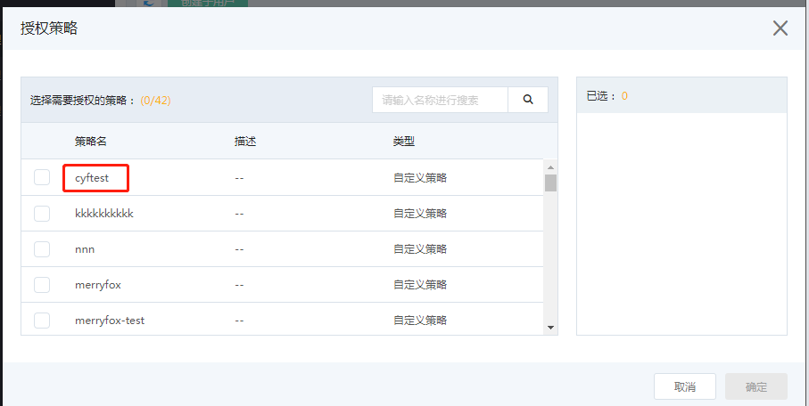
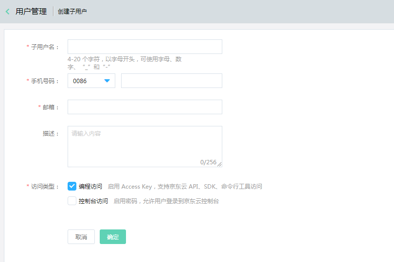
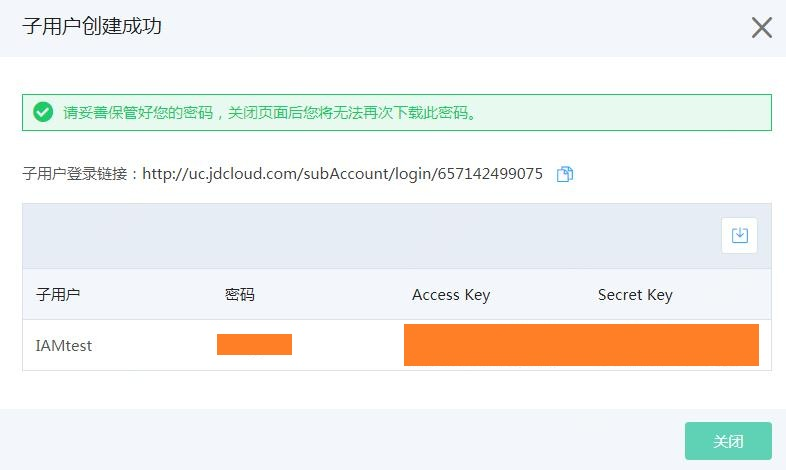
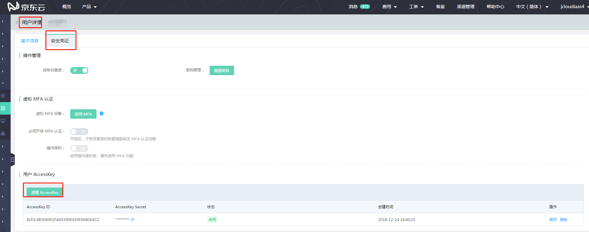

# 授权子账号访问 OSS
### 名词解释
IAM 详细介绍前往[IAM概述](https://docs.jdcloud.com/cn/iam/product-overview)。

### 身份管理相关术语
#### 主账号
主账号也叫根账号，是京东云资源归属、计费的主体。在用户注册、激活京东云时由系统创建。主账户为其名下所有的资源付费，并拥有所有京东云服务和资源的全部权限。

#### 子用户
子用户也叫子账号，是一种实体身份，有确定的用户名，密码和AK/SK，它通常与某个确定的实体一一对应。 子用户的用户名由主账号创建。子用户不是独立的京东云账号，
它归属于主账号，只能在主账号的空间下可见，他只有资源的使用权，没有资源的所有权。
没有独立的计量计费，子用户的对资源的使用费用将统一计到主账号的账单中。子用户必须得到主账号的授权，才能登录控制台或使用Open API操作主账号授权的资源。
#### 群组
即子用户组，是一组子用户的集合。利用群组，主账号可以更方便地管理多个权限相同的子用户，也可以通过将子用户加入或移出群组，来变更用户的权限。

# 子账号权限配置流程

- 步骤一：创建子账号

 在 IAM 控制台可创建子账号，并配置授予子账号的访问权限。具体操作如下所示：
 
 1.登录 [IAM 控制台](https://iam-console.jdcloud.com/summary)，单击左侧菜单栏【用户管理】，单击【新建子用户】：
 
 
 
2.按照要求填写用户相关信息。

- 步骤二：对子账号授予权限

根据系统提供的策略选择，可配置简单的策略【系统策略】，如 OSS 的管理员权限，只读权限等。如需配置更复杂的策略，请使用【策略管理】-【新建自定义策略】。

3.方法一： 访问子用户列表，点击【授权】按钮，可快捷的授予子用户相应的【系统策略】。

方法二：负责策略采用自定义策略，单击左侧菜单栏【策略管理】，单击【创建策略】

支持可视化策略生成器与策略编辑器

若采用策略编辑器，输入策略名称，在编辑框中输入json ，指定IAM policy。

4.创建完成自定义策略后，回到访问子用户列表，点击【授权】按钮，授予【自定义策略】，完成子账号与策略的关联。

本文还通过以下策略示例说明几种典型场景，详情参见[基于IAM Policy的权限控制-IAM Policy 示例](../../Operation-Guide/Access-Control/Access-Control-Base-On-IAM-Policy.md),可以直接复制在自定义策略到编辑器 。

- 步骤三：子账号访问主账号 OSS 资源（本期OSS控制台不支持子账号）
OSS 访问（API 或 SDK）需要如下资源：AccessKeyId 、AccessKeySecret 。
当使用子账号访问 OSS资源时，需要使用子账号的 AccessKeyId 和 AccessKeySecret，您可以在创建子账号时选择为子账号创建（Access Key）或者登陆访问管理控制台创建子账号的 AccessKeyId(Access Key) 和 AccessKeySecret(Secret Key)。

方法一：创建子账号时选择为创建子账号（Access Key）

方法二：登陆访问管理控制台创建或者查看子账号的 Access Key 和 Secret Key。

然后使用子账号 AccessKeyID 和 AccessKeySecret，利用OSS API 或SDK访问OSS，该操作与主账号相同。

### 使用Bucket policy 授权子账号

除了IAM policy您也可使用Bucket policy 授权子账号。具体授权步骤请参看[Bucket policy-访问权限设置](../../Operation-Guide/Manage-Bucket/Set-Bucket-Policy-2.md)。

