# 使用s3browser管理OSS
s3browser是一种易于使用管理S3的客户端。京东云OSS兼容 Amazon S3 API,您可使用s3browser管理京东云OSS，详见[兼容接口](https://docs.jdcloud.com/cn/object-storage-service/compatibility-api-overview)。 

* 安装：[安装s3browser](Manage-OSS-With-s3browser#user-content-1)
* 使用s3browser接入OSS：[使用s3browser接入OSS-增加用户](Manage-OSS-With-s3browser#user-content-2)
## 支持功能列表
* 创建存储空间（bucket）：[存储空间操作-创建存储空间（bucket）](Manage-OSS-With-s3browser#user-content-3)
* 设置存储空间的Acl：[ 存储空间操作-设置存储空间的Acl](Manage-OSS-With-s3browser#user-content-4)
* 设置Bucket policy：[ 存储空间操作-设置Bucket policy](Manage-OSS-With-s3browser#user-content-5)
* 设置静态网站托管（Website）：[ 存储空间操作-静态网站托管（Website）设置](Manage-OSS-With-s3browser#user-content-17)
* 删除存储空间：[存储空间操作-删除存储空间](Manage-OSS-With-s3browser#user-content-6)
* 设置CORS：[存储空间操作-CORS设置](Manage-OSS-With-s3browser#user-content-15)
* 设置生命周期管理（lifecycle）：[存储空间操作-生命周期管理（lifecycle）设置](Manage-OSS-With-s3browser#user-content-16)
* 添加具有权限的存储空间或文件路径：[存储空间操作-添加存储空间或文件路径](Manage-OSS-With-s3browser#user-content-7)
* 列出所有对象：[对象操作-列出所有对象](Manage-OSS-With-s3browser#user-content-8)
* 上传对象：[对象操作-上传对象](Manage-OSS-With-s3browser#user-content-9)
* 下载对象：[对象操作-下载对象](Manage-OSS-With-s3browser#user-content-10)
* 复制对象到OSS存储空间：[对象操作-复制对象到OSS存储空间](Manage-OSS-With-s3browser#user-content-11)
* 重命名对象：[对象操作-重命名对象](Manage-OSS-With-s3browser#user-content-12)
* 移动对象：[对象操作-移动对象](Manage-OSS-With-s3browser#user-content-13)
* 删除对象：[对象操作-删除对象](Manage-OSS-With-s3browser#user-content-14)

## 安装

1.下载安装包

下载地址：https://s3browser.com/download.aspx

2.安装

点开安装即可

## 使用s3browser接入OSS

###  增加用户

#### 步骤 1 在左侧的 account 下拉菜单中点击【add new account】
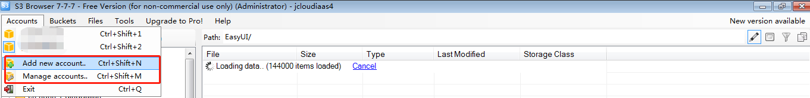

#### 步骤 2 在弹出的对话框中，填写相应参数：

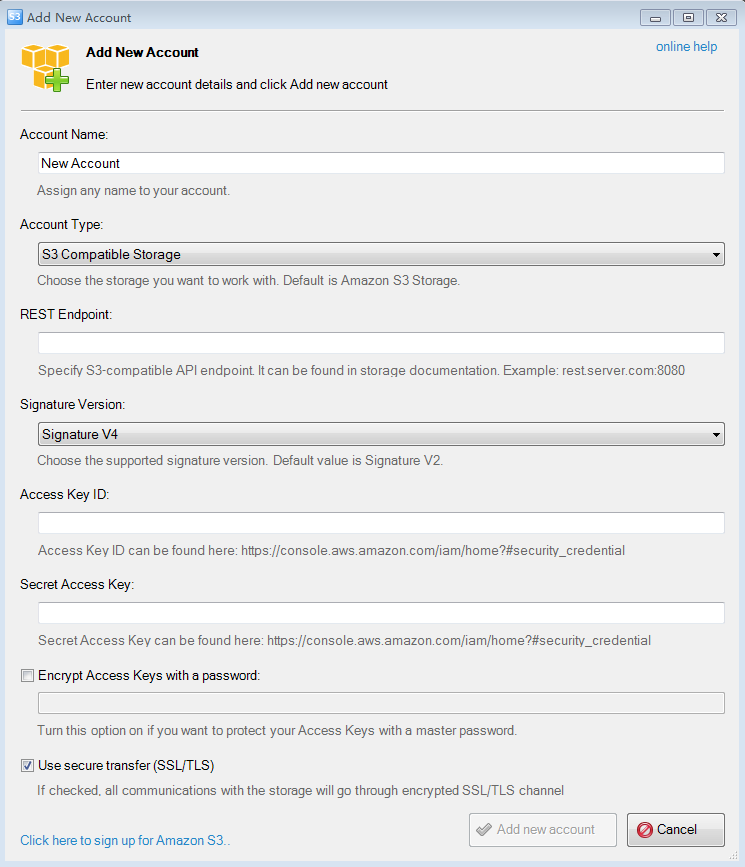

* Account Name：显示名称，一般填自己的用户名即可；
* Account Type: S3 Compatible Storage；
* REST Endpoint:填写京东云[兼容S3的服务域名](https://docs.jdcloud.com/cn/object-storage-service/regions-and-endpoints)；
* Signature Version: 选择Version 4；
* Access Key ID: 京东云的AK；
* Secret Access Key: 京东云的SK；
* 是否使用HTTPS: OSS支持http和https,为了您的数据更加安全建议默认勾选，使用https。

## 使用s3browsers管理OSS

### 存储空间操作

**存储空间操作中OSS暂不支持【服务器访问日志管理】与【版本控制】，跨区域复制功能由于该工具只能选择同一区域bucket，所以不能设置。与S3尚未兼容的[【镜像回源】](https://docs.jdcloud.com/cn/object-storage-service/manage-origin-retrieval-settings-2)与[【自定义域名】](https://docs.jdcloud.com/cn/object-storage-service/set-custom-domain-name-2)，请[前往控制台](https://oss-console.jdcloud.com/space)设置，另外有些高级配置该工具需要付费才可使用。**

#### 创建存储空间（bucket）

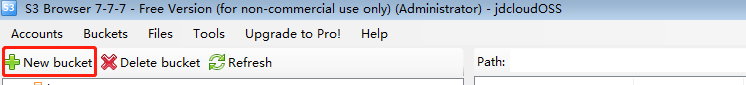

1.点击【New bucket】创建存储空间

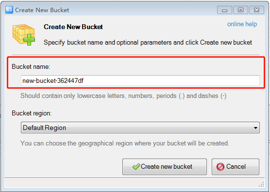

2.创建弹框中输入bucket name

**说明**

* 存储空间名称全局唯一，如果该名称已经被其他用户占用，将不能创建成功，请您根据[OSS命名规范](https://docs.jdcloud.com/cn/object-storage-service/put-bucket-2)，输入恰当的能够标识自身业务的名称。
* 存储空间创建时默认ACL 为私有读写，您可以根据自己的需求，在创建后更改空间访问权限。参见[【设置存储空间的Acl】](Manage-OSS-With-s3browser#user-content-4)
与[【设置Bucket policy】](Manage-OSS-With-s3browser#user-content-5)。

#### 设置存储空间的Acl

##### 操作步骤

1.在存储空间列表中，选中需要设置的bucket名称，单击右键，选择【edit Permissions(ACL)】。如图：

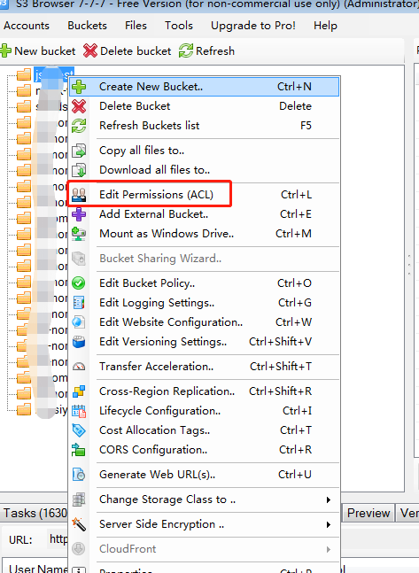

2.按照OSS支持的规则设置，完成设置。

##### 仅支持设置规则：

* 私有读写，对应设置如图：

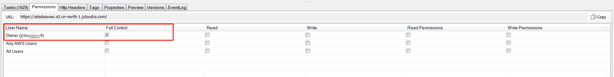

* 公有读私有写，对应设置如图：

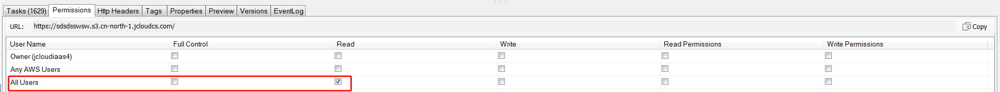

* 公共读写，对应设置如图：

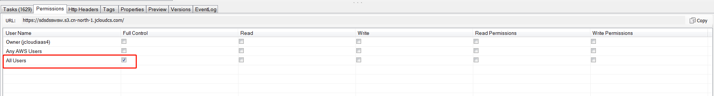

* 如果您想实现精细化授权给其他用户，可利京东云IAM ，通过京东云控制台可完成设置，如果仅需为其他京东云账号(包括主账号与子账号)授权OSS资源的权限，并实现细粒度的灵活授权请参考【设置Bucket policy】

**说明**

设置Bucket ACL时，建议您通过OSS控制台或者SDK设置，相比使用s3browsers更加便捷高效。
同时您需要注意，目前对于OSS，Bucket ACL 与Bucket policy 仅可通过其一管理存储空间权限，二者不可共存。如同时设置，s3browsers将出现报错并显示异常。

#### 设置Bucket policy

1.在存储空间列表中，选中需要设置的bucket名称，单击右键，选择【edit Bucket policy】。如图：

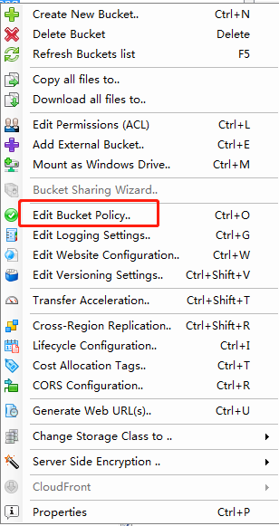

2.参考[Bucket policy 规范](https://docs.jdcloud.com/cn/object-storage-service/access-control-base-on-bucket-policy),在如下表格中完成设置。

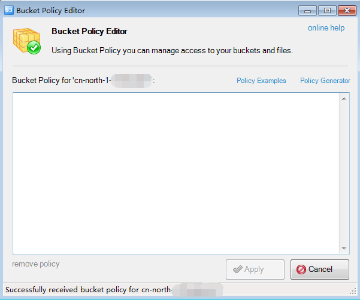

#### 静态网站托管（Website）设置

**说明：**

-  暂不支持 **所有请求重定向** 。
-  详见[静态网站托管设置](https://docs.jdcloud.com/cn/object-storage-service/set-bucket-website-2),API请参考[put bucket website](https://docs.jdcloud.com/cn/object-storage-service/put-bucket-website-2)。

##### 操作步骤

1.在存储空间列表中，选中需要设置的bucket名称，单击右键，选择【Website Configuration】。

2.在【Website Configuration】弹框中，按下图选中第二个单选框，并必须配置【Index document】,【Error document 】配置为可选。如下图：

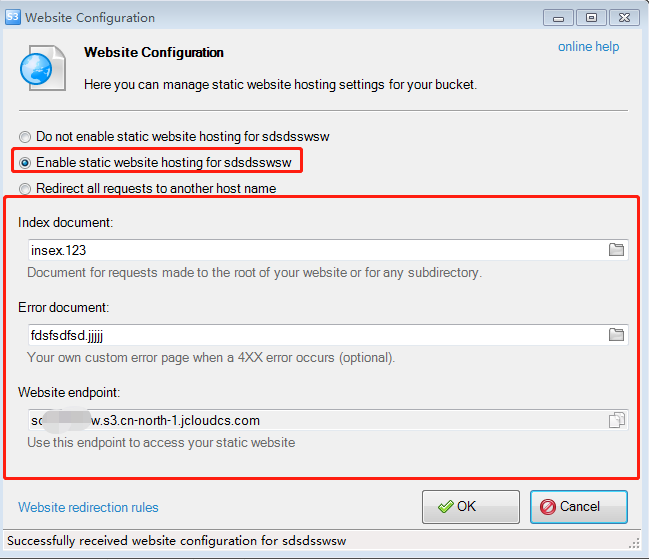

3.点击【OK】保存。

#### 删除存储空间

**说明：**

OSS 存储空间的删除目前必须满足以下条件：

* 存储空间内为空，即无任何文件，包括没有未完成的complete 的分片。
* 存储空间未开启跨区域复制，即不是跨区域复制中的目标存储空间或源存储空间
* 存储空间内没有图片样式。

##### 操作步骤

1.在存储空间列表中，选中将要删除的bucket名称，单击右键，选择【delete policy】。

2.点击下图中确定删除复选框，即可完成删除，如图：

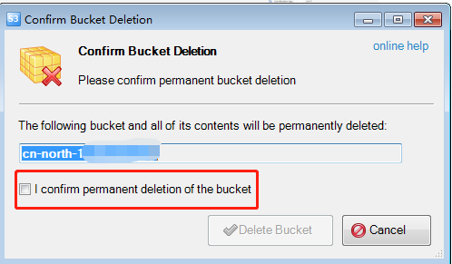

#### 跨域访问（CORS）设置

**说明：**

您可以使用CORS搭建web 应用，使用javaScript 和HTML5直接访问OSS中资源。详见[跨域访问设置](https://docs.jdcloud.com/cn/object-storage-service/set-bucket-cors-2),API请参考[put bucket cors](http://docs.jdcloud.com/cn/object-storage-service/put-bucket-website-2)。

##### 操作步骤

1.在存储空间列表中，选中需要设置的bucket名称，单击右键，选择【CORS Configuration】。

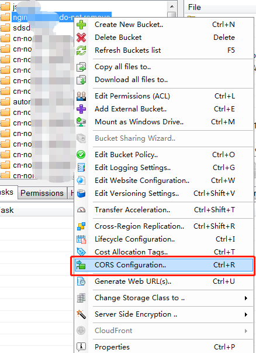

2.在下图中输入CORS配置，您可以点击下图中【Sample CORS Configuration】文字链接，在网页中挑选模板，按照自己需求修改，点击【Apply】,完成设置。

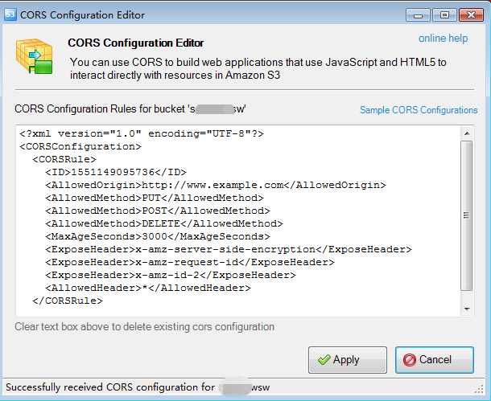

#### 生命周期管理（lifecycle）设置

**说明：**

* 可自动删除过期的Object，从而使Bucket在使用中便于维护且能降低成本。详见[生命周期管理](https://docs.jdcloud.com/cn/object-storage-service/lifecycle),API请参考[put bucket lifecycle](../API-Reference-S3-Compatible/Compatibility-API/Operations-On-Bucket/Put-Bucket-Lifecycle.md)。
* 目前仅支持删除对象，暂不支持 **转化存储类型与未合成分片过期自动删除** 。

##### 操作步骤

1.在存储空间列表中，选中需要设置的bucket名称，单击右键，选择【lifecycle Configuration】。

2.在【Filter】页签中，可以输入或者点击右侧文件夹图标选择文件前缀，若需要应用全部文件，该项不填即可。如下图：
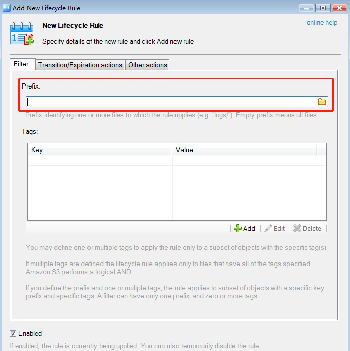

3.之后在【Transition/Expiration actions】页签中，完成过期删除的时间配置项。【Transitions】转换对象存储类型目前不支持，【other actions】完成全部请求重定向的配置，目前也不支持，之后点击【Add new rule】添加规则，如下图：

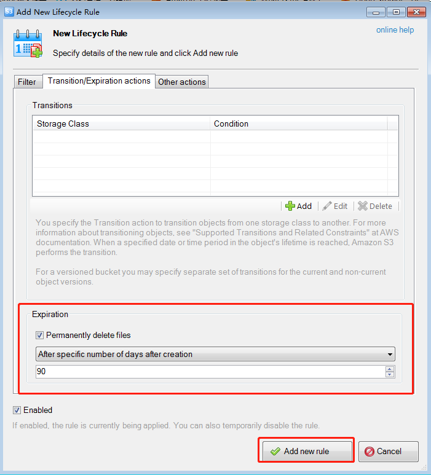

4.在【Bucket lifecycle rules】管理页面中，点击【Save】完成规则添加。
您也可点击已有的规则完成修改。
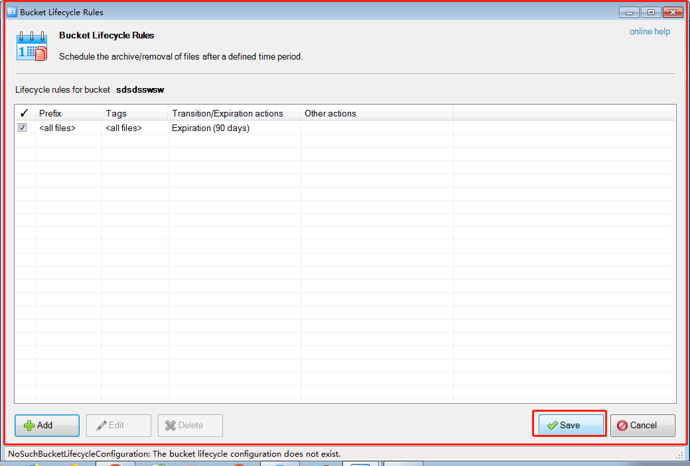

#### 添加存储空间或文件路径

**说明**

##### 应用场景：

当主账号或子账号被授予某个存储空间或某前缀文件的读取权限时，您可以通过添加 external bucekt 的方式实现在s3browser中管理文件与存储空间。

##### 操作步骤

1.使用您的账号登录s3browser后，在菜单栏中点击【Buckets】,下拉框中选择【Add External Buckets】。

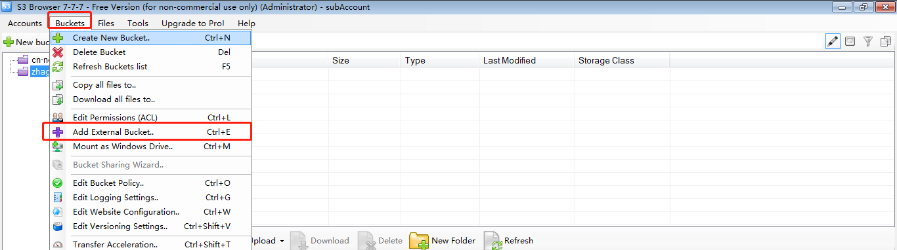

2.【Add External Buckets】弹框中添加文件路径，支持添加bucket 或 bucket中某文件夹，保存选项，如图：

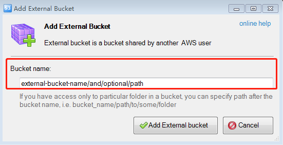

### 对象操作

**暂不支持设置对象acl与自定义header，tag 。**

#### 列出所有对象

单击对应的存储空间名即可。

如图：您可以创建文件夹，上传，下载，删除文件等。

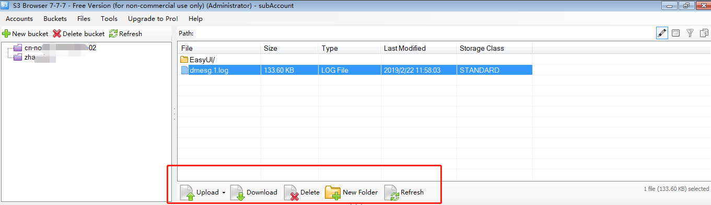

#### 上传对象

点击上图中，【Upload】选项,支持文件与文件夹上传。上传完成后自动刷新文件列表。

**s3browser** 免费版支持分片上传，大于1GB文件推荐使用该工具上传到OSS。 

#### 下载对象

* 方法一：选中需要下载的文件或者文件夹，点击上图中的【Download】选项，选择存储路径完成下载。
* 方法二：选中需要下载的文件或者文件夹，在弹出菜单中选择【Download】。

如下图：

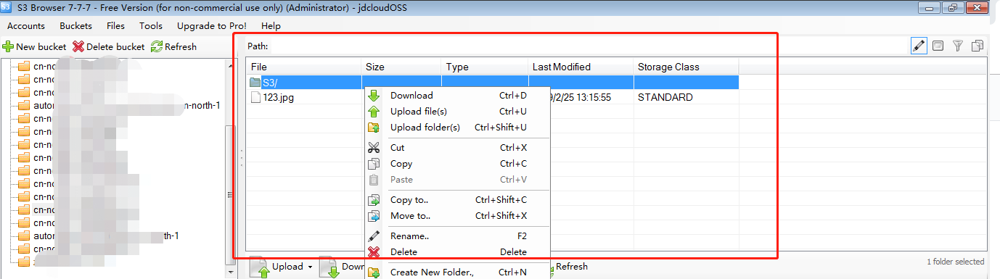

#### 复制对象到OSS存储空间

#####  操作步骤

1.右击需要复制的对象，支持文件与文件夹复制

2.点击【Copy to】

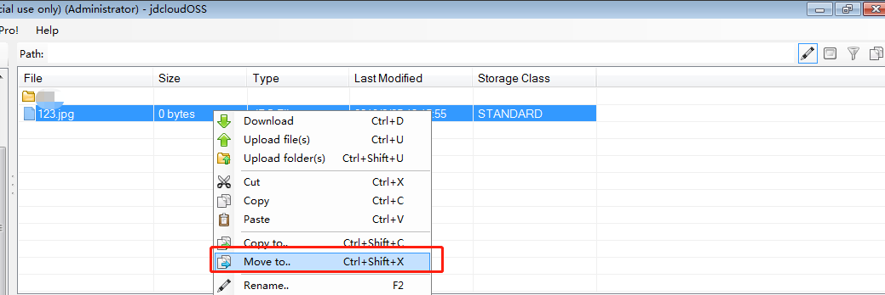
3.选择目的存储空间，然后点击OK即可。

#### 重命名对象

1.右击对象

2.选择【Rename】 ，重命名弹框中输入名字，点击【Rename】即可。

#### 移动对象

**说明**

此操作会将原来的对象删除。

#####  操作步骤
1.右击对象

2.选择【Move to 】

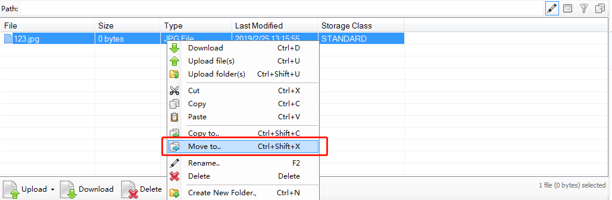

3.选择目的存储空间，点击OK即可。

#### 删除对象

支持文件与文件夹删除。

#####  操作步骤

* 方式一：点击对象，右击【Delete】

* 方式二：点击对象，点击对象框下面的【Delete】

