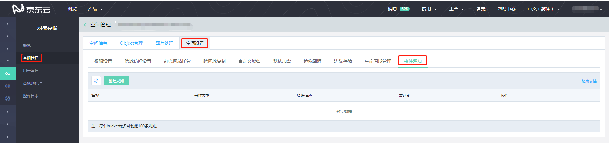
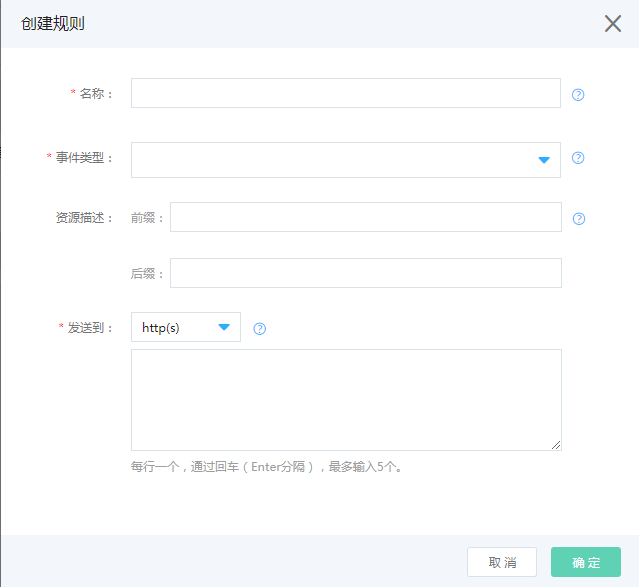
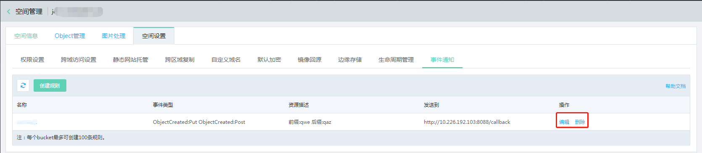

# 设置事件通知

OSS支持事件通知功能，您可以指定某些资源发生相关操作时及时进行回调通知。事件通知是异步进行的，不影响OSS操作。事件通知常见以下应用场景，例如：

有新数据从图片内容分享平台、音视频平台上传到OSS。

OSS上的相关内容发生了更新。

OSS上的重要文件被删除。

您可以为存储空间启用事件通知功能，以便每次发生这些事件时都向目标发送通知消息。本部分介绍如何使用 OSS 控制台启用事件通知。
有关将事件通知 REST API 的信息，请参阅[事件的通知-API](https://docs.jdcloud.com/cn/object-storage-service/callback-notification-2)。

 **事件通知支持的类型：[OSS可以为以下事件类型发送通知](Event-Notifications-1#user-content-1)**
 
 **事件通知支持的目标：[事件通知消息可以发送到的目标](Event-Notifications-1#user-content-2)**
 
 **控制台设置事件通知：[控制台设置事件通知](Event-Notifications-1#user-content-3)**
 

# 事件通知支持的类型和目标

您在为存储空间配置事件通知时，必须指定要针对哪些事件类型进行通知以及希望通知发送到哪些目标。

## OSS可以为以下事件类型发送通知

事件类型|描述
---|---
s3:ObjectCreated:* |创建Object的行为，包含Put Object，Post Object，Copy Object，Complete Multipart Upload
s3:ObjectCreated:Put |使用Put Object上传文件
s3:ObjectCreated:Post |使用Post Object上传文件
s3:ObjectCreated:Copy |使用Put Object-Copy复制文件
s3:ObjectCreated:CompleteMultipartUpload |完成分片上传
s3:ObjectRemoved:* |删除Object的行为，包含Delete Object
s3:ObjectRemoved:Delete |删除文件

## 事件通知消息可以发送到的目标：

*  **HTTP(S)**: 按照您配置的回调URL，当Bucket中事件通知触发时，OSS会向回调URL发送指定格式的通知内容，通知方式支持HTTP(S)。
*  **函数服务（Function Service）**: 函数服务是一项事件驱动的Serverless计算服务。通过函数服务平台，用户无需配置和管理服务器等基础设施，即可弹性、可靠地运行业务代码，快速构建应用与服务，且只需为代码实际消耗的资源付费。**目前函数服务仅支持华北地域配置**

# 控制台设置事件通知

1.登录京东云控制台，选择对象存储->空间管理->空间设置，选择 **事件通知** ，如图：

 
 
 2.点击【创建规则】，打开创建规则页面。
 
 
 
 3.在 **名称** 框中，输入规则名称。
 
 **说明**
 
 * 您的bucket最多可以创建100条规则。
 * 名称限制256个字节，由字母，数字，下滑线（_）,中滑线（-）组成。
 
 4.在 **事件类型** 下拉列表中，选择一个或多个需要进行消息通知的事件。
 
**说明**

* 事件类型对应OSS资源的不同操作，具体类型和含义请参下文中[OSS可以为以下事件类型发送通知](Event-Notifications-1#user-content-1)。
* 您可以选择多个想要触发通知的事件。
* 同样的事件不可以多次配置在同一资源上（重叠的前后缀）。
* 同样的事件可以配置发送到不同的目标。
* 需要特别注意的是，对于每个存储空间，单个事件不要配置多个相互重叠的前缀或后缀，事件通知服务将按序依次匹配，匹配成功则发出消息通知并终止匹配。
* 执行顺序以服务端规则为准，与控制台展示顺序存在不一致可能。

5.在 **资源描述** 处，添加前缀、后缀，完成对资源的描述,达到筛选文件的效果。

**说明**

* 资源描述：可以是前缀、后缀以及前后缀，请注意不同资源的描述不能有交集。
* 前缀与后缀：设置Object的前后缀可以达到只关注bucekt中部分Object的目标。
      例如：
   -  要关注bucekt中所有的文件，则前缀、后缀都不填。
   -  要关注bucekt中目录jdcloudoss下的所有文件，则前缀填 jdcloudoss/，后缀不填。
   -  要关注bucekt中所有的.jpg的图片，则前缀不填，后缀填 .jpg。
   -  要关注bucekt中目录jdcloudoss下的.mp3格式的影片，则前缀填 jdcloudoss/，后缀填 .mp3。
   
 6.在 **发送到** 下拉框中，选择【http(s)】或者【函数服务】，完成接收终端的设置。
 
**说明**

* 【http(s)】 ：OSS会向此地址发布消息，您可输入最多5个回调地址。必须为完整的URL，需指定http协议。了解更多请参考[回调通知](https://docs.jdcloud.com/cn/object-storage-service/callback-notification-2)。
* 【函数服务】：可运行基于OSS事件的Function 函数脚本。函数服务目前在公测阶段，您需先申请试用，了解更多[函数服务](https://www.jdcloud.com/cn/products/function-service)，参与公测。
*  函数服务目前仅支持华北-北京，其他区域暂不可设置【函数服务】。
*  OSS作为函数服务触发器，需满足函数服务关于单个函数最多创建10个触发器的限制，如果您超过限制将导致失败，查看某个函数触发器配置详情，请前往[函数服务控制台](https://function-console.jdcloud.com/services)。
 
7.点击【保存】。

**说明**

*  发动到选择【http(s)】时，点击保存OSS会向事件通知目标发送一条测试消息，为了您服务的安全，请完成[回调服务器设置签名认证]
(https://docs.jdcloud.com/cn/object-storage-service/setting-signature-authentication-for-callback-server),从而OSS会完成对该地址的订阅。

*  消息通知格式参见[消息通知](https://docs.jdcloud.com/cn/object-storage-service/callback-notification-2)。

## 您可通过控制台，编辑或者删除事件通知规则

 

