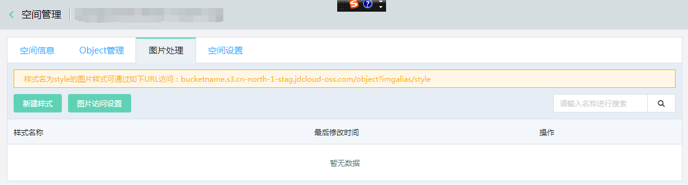
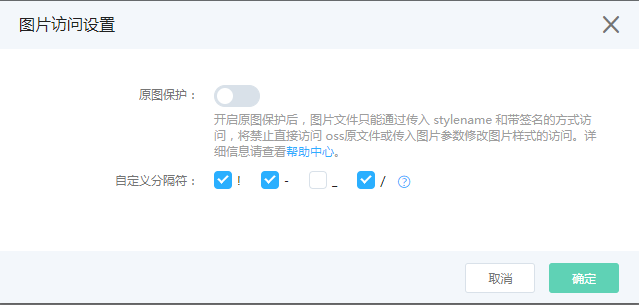

# 自定义分隔符

# 图片样式 

所有对图片的变换操作参数都会加在URL后面，这样会导致图片URL变得冗长，不方便阅读。京东云OSS的图片处理服务提供图片样式功能，您可以将常用的图片操作保存成一个别名，即图片样式（IMGStyle）。一个复杂操作，利用图片样式功能后，只要一个很短的URL就能实现相同的效果。

**一个Bucket下有多个样式，样式的作用范围只在一个Bucket下。**

##  图片样式访问规则 

*  **URL参数方式访问**
 ```
   <文件URL>?x-oss-process=imgalias/<StyleName>
 ```

示例：
```
bucket.s3.cn-north-1.jdcloud-oss.com/lena.jpg?x-oss-process=imgalias/stylename

```

 **这种方式是图片处理默认支持的样式访问方式,您只需要在控制台新建图片样式后即可使用**

* **分隔符方式访问**

```
<文件URL><分隔符><StyleName>

```

示例：
   
 ```
 bucket.s3.cn-north-1.jdcloud-oss.com/lena.jpg{分隔符}stylename 
 
 ```
 
 **当图片的URL带了分隔符，OSS图片处理服务会把该分隔符后面的内容当成样式的名称。** 分隔符只有在控制台配置成功后才能生效，支持
  `  -、_、/、!` 样式分隔符。分隔符方式访问为图片处理可选的使用方式。

       
**说明**

*  StyleName是图片样式的名称。

*   创建样式、删除样式和修改样式可在控制台操作也可通过OPENAPI操作。

*   设置多个分隔符后，访问图片的时候如果url中包含多个分隔符，会按照 `- `→ `_ ` → `/` →` ! ` 的顺序执行，具体规则请看下面例子：
示例：

若bucket设置的图片样式名称为：`imgStyle` 。请求中包含了多个合法的分隔符，且bucke设置了这些分隔符，如：`http://downloads.s3.cn-north-1.jcloudcs.com/lena.jpg-imgStyle_imgStyle`。根据匹配顺序`- `→ `_ ` → `/` →` ! ` ，系统先将 `-` 匹配为分隔符，该分隔符后的内容为图片样式名，即`imgStyle_imgStyle`，该分隔符前的内容为文件url，即object key为`lena.jpg`，若bucket未设置名为`imgStyle_imgStyle`的样式，系统将认为此处 `-` 不作为分隔符使用。继续匹配bucket中已设置的下一个分隔符 `_` 。同样，图片样式名为`imgStyle`，object key为`lena.jpg-imgStyle`，若bucket已经设置了名为`imgStyle`的样式，匹配成功，返回处理结果。

*   完成自定义分隔符设置后，若文件名中包含您设置的自定义分隔符，会优先按照自定义分隔符处理，详细说明请看下面例子。

例一：testbucket中存在文件名为`animal.jpg!imgStyle` 的文件，同时testbucket中存在名为`imgStyle`的图片样式，
访问文件URL`testbucket.s3.cn-north-1.jdcloud-oss.com/animal.jpg!imgStyle`,若名为animal.jpg的文件存在则将返回经过处理的图片，若不存在则返回404。

例二：testbucket中存在文件名为`animal.jpg!imgStyle` 的文件，同时testbucket中不存在名为`imgStyle`的图片样式，
访问文件URL`testbucket.s3.cn-north-1.jdcloud-oss.com/animal.jpg!imgStyle`,则返回`animal.jpg!imgStyle`文件。


  

## 设置分隔符 

1.  在[OSS控制台](https://oss-console.jdcloud.com/space)左侧存储空间列表中，单击您要向其设置分隔符的存储空间名称。

2.  单击**图片处理**页签，找到**图片访问设置**按钮。

    

3.  单击**图片访问设置**，打开设置窗口。

    

    在设置窗口中您可以进行以下设置：

    -   原图保护
    
        开启原图保护后，您需要了解的信息请参见[图片原图保护-原图保护规则](https://docs.jdcloud.com/cn/object-storage-service/source-image-protection)。

        
    -   自定义分隔符。
        * 你可以选择一个或者多个分隔符;
        * 分隔符与原图保护设置可分别设置。
        
        
4.设置好您需要的选项之后单击**确定**完成分隔符的设置。

**你也可以通过[OPENAPI](http://docs.jdcloud.com/cn/media-processing-service/api/setstyledelimiter)完成对自定义分隔符的设置。**


## 示例

假如对downloads这个bucket创建一个样式：


-   直接参数访问

    [https://downloads.s3.cn-north-1.jcloudcs.com/lena.jpg?x-oss-process=img/r/60/q/71/p/s/200/300](https://downloads.s3.cn-north-1.jcloudcs.com/lena.jpg?x-oss-process=img/r/60/q/71/p/s/200/300)

    

-   通过URL参数，使用样式访问

    [https://downloads.s3.cn-north-1.jdcloud-oss.com/lena.jpg?x-oss-process=imgalias/imgstyle_demo](https://downloads.s3.cn-north-1.jdcloud-oss.com/lena.jpg?x-oss-process=imgalias/imgstyle_demo)

    

-   通过样式分隔符，使用样式方式访问

    [https://downloads.s3.cn-north-1.jdcloud-oss.com/lena.jpg!imgstyle_demo](https://downloads.s3.cn-north-1.jdcloud-oss.com/lena.jpg!imgstyle_demo)

    


三者可以达到同样的效果。


