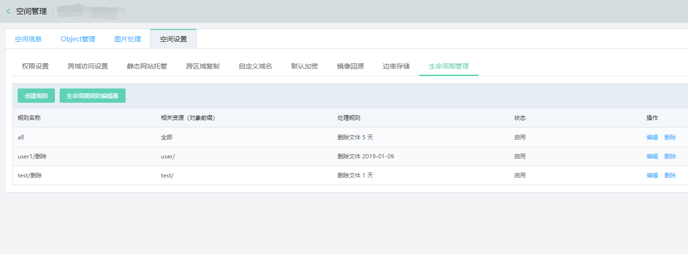
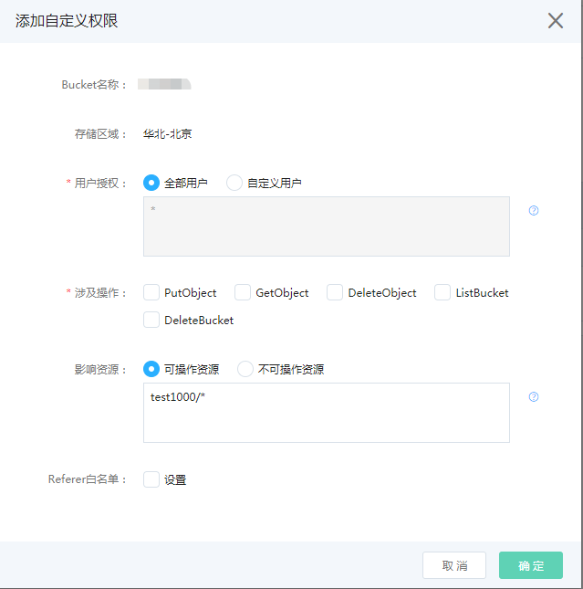

# 生命周期管理

## 生命周期概述

京东云对象存储通过Bucket规则设置，支持对象的生命周期（Lifecycle）管理功能。可自动删除过期的Object，从而使Bucket在使用中便于维护且能降低成本。用户如果手工维护数据的生命周期，则费时费力；但如果不去维护，则会产生不菲的费用。生命周期管理可以帮助用户自动化完成数据生命周期管理，实现数据删除的自动流程，节约人力和金钱成本。

## 规则说明

### 规则定义

生命周期管理规则需基于Bucket定义，配置的规则仅在当前Bucket下生效。每条规则包含以下定义项：

**支持操作**

 - 过期：设置Object的过期时间，OSS将在满足时间条件时删除指定Object。

**支持资源**

 - 前缀：支持按前缀过滤资源，只有匹配该前缀的Object才适用这个规则。

**支持时间条件**

 - 日期：可指定执行操作的绝对日期，到达该日期后会向相关Object执行相关操作；
 
 - 天数：可指定相对天数，定义Object会在最后修改日期后多少天后执行相关操作。

### 规则示例

生命周期配置为XML格式，每个Bucket最多有1000条规则，举例如下：

```
<LifecycleConfiguration>
  <Rule>
    <ID>id1</ID>
    <Filter>
       <Prefix>log1/</Prefix>
    </Filter>
    <Status>Enabled</Status>
    <Expiration>
       <Days>365</Days>
    </Expiration>
  </Rule>
  <Rule>
    <ID>id2</ID>
    <Filter>
       <Prefix>log2/</Prefix>
    </Filter>
    <Status>Enabled</Status>
    <Expiration>
       <Date>2020-01-01T00:00:00.000Z</Date>
    </Expiration>
  </Rule>  
  ...
</LifecycleConfiguration>
```

细节分析：

 - ID：当前生命周期规则名称，最多64个字符，不可与其他Rule中ID重叠；
 
 - Prefix：指定前缀过滤，该规则会匹配符合前缀条件的资源生效；

 - Status：指定该规则状态，Enabled为启用状态，该规则会一直匹配执行；Disabled为关闭状态，该规则将失效；

 - Days：可指定相对天数，定义Object会在最后修改日期后多少天后执行相关操作，Days必须为正整数；
 
 - Date：指定执行操作的绝对日期，该规则将会在指定日期的生效；该日期必须是UTC午夜零点，并符合ISO8601格式。

### 注意事项

**前缀**

 - 前缀的命名在UTF-8编码下不得超过1022个字节；
 
 - 当前缀为空时，表明该规则对Bucket中的所有资源生效，请谨慎配置前缀；
 
 - 所有规则前缀允许重叠，当时间条件满足后，所有满足前缀条件的资源均会执行过期操作。
 
**规则生效时间**
 
 - 当时间条件设定为天数时，将Object最后更新时间（Last-Modified）加上天数，再取整到下一个UTC午夜零点，即为规则生效执行时间；若规则生效时间为早于当前时间，将于次日UTC零点生效执行。例如，一个Object的最后更新时间是UTC的2018年1月1日上午1点，相匹配的规则定义的天数是5天，那么过期时间为UTC 2018年1月7日0点整。

 - 当时间条件设定为日期时，在该日期的UTC零点将会生效执行；若设置了一个过去的日期，将会与次日UTC零点生效执行。基于日期的操作并**非一次性操作**，即使过了该日期后，只要规则状态为“启用”，OSS仍会继续应用该基于日期的操作，请您谨慎设置日期条件。
 
 - 在同一规则中不能同时指定天数和日期。
 
 **执行说明**
 
 - 对于以任何时间条件的配置，OSS都会以生效日期的UTC（零时区）零点为准开始执行操作，由于是异步队列执行，且不排除有大批存量Object需要执行，所以实际删除成功的时间可能会延迟，您可以通过 GET 或 HEAD Object 操作来获取对象的当前状态。
 
 - OSS对于生命周期的执行效力不提供账单承诺，即对象资源的计费以实际删除成功的时间为准。
 
 - **资源过期删除是不可逆的，请根据您的需求合理配置生命周期时间计划。**

## 配置生命周期

对象存储支持通过控制台配置设置管理生命周期规则，设置步骤请参考如下内容。如需使用API设置生命周期，请参考[Put Bucket Lifecycle](../../API-Reference-S3-Compatible/Compatibility-API/Operations-On-Bucket/Put-Bucket-Lifecycle.md)。

1.登入控制台->对象存储->空间管理->进入某个Bucket->空间设置->生命周期管理，在该页面下您可以查看当前Bucket生命周期规则列表，也可以创建和删除生命周期规则。



2.点击“创建规则”，可进入创建生命周期规则页面，在该页面可设置生命周期规则。



细节说明：

 - 规则名称:当前生命周期规则名称，不可与当前Bucket下已有规则名称冲突；
 
 - 状态：默认为启用，可设置为禁用，禁用后，该规则不再生效，直至重新启用；
 
 - 影响资源：可选择指定前缀配置的资源生效或指定整个存储桶生效；
 
 - 过期策略：支持天数及日期两种时间条件，不能同时指定两种时间条件。
 
 注：若需要设置的生命周期规则大于100条，推荐使用API或SDK进行设置。
