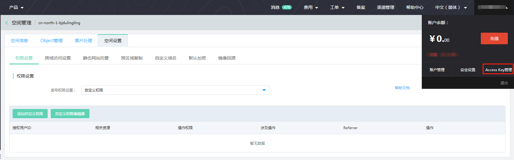

# 控制台中修改访问控制权限

当你创建存储空间后有修改Bucket的访问权限需求的时候可以使用以下方法完成修改。可以满足您更改整个存储空间访问权限或者实现更加细致的权限粒度控制。

|权限名称|权限英文值|权限说明|
|-|-|-|
|私有读写|Private|Bucket Owner获得全部可执行的操作权限，只有该Bucket的Owner可以对存放在其中的Object进行读/写/删除操作；其他人没有任何权限，在未经授权的情况下无法访问该Bucket内的Object|
|公有读私有写|Public-Read|Bucket Owner获得全部可执行的操作权限，只有该Bucket的Owner可以对存放在其中的Object进行写/删除操作；其他人（包括匿名访问）可以对Object进行读操作。|
|公有读写|Public-Read-Write|Bucket Owner获得全部可执行的操作权限，其他人获得READ和WRITE权限；所有这些操作产生的费用由该Bucket的Owner承担，请慎用该权限。|
自定义权限|User-Defined|可对指定用户设置GetObject、PutObject、DeleteObject、ListObjects、DeleteBucket的权限，并可指定该权限可访问的资源，以及指定具有该权限的IP地址和Referer白名单等.|

### 操作步骤

1.登录京东云控制台，选择对象存储->空间管理->空间设置，选择**权限设置**，展示您当前的权限设置内容，如图：

2.修改空间权限
 如图：
 
 **说明：**
 
 * 若修改ACL，则点击读写权限设置下拉框，选择私有读写、公有读私有写、公有读写3中权限，点击确定。

 * 若想实现对Bucket细粒度的权限管理，请使用Bucket policy,在读写权限设置处，点击自定义权限，即可完成Bucket policy设置。设置页面如下图：
 
 支持权限弹框设置和编辑器两种方式：
 【添加自定义权限】--您可以使用方便简单的弹框，填写设置项完成设置。
 【添加自定义编辑器】--您可以可视化编辑器，直接填写JSON指定合法的Bucket policy。
  
  
细节说明：

（1）每个Bucket最多允许创建10个Bucket Policy；

（2）Bucket Policy中各个字段的定义如下：

a. 用户授权：定义了该Bucket Policy所影响到的用户，默认值为*，语义是对全部用户生效，若需要只针对部分用户生效，请点击“自定义用户”，并在文本框中输入对应用户的用户ID（注：用户ID不同为用户Pin，您的用户ID可以到用户管理中去查询，效果如下图），每行一个用户ID，即通过换行符间隔多个用户ID。

b. 涉及操作：定义了对该Bucket可以进行的操作，可进行单选也可进行全选，但至少要勾选一项，每项操作定义如下：

|操作项名称|操作项说明|
|-|-|
|PutObject|上传某个Object到该Bucket，支持普通上传和分块上传|
|GetObject|获取该Bucket内某个Object及其相关信息|
|DeleteObject|删除该Bucket内某个Object|
|ListBucket|列出该Bucket内的Objcet|
|DeleteBucket|删除该Bucket|

c. 影响资源：定义了对该Bucket下的哪些资源可操作或不可操作（即Allow或Deny），默认选中“可操作资源”，文本框中默认值为bucketname/*，语义为对当前Bucket下的全部资源是可操作的，输入格式示例：myBucket/myfolder/object* ，myBucket/*，内容必须以Bucket名称开始，资源如果只有1个斜杠，不能以斜杠结尾，资源可以设置多个，每行1个且每行最多1个通配符，最多可以增加10条记录。

d. Referer白名单：由于京东云对象存储是按用量收费，为避免您存储在京东云对象存储的数据被其他人盗链，京东云对象存储支持基于HTTP Header中表头字段的Referer防盗链方法，您可以在对象存储控制台的自定义权限中或者通过API的方式对一个Bucket设置Referer字段的白名单和是否允许Referer为空的请求访问，下文会对Referer白名单的规则作出详解。

（3）除了通过表单来创建Bucket Policy之外，您也可以通过自定义权限编辑器进行Policy设置（注：编辑器中会展示出当前Bucket下全部的Policy，编辑器中无法添加注释，且最多允许输入16KB），效果如下：

（4）若您是通过API或SDK创建的Bucket，并且在创建时并未指定Bucket的权限，则系统会为该Bucket赋予默认的私有读写（Private）权限，即只有Bucket Owner可对该Bucket下的资源进行操作和访问，全部其他用户的所有请求都会被拒绝，若要允许某些用户对于该Bucket下的资源进行访问和操作，请在Bucket Policy中进行授权或将Bucket的权限改为公有读或公有读写（Public-Read或Public-Read-Write）。

## 设置Referer白名单

为了防止存储在对象存储中的数据被其他人盗链，京东云对象存储支持基于HTTP Header Referer字段的防盗链方法。可通过控制台设置Referer字段的白名单。设置白名单后，只有Referer字段在白名单内的用户才可访问Bucket中存储的数据，不在白名单内的请求会被拒绝。但若未配置Referer白名单时，默认可访问，不受白名单限制。

使用规则如下：

* Referer防盗链规则只对Bucket权限为“自定义权限”的Bucket生效，默认规则为“允许Referer为空、白名单为空”；

* 空Referer的定义为：一个HTTP请求中不包含Referer头部或Referer头部的内容为空；

* Referer白名单支持域名或IP地址（若无域名，必须将IP加入白名单中），可以设置多个，使用换行符（回车）来分隔，不区分大小写，域名前不需要写 http:// 或https:// ；

* 防盗链输入内容最多可输 500 条或总字节数不超过16384字节（即16KB）；

* 防盗链Referer域名或IP参数支持使用通配符“*”，在域名前缀使用通配符如*.test.com可用于指代所有test.com下的多级子域名，域名支持http和https协议；

* IP地址：指定拥有该权限的IP地址列表，使用CIDR方式对IP进行标识，每个IP最多1个通配符*，并且以.*结尾。示例：192.168.0.1/24，192.168.0.100，192.168.* 或192.168.1.*；

Referer白名单语义解释：

* 当用户设置允许Referer为空，且白名单内为空时，则Referer为空的请求会被允许，其他请求（Referer不为空）都会被拒绝；

* 当用户设置允许Referer为空，且白名单内不为空时，则Referer为空的请求和符合白名单的请求会被允许，其他请求都会被拒绝；

* 当用户设置不允许Referer为空，且白名单内为空时，则无论Referer是否为空，全部请求都被拒绝；

* 当用户设置不允许Referer为空，且白名单内不为空时，则只有Referer属于白名单的请求被允许，其他请求（包括Referer为空的请求）会被拒绝。

参考效果如下：

 
 
 

 
 
 
 

