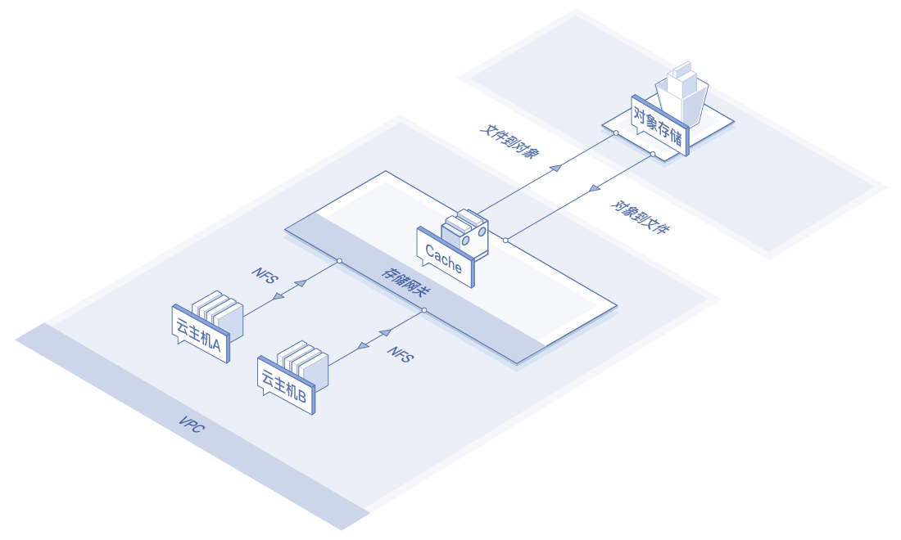
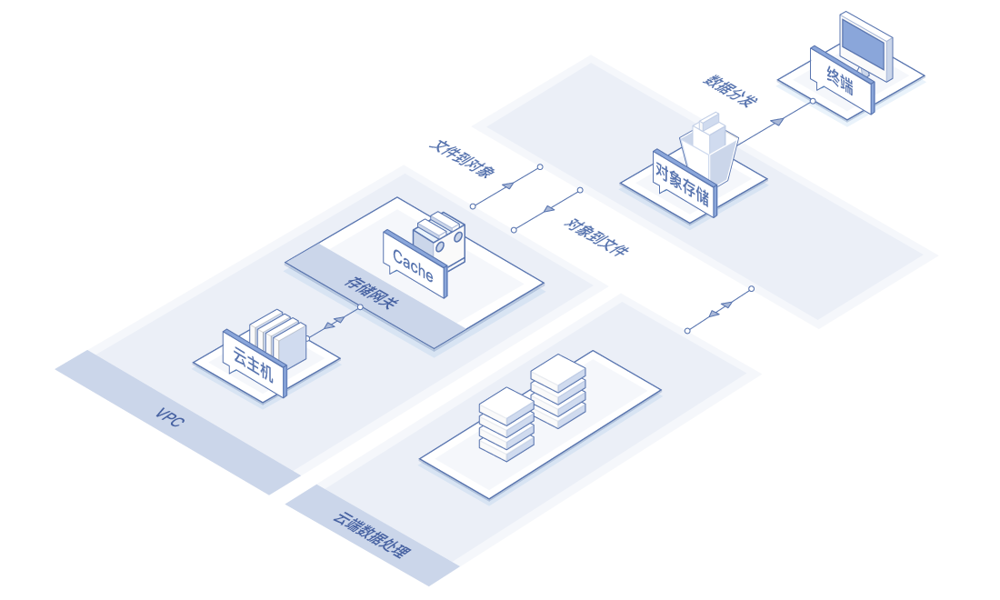

# 应用场景

## 文件共享及备份

支持多台云主机间文件共享，例如服务器A将日志存放在存储网关上以用于后续处理分析，服务器B也可将应用数据放在存储网关上从而实现云主机自身的无状态，存储网关最终将数据异步备份至OSS，实现数据高可靠性。

## 数据处理及分发

文件网关最终将文件存储到对象存储 OSS 上，OSS 为文件提供数据处理及分发能力，减轻资源服务器的压力，并利用无限容量、高频读写的特性，为静态资源提供可扩展和可靠的存储。

