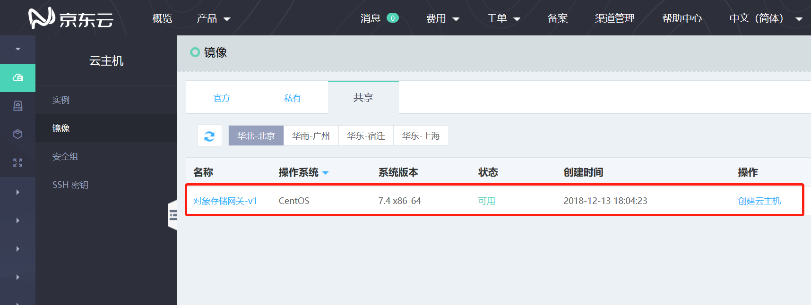
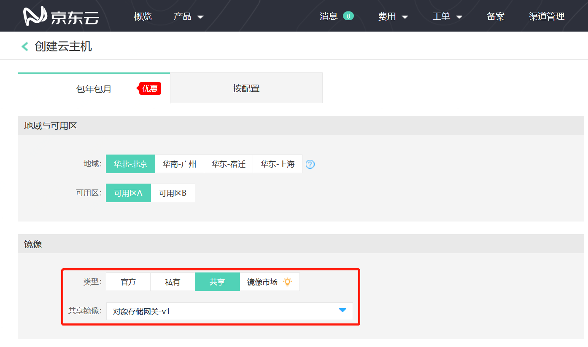
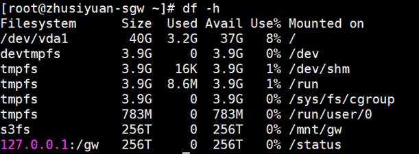

# 部署存储网关

## 注意事项

1.使用存储网关需要依赖云主机及对象存储产品，请确保提前开通云主机及对象存储服务。

2.部署存储网关的云主机最低配置：4核 CPU / 4GB 内存/ 40G SSD云硬盘；您可根据数据规模配置更大容量的云硬盘。

## 创建存储网关 

1.目前存储网关为公测阶段，创建前请提交[公测申请](https://www.jdcloud.com/cn/public/testApply/storagegateway)。公测申请通过后可在控制台-云主机-镜像-共享镜像页面下查看到存储网关的镜像。



2.可在当前存储网关镜像下点击 **创建云主机** 完成云主机创建，或者在 **创建云主机** 页面中设置共享镜像，并选择存储网关镜像。更多帮助请查看[创建Linux实例](https://docs.jdcloud.com/cn/virtual-machines/create-linux-instance)



注：Bucket与存储网关需在同一个地域，创建云主机时请根据您的业务需要选择地域。

3.创建完成后登入该云主机进行存储网关相关配置。

## 配置存储网关

云主机创建完成后，需登入该云主机配置该存储网关连接的Bucket，并启动存储网关服务。

1.首次登入部署存储网关的云主机时，将会要求输入以下信息，并作为配置项保存在存储网关配置文件`/etc/gateway/gw.conf`中。

- accessKeyID：您的accessKeyID

- accessKeySecret：您的accessKeySecret

- endpoint：Bucket所在Endpoint

- bucket：连接存储网关的Bucket名称

注： accessKeyID及accessKeySecret获取请查看[AccessKey管理](https://uc.jdcloud.com/account/accesskey)；endpoint请查看[OSS服务器域名](https://docs.jdcloud.com/cn/object-storage-service/regions-and-endpoints)；单个存储网关仅支持连接一个Bucket。

配置示例：

```
accessKeyID：xxxxxxxxxxxxxxxx
accessKeySecret: xxxxxxxxxxxxxxxx
endpoint：http://s3.cn-north-1.jcloudcs.com   //endpoint须使用http://或https://开头
bucket：bucketname
```

2.初始化云硬盘，初始化脚本路径为`/root/bin/auto_fdisk.sh`，该操作将会初始化云硬盘并设置为存储网关的本地缓存。执行命令示例如下：

```
auto_fdisk.sh /dev/vdb /cache ext4
```

注：

- `/dev/vdb`为您的云硬盘设备名，可根据您需要初始化为本地缓存的云硬盘自行设置；

- `/cache ext4`等参数不允许修改。关于初始化云硬盘请参考[数据盘的分区、格式化及挂载](https://docs.jdcloud.com/cn/cloud-disk-service/linux-partition)。弹出`Warning：This directory exists , is this ok ? [Y/N]`，请输入`Y`。

- 存储网关的缓存目录为`/cache`，其下缓存有您近期访问的数据，该缓存可手动清理。
 
3.配置完成后即可启动该存储网关上的NFS文件系统，启动脚本路径为`/root/bin/gw `，执行该脚本启动NFS服务。执行命令示例如下：

```
gw start
```

注：执行启动命令后，当显示`Starting httpd... monitor`时，即开启完成，执行`ctrl+c`退出即可，退出后，monitor作为服务运行监控模块会在后台执行。

4.执行`df -h`命令查看是否启动成功，如图所示，127.0.0.1:/gw为已成功开启的NFS共享文件系统。



注：127.0.0.1为本地回送地址，即Localhost。

5.存储网关配置文件路径为`/etc/gateway/gw.conf`，相关配置项为accessKeyID、accessKeySecret、endpoint、bucket。也可以通过执行`gw install`来重新配置。重启NFS服务后，新配置项才会生效。重启NFS服务命令示例如下：

```
gw restart
```

